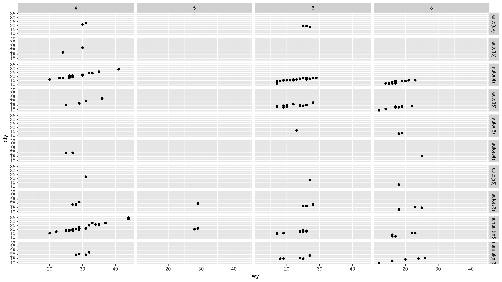

# 1章 ggplot2によるデータ可視化

### 1.0 ライブラリーの読み込み 

```text
library("tidyverse")
```

### 1.1 はじめに


練習問題はありません。


### 1.2 第1ステップ

#### 練習問題1 : ggplot\(data = mpg\)を実行しなさい。どうなるか。

```text
ggplot(data = mpg)
```

`ggplot()`は座標平面を表示する関数なので、何かが表示されるわけではありません。


#### 練習問題2 : mtcarsには何行あるか。何列あるか。

基本的には`ncol()`、`nrow()`、`dim()`などでデータフレームのサイズは確認できます。

```text
ncol(mtcars)
[1] 11

nrow(mtcars)
[1] 32

dim(mtcars)
[1] 32 11
```

他にも`{glimpse}`パッケージの`glimpse()`でも確認できます。

```text
library("glimpse")
mtcars %>% glimpse()

Observations: 32
Variables: 11
$ mpg  <dbl> 21.0, 21.0, 22.8, 21.4, 18.7, 18.1, 14.3, 24.4, 22.8, 19.2, 17.8, …
$ cyl  <dbl> 6, 6, 4, 6, 8, 6, 8, 4, 4, 6, 6, 8, 8, 8, 8, 8, 8, 4, 4, 4, 4, 8, …
$ disp <dbl> 160.0, 160.0, 108.0, 258.0, 360.0, 225.0, 360.0, 146.7, 140.8, 167…
$ hp   <dbl> 110, 110, 93, 110, 175, 105, 245, 62, 95, 123, 123, 180, 180, 180,…
$ drat <dbl> 3.90, 3.90, 3.85, 3.08, 3.15, 2.76, 3.21, 3.69, 3.92, 3.92, 3.92, …
$ wt   <dbl> 2.620, 2.875, 2.320, 3.215, 3.440, 3.460, 3.570, 3.190, 3.150, 3.4…
$ qsec <dbl> 16.46, 17.02, 18.61, 19.44, 17.02, 20.22, 15.84, 20.00, 22.90, 18.…
$ vs   <dbl> 0, 0, 1, 1, 0, 1, 0, 1, 1, 1, 1, 0, 0, 0, 0, 0, 0, 1, 1, 1, 1, 0, …
$ am   <dbl> 1, 1, 1, 0, 0, 0, 0, 0, 0, 0, 0, 0, 0, 0, 0, 0, 0, 1, 1, 1, 0, 0, …
$ gear <dbl> 4, 4, 4, 3, 3, 3, 3, 4, 4, 4, 4, 3, 3, 3, 3, 3, 3, 4, 4, 4, 3, 3, …
$ carb <dbl> 4, 4, 1, 1, 2, 1, 4, 2, 2, 4, 4, 3, 3, 3, 4, 4, 4, 1, 2, 1, 1, 2, …
```

普通のやり方ではないので非推奨だけど、無理やり調べられなくもない。

```text
mtcars %>% map_chr(.f = class) %>% table()
.
numeric 
     11 

mtcars %>% select(mpg) %>% map_dbl(.f = length)
mpg 
 32 
```

#### 練習問題3 : drv変数は何を記述するか。?mpgのヘルプを読んで見つけなさい。

`drv`変数は、前輪、後輪、または四輪駆動に車を分類するカテゴリ変数です。

```text
?mpg
```

| Variable | Content |
| :--- | :--- |
| drv | f = front-wheel drive, r = rear wheel drive, 4 = 4wd |

#### 練習問題4 : hwyとcylの散布図を作りなさい。

```text
ggplot(data = mpg, mapping = aes(x = hwy, y = cyl)) +
  geom_point()
```


#### 練習問題5 : classとdrvの散布図はどうなるのか。なぜプロットが役に立たないのか。

この散布図は、カテゴリカル変数とカテゴリカル変数の散布図なので、わずかな点しかプロットされず役に立たない。つまり、カテゴリの組み合わせが存在しているかどうかしかわかりません。

```text
ggplot(data = mpg, mapping = aes(x = class, y = drv)) +
  geom_point()
```


組み合わせ自体は下記の通りではあるが、`drv`のカーディナリティは3で、`class`のカーディナリティは7なので、組み合わせは21通りあるはずが12通りしかなく、存在していない組み合わせがあることがわかります。

```text
mpg %>% 
  group_by(drv, class) %>% 
  summarise(cnt = n())

# A tibble: 12 x 3
# Groups:   drv [3]
   drv   class        cnt
   <chr> <chr>      <int>
 1 4     compact       12
 2 4     midsize        3
 3 4     pickup        33
 4 4     subcompact     4
 5 4     suv           51
 6 f     compact       35
 7 f     midsize       38
 8 f     minivan       11
 9 f     subcompact    22
10 r     2seater        5
11 r     subcompact     9
12 r     suv           11

mpg %>% distinct(drv)
# A tibble: 3 x 1
  drv  
  <chr>
1 f    
2 4    
3 r    

mpg %>% distinct(class)
# A tibble: 7 x 1
  class     
  <chr>     
1 compact   
2 midsize   
3 suv       
4 2seater   
5 minivan   
6 pickup    
7 subcompact
```

その場合、`{tidyr}`の`complete()`を使うと、全ての組み合わせを補完できる。そして、`geom_point(aes(size = n))`と指定すれば、組み合わせだけではなく、組み合わせ数の多さを「大きさ」で表現することが可能です。ここでは、組み合わせ数が0でも小さな点で表示されるようにしています。

```text
mpg %>%
  count(class, drv) %>%
  complete(class, drv, fill = list(n = 0L)) %>%
  ggplot(data = ., mapping = aes(x = class, y = drv)) +
  geom_point(aes(size = n))
```


組み合わせが21通りなので、丸の「大きさ」でも判断ができるが、組み合わせがどんどん増えると確認するのが辛くなるので、その時は「色の濃さ」で大小を判断できるヒートマップなどを使うのも一つのやり方として良いかもしれません。

```text
mpg %>%
  count(class, drv) %>%
  complete(class, drv, fill = list(n = 0L)) %>%
  ggplot(data = ., mapping = aes(x = class, y = drv)) +
  geom_tile(aes(fill = n)) + 
  scale_fill_gradient(low = "#FFFFFF", high = "#006E4F") + 
  theme_bw()
```


### 1.3 エステティックマッピング

#### 練習問題1 : このコードはどこがおかしいか。点が青くないのはなぜか？

```text
ggplot(data = mpg) +
  geom_point(mapping = aes(x = displ, y = hwy, colour = "blue"))
```

実際にプロットすると、`color = "blue"`と記述しているにも関わらず、点が赤くなります。これは、 aes\(\)は、変数と値の間のマッピングを行う関数なので、`colour = "blue"`は単一の値のみをとるカテゴリカル変数として解釈されます\(これは色が青という意味ではく、カーディナリティが1のカテゴリカル変数というニュアンス\)。なので、すべての点が赤色になります。`colour = "1"`でも同様の結果です。


単色を使って点に色を付ける場合は、`aes()`の外で行います。

```text
ggplot(data = mpg) +
    geom_point(mapping = aes(x = displ, y = hwy), colour = "#006E4F")
```


#### 練習問題2 : mpgのどれがカテゴリカル変数なのか。

もちろん`tbl_df`データフレームをそのまま表示してもデータの型はわかるので、これでもよいと思います。

```text
mpg
# A tibble: 234 x 11
   manufacturer model      displ  year   cyl trans      drv     cty   hwy fl    class  
   <chr>        <chr>      <dbl> <int> <int> <chr>      <chr> <int> <int> <chr> <chr>  
 1 audi         a4           1.8  1999     4 auto(l5)   f        18    29 p     compact
 2 audi         a4           1.8  1999     4 manual(m5) f        21    29 p     compact
 3 audi         a4           2    2008     4 manual(m6) f        20    31 p     compact
 4 audi         a4           2    2008     4 auto(av)   f        21    30 p     compact
 5 audi         a4           2.8  1999     6 auto(l5)   f        16    26 p     compact
 6 audi         a4           2.8  1999     6 manual(m5) f        18    26 p     compact
 7 audi         a4           3.1  2008     6 auto(av)   f        18    27 p     compact
 8 audi         a4 quattro   1.8  1999     4 manual(m5) 4        18    26 p     compact
 9 audi         a4 quattro   1.8  1999     4 auto(l5)   4        16    25 p     compact
10 audi         a4 quattro   2    2008     4 manual(m6) 4        20    28 p     compact
# … with 224 more rows
```

`for-loop`で各カラムのデータ型を取得する方法でも良いが、これだと少し長いので`{purrr}`を使うとシンプルに書けます。

```text
output <- vector(mode = "list", length = length(mpg))
names(output) <- names(mpg)

for (ns in names(mpg)) {
  output[[ns]] <- class(mpg[[ns]])
}

unlist(output)
manufacturer        model        displ         year          cyl        trans          drv 
 "character"  "character"    "numeric"    "integer"    "integer"  "character"  "character" 
         cty          hwy           fl        class 
   "integer"    "integer"  "character"  "character" 
```

`{purrr}`の`map()`を使うとこんな感じです。

```text
mpg %>% map_chr(class)

manufacturer        model        displ         year          cyl        trans          drv 
 "character"  "character"    "numeric"    "integer"    "integer"  "character"  "character" 
         cty          hwy           fl        class 
   "integer"    "integer"  "character"  "character" 

mpg %>% map_chr(class) %>% table()
.
character   integer   numeric 
        6         4         1 
```

#### 練習問題3 : 連続変数をcolor, size, shapeにマッピングしてみる。カテゴリカル変数と連続変数ではこれらのエステティック属性がどのように振る舞うか。

colorやsizeは問題ないですが、連続値がshapeにマッピングされると、エラーが発生します。小さい点が小さい値に対応し、カラースケールでは、どの色が大きく、その色が小さいと対応させることができますが、形状で大きいか小さいかは判断できません。

```text
library("gridExtra")
g1 <- ggplot(data = mpg, mapping = aes(x = displ, y = hwy, colour = cty)) +
  geom_point()

g2 <- ggplot(data = mpg, mapping = aes(x = displ, y = hwy, size = cty)) +
  geom_point()

ggplot(data = mpg, mapping = aes(x = displ, y = hwy, shape = cty)) +
  geom_point()
エラー: A continuous variable can not be mapped to shape

grid.arrange(g1, g2, ncol = 2)
```


#### 練習問題4 : 1つの変数に複数のエステティック属性をマップするとどうなるか。

色の濃さと丸の大きさで値の大小を表現することになりますが、いずれかがエステティック属性にマッピングされていれば充分です。

```text
ggplot(data = mpg, mapping = aes(x = displ, y = hwy, colour = hwy, size = displ)) +
  geom_point()
```


#### 練習問題5 : エステティック属性のstrokeは何をするのか。

`stroke`は、図形の境界線のサイズを変更します。これらは塗りつぶされた図形で、枠の色とサイズは図形の塗りつぶされた内部の色とサイズとは異なります。

```text
x <- list(1,2,3,4,5)
plots <- x %>% 
  map( ~ ggplot(data = mtcars, mapping = aes(mpg, wt)) + geom_point(stroke = ., fill = "white", colour = "black", shape = 21))
grid.arrange(plots[[1]], plots[[2]], plots[[3]], plots[[4]], plots[[5]],
             ncol = 3, nrow = 2)
```


#### 練習問題6 : エステティック属性をaes\(color = displ &lt; 5\)とするとどうなるのか。

エステティック属性には式を使って、マッピングすることが可能です。この場合、5よりも小さいものは`TRUE`となり、それ以外が`FALSE`となって色分けされます。

```text
ggplot(data = mpg, mapping = aes(x = displ, y = hwy, colour = displ < 5)) +
  geom_point()
```


### 1.4 よくある不具合


演習問題なし


### 1.5 ファセット

#### 練習問題1 : 連続変数でファセットを作るとどうなるのか。

連続変数はカテゴリカル変数に変換され、プロットはファセットごとに表示されます。

```text
ggplot(data = mpg, mapping = aes(x = displ, y = hwy)) +
  geom_point() +
  facet_grid(. ~ cty)
```


#### 練習問題2 : `facet_grid(drv ~ cyl)`の空のセルは何か？

空のセルは、組み合わせがない場合の表示です。

```text
ggplot(data = mpg) +
  geom_point(mapping = aes(x = hwy, y = cty)) +
  facet_grid(drv ~ cyl)
```


#### 練習問題3 : 次のコードはどのようなプロットになりますか？`.`はなんですか？

`drv ~ .`は、`drv`の値でファセットを行方向に作ります。`行分割 ~ 列分割` というイメージです。

```text
ggplot(data = mpg) +
  geom_point(mapping = aes(x = displ, y = hwy)) +
  facet_grid(drv ~ .)
```


#### 練習問題4 : このセクションの最初のファセットプロットを再現してください。

```text
ggplot(data = mpg) +
  geom_point(mapping = aes(x = displ, y = hwy)) +
  facet_wrap( ~ class, nrow = 2)
```


#### 練習問題5 : `?facet_wrap`を読み、`nrow`と`ncol`はどう作用するのか調べなさい。

`nrow(ncol)`は、ファセットをレイアウトするときに使用する行数と列数を決定します。

```text
ggplot(data = mpg) +
  geom_point(mapping = aes(x = hwy, y = cty)) +
  facet_wrap(drv ~ cyl, nrow = 1, ncol = 9)
```


#### 練習問題6 : `facet_grid()`を使うとき、レベルが多い方を行にするべきなのはなぜでしょうか。

プロットが水平方向\(横方向\)にレイアウトされていると、比率が横長に保たれるため、通常のプロットを小さくしたように見ることができるから。列にカーディナリティが多い変数を使うと、列数が多くなり、縦長の親しみのないプロットになるためです。

```text
ggplot(data = mpg) +
  geom_point(mapping = aes(x = hwy, y = cty)) +
  facet_grid(trans ~ cyl)
```



### 1.6 幾何オブジェクト

#### 練習問題1 : 折れ線グラフを作成するためには、どのような幾何オブジェクトを使用するのか。

基本的には、`geom_line()`で問題ないと思いますが、層化プロットを作りたいのであれば、`geom_area()`を使用します。

#### 練習問題2 : 次のコードの出力を予想してください。

```text
ggplot(data = mpg, mapping = aes(x = displ, y = hwy, colour = drv)) +
  geom_point() +
  geom_smooth(se = FALSE)
```


#### 練習問題3 : `show.legend = FALSE`は何をしているのか。

`show.legend = FALSE`は 、凡例を非表示にしています。

```text
ggplot(data = mpg) +
  geom_smooth(mapping = aes(x = displ, y = hwy, colour = drv),
  show.legend = FALSE)
```


#### 練習問題4 : `geom_smooth()`の`se`は何をしているのか。

標準誤差\(Standard Error, SE\)を表示するかどうかの引数です。

```text
ggplot(data = mpg, mapping = aes(x = displ, y = hwy, colour = drv)) +
  geom_point() +
  geom_smooth(se = TRUE)
```


#### 練習問題5 : この2つのグラフは違って見えるでしょうか？その理由はなんでしょうか？

`geom_point()`と`geom_smooth()`は、同じデータのマッピングを使用するため、両方の見た目は同じです。`ggplot()`にマッピングするための変数を入れておけば、何度も指定する必要はありません。

```text
ggplot(data = mpg, mapping = aes(x = displ, y = hwy)) +
  geom_point() +
  geom_smooth()

ggplot() +
  geom_point(data = mpg, mapping = aes(x = displ, y = hwy)) +
  geom_smooth(data = mpg, mapping = aes(x = displ, y = hwy))
```


#### 練習問題6 : 次のグラフを生成しなさい。

```text
g1 <- ggplot(data = pg, mapping = aes(x = displ, y = hwy)) +
  geom_point() +
  geom_smooth(se = FALSE)

g2 <- ggplot(data = mpg, mapping = aes(x = displ, y = hwy)) +
  geom_smooth(mapping = aes(group = drv), se = FALSE) +
  geom_point()

g3 <- ggplot(data = mpg, mapping = aes(x = displ, y = hwy, colour = drv)) +
  geom_point() +
  geom_smooth(se = FALSE)

g4 <- ggplot(data = mpg, mapping = aes(x = displ, y = hwy)) +
  geom_point(aes(colour = drv)) +
  geom_smooth(se = FALSE)

g5 <- ggplot(data = mpg, mapping = aes(x = displ, y = hwy)) +
  geom_point(aes(colour = drv)) +
  geom_smooth(aes(linetype = drv), se = FALSE)

g6 <- ggplot(data = mpg, mapping = aes(x = displ, y = hwy)) +
  geom_point(size = 4, color = "white") +
  geom_point(aes(colour = drv))

grid.arrange(g1, g2, g3, g4, g5, g6, ncol = 2, nrow = 3)
```


### 1.7 統計変換

#### 練習問題1 : 関連付けられているデフォルトの`geom`は`stat_summary()`でしょうか。？geom関数で書き換えることができますか？

質問で参照されている「前のプロット」は次のとおりです。デフォルトの`geom`は`stat_summary()`です。`geom_pointrange()`を使い、`stat = "summary"`を使うことで再現できます。

```text
g1 <- ggplot(data = diamonds) +
  stat_summary(
    mapping = aes(x = cut, y = depth),
    fun.ymin = min,
    fun.ymax = max,
    fun.y = median
  )

g2 <- ggplot(data = diamonds) +
  geom_pointrange(
    mapping = aes(x = cut, y = depth),
    stat = "summary",
    fun.ymin = min,
    fun.ymax = max,
    fun.y = median
  )

gridExtra::grid.arrange(g1, g2, ncol = 2)
```


#### 練習問題2 : `geom_col()`関数は`geom_bar()`は異なるデフォルト統計変換を持ちますか？

`geom_col()`関数は`geom_bar()`とは異なるデフォルトの`stat`を持ちます。`geom_col()`のデフォルトの`stat`は`stat_identity()`で、データをそのまま表示します。 `geom_col()`関数は、x値とデータに棒の高さを表すy値が含まれることを前提とします。

`geom_bar()`のデフォルトのstatは`stat_bin()`です。`geom_bar()`関数はx変数のみを期待します。`stat`、`stat_bin()`は、xの値ごとにサンプルのデータを数えることによって入力データを前処理します。yのエスティックはこれらの数の値を使います。

```text
g1 <- ggplot(data = diamonds, mapping = aes(color)) +
  geom_bar()

g2 <- diamonds %>%
  group_by(color) %>%
  summarise(cnt = n()) %>%
  ggplot(. = diamonds, mapping = aes(color, cnt)) +
  geom_col()

gridExtra::grid.arrange(g1, g2, ncol = 2)
```


#### 練習問題3 : ほとんどの`geoms`と`stats`はペアになっています。ドキュメントを読み、すべてのペアのリストを作成してください。

| **geom** | **Stat** |
| :--- | :--- |
| geom\_bar\(\) | stat\_count\(\) |
| geom\_bin2d\(\) | stat\_bin\_2d\(\) |
| geom\_boxplot\(\) | stat\_boxplot\(\) |
| geom\_contour\(\) | stat\_contour\(\) |
| geom\_count\(\) | stat\_sum\(\) |
| geom\_density\(\) | stat\_density\(\) |
| geom\_density\_2d\(\) | stat\_density\_2d\(\) |
| geom\_hex\(\) | stat\_hex\(\) |
| geom\_freqpoly\(\) | stat\_bin\(\) |
| geom\_histogram\(\) | stat\_bin\(\) |
| geom\_qq\_line\(\) | stat\_qq\_line\(\) |
| geom\_qq\(\) | stat\_qq\(\) |
| geom\_quantile\(\) | stat\_quantile\(\) |
| geom\_smooth\(\) | stat\_smooth\(\) |
| geom\_violin\(\) | stat\_violin\(\) |
| geom\_sf\(\) | stat\_sf\(\) |

#### 練習問題4 : `stat_smooth()`は何を計算しますか。パラメタはどのようにふるまいますか。

`stat_smooth()`は下記のパラメタをもちます。

* `y` : 予測値
* `ymin` : 下側信頼区間
* `ymax` : 上側信頼区間
* `se` : 標準誤差

#### 練習問題5 : 100％棒グラフの`group = 1`はなぜ必要なのでしょうか。

`group = 1`が含まれていない場合、プロット内のすべてのバーは同じ高さ、1の高さになります。`stat`はグループ内のカウントを計算するので、関数`geom_bar()`はグループが値に等しいと見なされます。

```text
g1 <- ggplot(data = diamonds) +
  geom_bar(mapping = aes(x = cut, fill = color, y = ..prop..))

g2 <- ggplot(data = diamonds) +
  geom_bar(aes(x = cut, y = ..count.. / sum(..count..), fill = color))

gridExtra::grid.arrange(g1, g2, ncol = 2)
```


### 1.8 位置の調整

#### 練習問題1 : このプロットの問題点を何か。改善点を上げてください。

`cty`と`hwy`の組み合わせで複数の観測値があるため、点と点が重なっており、組み合わせのカウントが1の場合と、組み合わせのカウントが複数の場合に、大乗を判断できない。ジッターを使用してプロットを改善させるほうがよい。

```text
g1 <- ggplot(data = mpg, mapping = aes(x = cty, y = hwy)) +
  geom_point()

g2 <- ggplot(data = mpg, mapping = aes(x = cty, y = hwy)) +
  geom_point(position = "jitter")

gridExtra::grid.arrange(g1, g2, ncol = 2)
```


#### 練習問題2 : `geom_jitter()`のジッター量を調整するパラメタはどれか。

練習問題1を参照してください。

* `width` : 垂直方向の移動量を制御します。
* `height` : 水平方向の移動量を制御します。

#### 練習問題3 : `geom_jitter()`と `geom_count()`を比較しなさい

`geom_jitter()`は点にランダムな変化を加えます。`geom geom_count()`は、観測数に比例して点のサイズが決まります。

```text
g1 <- ggplot(data = mpg, mapping = aes(x = cty, y = hwy, color = drv)) +
  geom_point()

g2 <- ggplot(data = mpg, mapping = aes(x = cty, y = hwy, color = drv)) +
  geom_jitter()

g3 <- ggplot(data = mpg, mapping = aes(x = cty, y = hwy, color = drv)) +
  geom_count()

gridExtra::grid.arrange(g1, g2, g3, ncol = 3)
```


#### 練習問題4 :  `geom_boxplot()`のデフォルトの位置調整は何か。

`geom_boxplot()`のデフォルトは、`position = "dodge"`です。何も指定しない場合、`position = "dodge"`を指定した場合と 同じになります。

```text
g1 <- ggplot(data = mpg, mapping = aes(x = drv, y = hwy, colour = class)) +
  geom_boxplot(position = "identity")

g2 <- ggplot(data = mpg, mapping = aes(x = drv, y = hwy, colour = class)) +
  geom_boxplot(position = "dodge")

gridExtra::grid.arrange(g1, g2, ncol = 2)
```


### 1.9 座標系

#### 練習問題1 : 積み上げ棒グラフを、`coord_polar()`で円グラフに変換しなさい。

角度で割合を表現する場合は、`coord_polar(theta = "y")`を指定する。指定しない場合は、ブルズ・アイチャートがデフォルトで設定されている。

```text
g1 <- ggplot(data = mpg, mapping = aes(x = "1", fill = drv)) +
  geom_bar()

g2 <- ggplot(data = mpg, mapping = aes(x = "1", fill = drv)) +
  geom_bar(width = 1) +
  coord_polar(theta = "y")

g3 <- ggplot(data = mpg, mapping = aes(x = "1", fill = drv)) +
  geom_bar(width = 1) +
  coord_polar()

gridExtra::grid.arrange(g1, g2, g3, ncol = 3)
```


#### 練習問題2 : `labs()`は何をするのか。

`labs()`はタイトル、サブタイトル、軸の名前、キャプションを追加できます。

```text
ggplot(data = mpg, mapping = aes(x = "1", fill = drv)) +
  geom_bar(width = 1) +
  coord_polar() +
  labs(
    y = "count",
    x = "",
    title = "Bull's eye",
    subtitle = "mpg dataset",
    caption = "Source: https://en.wikipedia.org/wiki/Bullseye_(target)"
  )
```


#### 練習問題3 : `coord_quickmao()`と `coord_map()`は何が違うのか。

[MapProjections](https://ggplot2.tidyverse.org/reference/coord_map.html)のページによると下記の通り。

> `In general, map projections must account for the fact that the actual length (in km) of one degree of longitude varies between the equator and the pole. Near the equator, the ratio between the lengths of one degree of latitude and one degree of longitude is approximately 1. Near the pole, it tends towards infinity because the length of one degree of longitude tends towards 0. For regions that span only a few degrees and are not too close to the poles, setting the aspect ratio of the plot to the appropriate lat/lon ratio approximates the usual mercator projection. This is what coord_quickmap does, and is much faster (particularly for complex plots like geom_tile()) at the expense of correctness.`

地図関係の知識が乏しいので、正確ではないかもしれませんが、`coord_map()`は、メルカトル図法を使用して作図しますが、 `coord_quickmap()`は、地球の曲率を無視し、近似的な緯度/経度比のマップを作図します。

```text
library("maps")
world_map <- map_data ("world")
japan <- world_map[world_map$region == "Japan",]
g1 <- ggplot(data = japan, mapping = aes(long, lat, group = group)) +
  geom_polygon(fill = "white", colour = "black") + 
  coord_map()

g2 <- ggplot(data = japan, mapping = aes(long, lat, group = group)) +
  geom_polygon(fill = "white", colour = "black") + 
  coord_quickmap()

gridExtra::grid.arrange(g1, g2, ncol = 2)
```


#### 練習問題4 :  `geom_boxplot()`のデフォルトの位置調整は何か。

`coord_fixed()`は座標系を同じ比率に固定します。例えば、`geom_abline()`が生成する角度を、視覚的に45度に見えるように座標比率を調整できます。

```text
g1 <- ggplot(data = mpg, mapping = aes(x = cty, y = hwy)) +
  geom_point() +
  geom_abline() + xlim(0, 50) + ylim(0, 50)

g2 <- ggplot(data = mpg, mapping = aes(x = cty, y = hwy)) +
  geom_point() +
  geom_abline() +
  coord_fixed() + xlim(0, 50) + ylim(0, 50)

gridExtra::grid.arrange(g1, g2, ncol = 2)
```


### 1.10 階層グラフィック図法


練習問題はありません。


