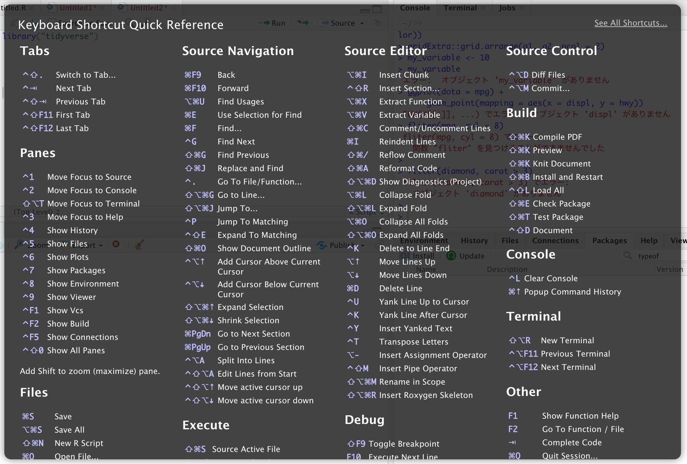

# 2章 ワークフロー：基本

### 2.0 ライブラリーの読み込み 

```text
library("tidyverse")
```

### 2.1 コーディングの基本


練習問題はありません


### 2.2 名前の中には何があるのか。


練習問題はありません


### 2.3 関数呼び出し

#### 練習問題1 : 次のコードは何がおかしいのか。

`i`が`ı`になっているためエラーが起こります。類似文字を区別しやすいフォントを使うことを推奨します。`o(O)`と`0(zero)`や`I(I)`と`l(L)`などです。

```text
my_variable <- 10
my_varıable
エラー:  オブジェクト 'my_varıable' がありません 
```

#### 練習問題2 : 次のRコマンドを正しく修正してください。

`data`が`dota`になっているため、エラーが起こります。タイポはよくあるので気をつけるしかありません。

```text
ggplot(dota = mpg) +
  geom_point(mapping = aes(x = displ, y = hwy))
 FUN(X[[i]], ...) でエラー:  オブジェクト 'displ' がありません 
```

`filter()`が`fliter()`になっているため、エラーが起こります。

```text
fliter(mpg, cyl = 8)
fliter(mpg, cyl = 8) でエラー: 
  関数 "fliter" を見つけることができませんでした 
```

`diamonds`が`diamond`になっているため、エラーが起こります。

```text
filter(diamond, carat > 3)
filter(diamond, carat > 3) でエラー: 
  オブジェクト 'diamond' がありません 
```

#### 練習問題3 : Alt + Shift + Kを押すと何が起こるのか。

キーボードショートカットが表示されます。メニューの`Tools -> Keyboard Shortcuts Help`からでも表示できます。



