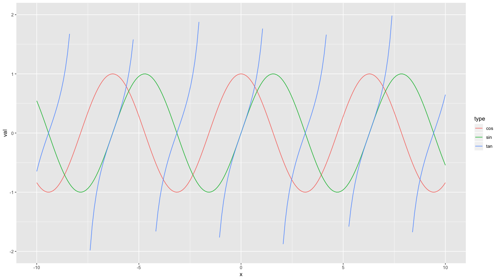
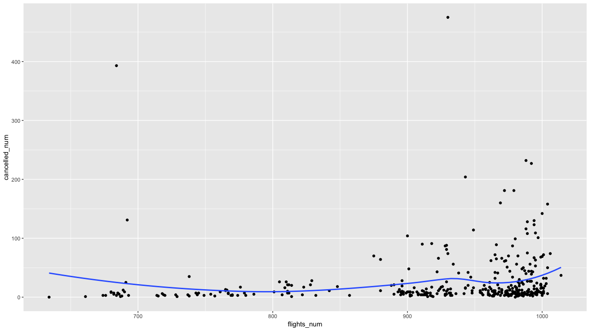
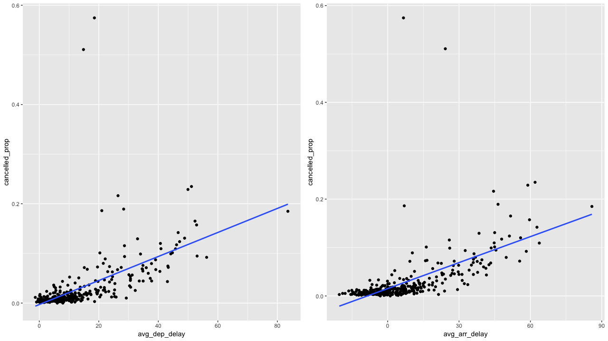
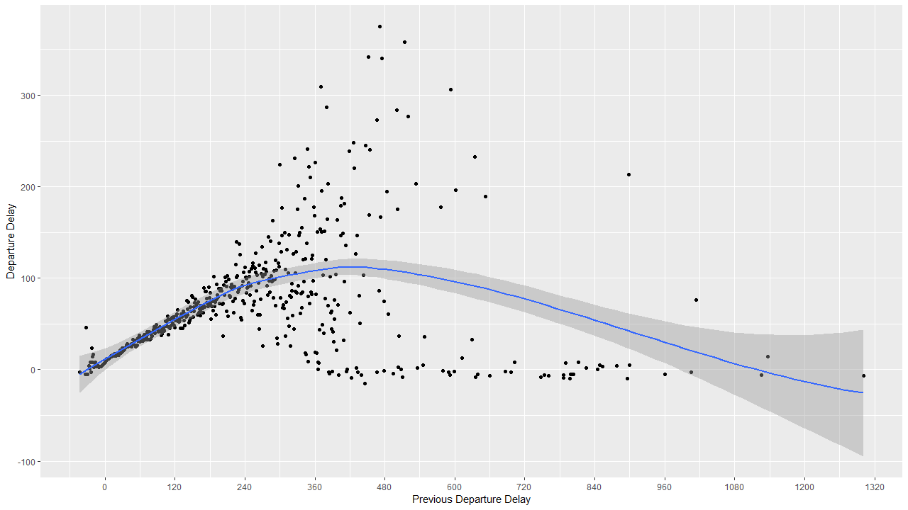

# 3章 dplyrによるデータ変換

### 3.0 ライブラリーの読み込み

```text
library("tidyverse")
library("nycflights13")
library("gridExtra")
```

### 3.1 はじめに


練習問題はありません


### 3.2 `filter()`で行にフィルタをかける

#### 練習問題1.1 : 到着が2時間以上遅れた

`arr_delay`は分単位なので、120分以上をフィルタします。

```text
flights %>% 
  filter(., arr_delay >= 120)

# A tibble: 10,200 x 19
    year month   day dep_time sched_dep_time dep_delay arr_time sched_arr_time arr_delay carrier
   <int> <int> <int>    <int>          <int>     <dbl>    <int>          <int>     <dbl> <chr>  
 1  2013     1     1      811            630       101     1047            830       137 MQ     
 2  2013     1     1      848           1835       853     1001           1950       851 MQ     
 3  2013     1     1      957            733       144     1056            853       123 UA     
 4  2013     1     1     1114            900       134     1447           1222       145 UA     
 5  2013     1     1     1505           1310       115     1638           1431       127 EV     
 6  2013     1     1     1525           1340       105     1831           1626       125 B6     
 7  2013     1     1     1549           1445        64     1912           1656       136 EV     
 8  2013     1     1     1558           1359       119     1718           1515       123 EV     
 9  2013     1     1     1732           1630        62     2028           1825       123 EV     
10  2013     1     1     1803           1620       103     2008           1750       138 MQ     
# … with 10,190 more rows, and 9 more variables: flight <int>, tailnum <chr>, origin <chr>,
#   dest <chr>, air_time <dbl>, distance <dbl>, hour <dbl>, minute <dbl>, time_hour <dttm>
```

#### 練習問題1.2 : ヒューストンへのフライト

or条件で`dest == "IAH" | dest == "HOU"`と指定します。

```text
flights %>% 
  filter(., dest == "IAH" | dest == "HOU")

# A tibble: 9,313 x 19
    year month   day dep_time sched_dep_time dep_delay arr_time sched_arr_time arr_delay carrier
   <int> <int> <int>    <int>          <int>     <dbl>    <int>          <int>     <dbl> <chr>  
 1  2013     1     1      517            515         2      830            819        11 UA     
 2  2013     1     1      533            529         4      850            830        20 UA     
 3  2013     1     1      623            627        -4      933            932         1 UA     
 4  2013     1     1      728            732        -4     1041           1038         3 UA     
 5  2013     1     1      739            739         0     1104           1038        26 UA     
 6  2013     1     1      908            908         0     1228           1219         9 UA     
 7  2013     1     1     1028           1026         2     1350           1339        11 UA     
 8  2013     1     1     1044           1045        -1     1352           1351         1 UA     
 9  2013     1     1     1114            900       134     1447           1222       145 UA     
10  2013     1     1     1205           1200         5     1503           1505        -2 UA     
# … with 9,303 more rows, and 9 more variables: flight <int>, tailnum <chr>, origin <chr>,
#   dest <chr>, air_time <dbl>, distance <dbl>, hour <dbl>, minute <dbl>, time_hour <dttm>
```

この選び方だと条件が多くなると見づらくなるので、`dest %in% c("IAH", "HOU")`で指定します。

```text
flights %>% 
  filter(., dest %in% c("IAH", "HOU"))
  
# A tibble: 9,313 x 19
    year month   day dep_time sched_dep_time dep_delay arr_time sched_arr_time arr_delay carrier
   <int> <int> <int>    <int>          <int>     <dbl>    <int>          <int>     <dbl> <chr>  
 1  2013     1     1      517            515         2      830            819        11 UA     
 2  2013     1     1      533            529         4      850            830        20 UA     
 3  2013     1     1      623            627        -4      933            932         1 UA     
 4  2013     1     1      728            732        -4     1041           1038         3 UA     
 5  2013     1     1      739            739         0     1104           1038        26 UA     
 6  2013     1     1      908            908         0     1228           1219         9 UA     
 7  2013     1     1     1028           1026         2     1350           1339        11 UA     
 8  2013     1     1     1044           1045        -1     1352           1351         1 UA     
 9  2013     1     1     1114            900       134     1447           1222       145 UA     
10  2013     1     1     1205           1200         5     1503           1505        -2 UA     
# … with 9,303 more rows, and 9 more variables: flight <int>, tailnum <chr>, origin <chr>,
#   dest <chr>, air_time <dbl>, distance <dbl>, hour <dbl>, minute <dbl>, time_hour <dttm>
```

指定したもの以外を抜き出す`%nin%`は実装されていないので、自分で作る必要があります。

```text
`%nin%` = Negate(`%in%`)

flights %>% 
  filter(., dest %nin% c("IAH", "HOU"))
```

#### 練習問題1.3 : United, American, deltaのフライト

`%in%`で複数指定しますが、これだと正しくデータを取得できません。

```text
flights %>% 
  filter(., carrier %in% c("United", "American", "Delta"))

# A tibble: 0 x 19
# … with 19 variables: year <int>, month <int>, day <int>, dep_time <int>, sched_dep_time <int>,
#   dep_delay <dbl>, arr_time <int>, sched_arr_time <int>, arr_delay <dbl>, carrier <chr>,
#   flight <int>, tailnum <chr>, origin <chr>, dest <chr>, air_time <dbl>, distance <dbl>,
#   hour <dbl>, minute <dbl>, time_hour <dttm>
```

理由は簡単で、実際に使われているのはキャリアコードだからです。実務でもよく起こるエラーです。実際に調べると、Deltaのキャリアコードは`"DL"`、Americanの場合`"AA"`、Unitedの場合です`"UA"`。

```text
airlines
# A tibble: 16 x 2

   carrier name                       
   <chr>   <chr>                      
 1 9E      Endeavor Air Inc.          
 2 AA      American Airlines Inc.     
 3 AS      Alaska Airlines Inc.       
 4 B6      JetBlue Airways            
 5 DL      Delta Air Lines Inc.       
 6 EV      ExpressJet Airlines Inc.   
 7 F9      Frontier Airlines Inc.     
 8 FL      AirTran Airways Corporation
 9 HA      Hawaiian Airlines Inc.     
10 MQ      Envoy Air                  
11 OO      SkyWest Airlines Inc.      
12 UA      United Air Lines Inc.      
13 US      US Airways Inc.            
14 VX      Virgin America             
15 WN      Southwest Airlines Co.     
16 YV      Mesa Airlines Inc.   
```

キャリコードを指定して、フィルタします。

```text
flights %>% 
  filter(., carrier %in% c("AA", "DL", "UA"))

# A tibble: 139,504 x 19
    year month   day dep_time sched_dep_time dep_delay arr_time sched_arr_time arr_delay carrier
   <int> <int> <int>    <int>          <int>     <dbl>    <int>          <int>     <dbl> <chr>  
 1  2013     1     1      517            515         2      830            819        11 UA     
 2  2013     1     1      533            529         4      850            830        20 UA     
 3  2013     1     1      542            540         2      923            850        33 AA     
 4  2013     1     1      554            600        -6      812            837       -25 DL     
 5  2013     1     1      554            558        -4      740            728        12 UA     
 6  2013     1     1      558            600        -2      753            745         8 AA     
 7  2013     1     1      558            600        -2      924            917         7 UA     
 8  2013     1     1      558            600        -2      923            937       -14 UA     
 9  2013     1     1      559            600        -1      941            910        31 AA     
10  2013     1     1      559            600        -1      854            902        -8 UA     
# … with 139,494 more rows, and 9 more variables: flight <int>, tailnum <chr>, origin <chr>,
#   dest <chr>, air_time <dbl>, distance <dbl>, hour <dbl>, minute <dbl>, time_hour <dttm>
```

#### 練習問題1.4 : 夏期\(7~9月\)のフライト

and条件で`month >= 7, month <= 9`と指定します。

```text
flights %>% 
  filter(., month >= 7, month <= 9)

# A tibble: 86,326 x 19
    year month   day dep_time sched_dep_time dep_delay arr_time sched_arr_time arr_delay carrier
   <int> <int> <int>    <int>          <int>     <dbl>    <int>          <int>     <dbl> <chr>  
 1  2013     7     1        1           2029       212      236           2359       157 B6     
 2  2013     7     1        2           2359         3      344            344         0 B6     
 3  2013     7     1       29           2245       104      151              1       110 B6     
 4  2013     7     1       43           2130       193      322             14       188 B6     
 5  2013     7     1       44           2150       174      300            100       120 AA     
 6  2013     7     1       46           2051       235      304           2358       186 B6     
 7  2013     7     1       48           2001       287      308           2305       243 VX     
 8  2013     7     1       58           2155       183      335             43       172 B6     
 9  2013     7     1      100           2146       194      327             30       177 B6     
10  2013     7     1      100           2245       135      337            135       122 B6     
# … with 86,316 more rows, and 9 more variables: flight <int>, tailnum <chr>, origin <chr>,
#   dest <chr>, air_time <dbl>, distance <dbl>, hour <dbl>, minute <dbl>, time_hour <dttm>
```

`month %in% 7:9`と指定しても同じデータをフィルタできます。こうすることで簡潔に記述できます。

```text
flights %>% 
  filter(., month %in% 7:9)

# A tibble: 86,326 x 19
    year month   day dep_time sched_dep_time dep_delay arr_time sched_arr_time arr_delay carrier
   <int> <int> <int>    <int>          <int>     <dbl>    <int>          <int>     <dbl> <chr>  
 1  2013     7     1        1           2029       212      236           2359       157 B6     
 2  2013     7     1        2           2359         3      344            344         0 B6     
 3  2013     7     1       29           2245       104      151              1       110 B6     
 4  2013     7     1       43           2130       193      322             14       188 B6     
 5  2013     7     1       44           2150       174      300            100       120 AA     
 6  2013     7     1       46           2051       235      304           2358       186 B6     
 7  2013     7     1       48           2001       287      308           2305       243 VX     
 8  2013     7     1       58           2155       183      335             43       172 B6     
 9  2013     7     1      100           2146       194      327             30       177 B6     
10  2013     7     1      100           2245       135      337            135       122 B6     
# … with 86,316 more rows, and 9 more variables: flight <int>, tailnum <chr>, origin <chr>,
#   dest <chr>, air_time <dbl>, distance <dbl>, hour <dbl>, minute <dbl>, time_hour <dttm>
```

#### 練習問題1.5 : 到着が2時間遅れたが、出発が遅れなかったフライト

```text
flights %>% 
　filter(., arr_delay > 120, dep_delay <= 0)

# A tibble: 29 x 19
    year month   day dep_time sched_dep_time dep_delay arr_time sched_arr_time arr_delay carrier
   <int> <int> <int>    <int>          <int>     <dbl>    <int>          <int>     <dbl> <chr>  
 1  2013     1    27     1419           1420        -1     1754           1550       124 MQ     
 2  2013    10     7     1350           1350         0     1736           1526       130 EV     
 3  2013    10     7     1357           1359        -2     1858           1654       124 AA     
 4  2013    10    16      657            700        -3     1258           1056       122 B6     
 5  2013    11     1      658            700        -2     1329           1015       194 VX     
 6  2013     3    18     1844           1847        -3       39           2219       140 UA     
 7  2013     4    17     1635           1640        -5     2049           1845       124 MQ     
 8  2013     4    18      558            600        -2     1149            850       179 AA     
 9  2013     4    18      655            700        -5     1213            950       143 AA     
10  2013     5    22     1827           1830        -3     2217           2010       127 MQ     
# … with 19 more rows, and 9 more variables: flight <int>, tailnum <chr>, origin <chr>,
#   dest <chr>, air_time <dbl>, distance <dbl>, hour <dbl>, minute <dbl>, time_hour <dttm>
```

#### 練習問題1.6 : 遅延は少なくとも1時間を超えたが、運行で30分以上取り返したフライト

1時間以上遅延したものは`dep_delay >= 60`でフィルタでき、30分以上取り戻したものは、`dep_delay - arr_delay > 30` となる。`dep_delay - arr_delay == 0`の場合、遅れた分、遅れて到着しているため。

```text
flights %>% 
  filter(., dep_delay >= 60, dep_delay - arr_delay > 30)

# A tibble: 1,844 x 19
    year month   day dep_time sched_dep_time dep_delay arr_time sched_arr_time arr_delay carrier
   <int> <int> <int>    <int>          <int>     <dbl>    <int>          <int>     <dbl> <chr>  
 1  2013     1     1     2205           1720       285       46           2040       246 AA     
 2  2013     1     1     2326           2130       116      131             18        73 B6     
 3  2013     1     3     1503           1221       162     1803           1555       128 UA     
 4  2013     1     3     1839           1700        99     2056           1950        66 AA     
 5  2013     1     3     1850           1745        65     2148           2120        28 AA     
 6  2013     1     3     1941           1759       102     2246           2139        67 UA     
 7  2013     1     3     1950           1845        65     2228           2227         1 B6     
 8  2013     1     3     2015           1915        60     2135           2111        24 9E     
 9  2013     1     3     2257           2000       177       45           2224       141 9E     
10  2013     1     4     1917           1700       137     2135           1950       105 AA     
# … with 1,834 more rows, and 9 more variables: flight <int>, tailnum <chr>, origin <chr>,
#   dest <chr>, air_time <dbl>, distance <dbl>, hour <dbl>, minute <dbl>, time_hour <dttm>
```

#### 練習問題1.7 : 深夜0時〜午前6時までのフライト

深夜0時は、`dep_time == 0000`ではないので、`dep_time == 2400`で指定します。

```text
flights %>% 
  filter(., dep_time <= 600 | dep_time == 2400)

# A tibble: 9,373 x 19
    year month   day dep_time sched_dep_time dep_delay arr_time sched_arr_time arr_delay carrier
   <int> <int> <int>    <int>          <int>     <dbl>    <int>          <int>     <dbl> <chr>  
 1  2013     1     1      517            515         2      830            819        11 UA     
 2  2013     1     1      533            529         4      850            830        20 UA     
 3  2013     1     1      542            540         2      923            850        33 AA     
 4  2013     1     1      544            545        -1     1004           1022       -18 B6     
 5  2013     1     1      554            600        -6      812            837       -25 DL     
 6  2013     1     1      554            558        -4      740            728        12 UA     
 7  2013     1     1      555            600        -5      913            854        19 B6     
 8  2013     1     1      557            600        -3      709            723       -14 EV     
 9  2013     1     1      557            600        -3      838            846        -8 B6     
10  2013     1     1      558            600        -2      753            745         8 AA     
# … with 9,363 more rows, and 9 more variables: flight <int>, tailnum <chr>, origin <chr>,
#   dest <chr>, air_time <dbl>, distance <dbl>, hour <dbl>, minute <dbl>, time_hour <dttm>
```

モジュロ演算を使用すればもう少し簡潔に表現できます。

```text
flights %>% 
  filter(., dep_time %% 2400 <= 600)
  
# A tibble: 9,373 x 19
    year month   day dep_time sched_dep_time dep_delay arr_time sched_arr_time arr_delay carrier
   <int> <int> <int>    <int>          <int>     <dbl>    <int>          <int>     <dbl> <chr>  
 1  2013     1     1      517            515         2      830            819        11 UA     
 2  2013     1     1      533            529         4      850            830        20 UA     
 3  2013     1     1      542            540         2      923            850        33 AA     
 4  2013     1     1      544            545        -1     1004           1022       -18 B6     
 5  2013     1     1      554            600        -6      812            837       -25 DL     
 6  2013     1     1      554            558        -4      740            728        12 UA     
 7  2013     1     1      555            600        -5      913            854        19 B6     
 8  2013     1     1      557            600        -3      709            723       -14 EV     
 9  2013     1     1      557            600        -3      838            846        -8 B6     
10  2013     1     1      558            600        -2      753            745         8 AA     
# … with 9,363 more rows, and 9 more variables: flight <int>, tailnum <chr>, origin <chr>,
#   dest <chr>, air_time <dbl>, distance <dbl>, hour <dbl>, minute <dbl>, time_hour <dttm>
```

#### 練習問題2 : `between()`を使って、先程の問題を簡略化しなさい。

```text
flights %>% 
  filter(., between(month, 7, 9))

# A tibble: 86,326 x 19
    year month   day dep_time sched_dep_time dep_delay arr_time sched_arr_time arr_delay carrier
   <int> <int> <int>    <int>          <int>     <dbl>    <int>          <int>     <dbl> <chr>  
 1  2013     7     1        1           2029       212      236           2359       157 B6     
 2  2013     7     1        2           2359         3      344            344         0 B6     
 3  2013     7     1       29           2245       104      151              1       110 B6     
 4  2013     7     1       43           2130       193      322             14       188 B6     
 5  2013     7     1       44           2150       174      300            100       120 AA     
 6  2013     7     1       46           2051       235      304           2358       186 B6     
 7  2013     7     1       48           2001       287      308           2305       243 VX     
 8  2013     7     1       58           2155       183      335             43       172 B6     
 9  2013     7     1      100           2146       194      327             30       177 B6     
10  2013     7     1      100           2245       135      337            135       122 B6     
# … with 86,316 more rows, and 9 more variables: flight <int>, tailnum <chr>, origin <chr>,
#   dest <chr>, air_time <dbl>, distance <dbl>, hour <dbl>, minute <dbl>, time_hour <dttm>
> 
```

#### 練習問題3 : `dep_time`が欠損値のフライトはいくつあるか。

`is.na(dep_time)`で`TRUE`かどうかを判定し、`TRUE`をフィルタします。

```text
flights %>% 
  filter(., is.na(dep_time))

# A tibble: 8,255 x 19
    year month   day dep_time sched_dep_time dep_delay arr_time sched_arr_time arr_delay carrier
   <int> <int> <int>    <int>          <int>     <dbl>    <int>          <int>     <dbl> <chr>  
 1  2013     1     1       NA           1630        NA       NA           1815        NA EV     
 2  2013     1     1       NA           1935        NA       NA           2240        NA AA     
 3  2013     1     1       NA           1500        NA       NA           1825        NA AA     
 4  2013     1     1       NA            600        NA       NA            901        NA B6     
 5  2013     1     2       NA           1540        NA       NA           1747        NA EV     
 6  2013     1     2       NA           1620        NA       NA           1746        NA EV     
 7  2013     1     2       NA           1355        NA       NA           1459        NA EV     
 8  2013     1     2       NA           1420        NA       NA           1644        NA EV     
 9  2013     1     2       NA           1321        NA       NA           1536        NA EV     
10  2013     1     2       NA           1545        NA       NA           1910        NA AA     
# … with 8,245 more rows, and 9 more variables: flight <int>, tailnum <chr>, origin <chr>,
#   dest <chr>, air_time <dbl>, distance <dbl>, hour <dbl>, minute <dbl>, time_hour <dttm>
```

これだと欠損値の数がカウントできないので、カウントしたい場合は`map()`を使うと簡潔。

```text
flights %>% 
  purrr::map_int(., function(x){sum(is.na(x))})

　    year          month            day       dep_time sched_dep_time      dep_delay 
      　 0              0              0           8255              0           8255 
　arr_time sched_arr_time      arr_delay        carrier         flight        tailnum 
    　8713              0           9430              0              0           2512 
  　origin           dest       air_time       distance           hour         minute 
　       0              0           9430              0              0              0 
time_hour 
        0
```

#### 練習問題4 : `NA^0`はなぜ欠損値にならないのか。

Rでは、`NA^0 == 1`となっています。したがって、Rでは`x^0 = 1`となります。他には、下記のような特徴があります。

```text
NA | TRUE
[1] TRUE

NA | FALSE
[1] NA

NA & TRUE
[1] NA

NA & FALSE
[1] FALSE

NA * 0
[1] NA
```

### 3.3 `arrange()`で行を配置する

#### 練習問題1 : 欠損値を頭から並べるためには`arrange()`をどう使えばよいか。

`arrange()`を使うと`NA`は最後に並べられます。なので、`tail()`でお尻のデータを表示させることでも、目的は達成できます。

```text
flights %>% 
  arrange(dep_time) %>%
  tail()

# A tibble: 6 x 19
   year month   day dep_time sched_dep_time dep_delay arr_time sched_arr_time arr_delay carrier flight tailnum origin dest  air_time
  <int> <int> <int>    <int>          <int>     <dbl>    <int>          <int>     <dbl> <chr>    <int> <chr>   <chr>  <chr>    <dbl>
1  2013     9    30       NA           1842        NA       NA           2019        NA EV        5274 N740EV  LGA    BNA         NA
2  2013     9    30       NA           1455        NA       NA           1634        NA 9E        3393 NA      JFK    DCA         NA
3  2013     9    30       NA           2200        NA       NA           2312        NA 9E        3525 NA      LGA    SYR         NA
4  2013     9    30       NA           1210        NA       NA           1330        NA MQ        3461 N535MQ  LGA    BNA         NA
5  2013     9    30       NA           1159        NA       NA           1344        NA MQ        3572 N511MQ  LGA    CLE         NA
6  2013     9    30       NA            840        NA       NA           1020        NA MQ        3531 N839MQ  LGA    RDU         NA
# ... with 4 more variables: distance <dbl>, hour <dbl>, minute <dbl>, time_hour <dttm>
```

`desc(dep_time)`では、`NA`から並べることはできません。

```text
flights %>% 
  arrange(desc(dep_time))

# A tibble: 336,776 x 19
    year month   day dep_time sched_dep_time dep_delay arr_time sched_arr_time arr_delay carrier flight tailnum origin dest  air_time
   <int> <int> <int>    <int>          <int>     <dbl>    <int>          <int>     <dbl> <chr>    <int> <chr>   <chr>  <chr>    <dbl>
 1  2013    10    30     2400           2359         1      327            337       -10 B6         839 N661JB  JFK    BQN        182
 2  2013    11    27     2400           2359         1      515            445        30 B6         745 N629JB  JFK    PSE        230
 3  2013    12     5     2400           2359         1      427            440       -13 B6        1503 N587JB  JFK    SJU        182
 4  2013    12     9     2400           2359         1      432            440        -8 B6        1503 N705JB  JFK    SJU        195
 5  2013    12     9     2400           2250        70       59           2356        63 B6        1816 N187JB  JFK    SYR         41
 6  2013    12    13     2400           2359         1      432            440        -8 B6        1503 N587JB  JFK    SJU        192
 7  2013    12    19     2400           2359         1      434            440        -6 B6        1503 N561JB  JFK    SJU        193
 8  2013    12    29     2400           1700       420      302           2025       397 AA        2379 N3GMAA  LGA    MIA        161
 9  2013     2     7     2400           2359         1      432            436        -4 B6         727 N559JB  JFK    BQN        186
10  2013     2     7     2400           2359         1      443            444        -1 B6         739 N766JB  JFK    PSE        194
# ... with 336,766 more rows, and 4 more variables: distance <dbl>, hour <dbl>, minute <dbl>, time_hour <dttm>
```

他の方法として、 `NA`をソートしてから、`dep_timeを`昇順にソートすることも可能です。

```text
flights %>% 
  arrange(desc(is.na(dep_time)), dep_time)

# A tibble: 336,776 x 19
    year month   day dep_time sched_dep_time dep_delay arr_time sched_arr_time arr_delay carrier flight tailnum origin dest  air_time
   <int> <int> <int>    <int>          <int>     <dbl>    <int>          <int>     <dbl> <chr>    <int> <chr>   <chr>  <chr>    <dbl>
 1  2013     1     1       NA           1630        NA       NA           1815        NA EV        4308 N18120  EWR    RDU         NA
 2  2013     1     1       NA           1935        NA       NA           2240        NA AA         791 N3EHAA  LGA    DFW         NA
 3  2013     1     1       NA           1500        NA       NA           1825        NA AA        1925 N3EVAA  LGA    MIA         NA
 4  2013     1     1       NA            600        NA       NA            901        NA B6         125 N618JB  JFK    FLL         NA
 5  2013     1     2       NA           1540        NA       NA           1747        NA EV        4352 N10575  EWR    CVG         NA
 6  2013     1     2       NA           1620        NA       NA           1746        NA EV        4406 N13949  EWR    PIT         NA
 7  2013     1     2       NA           1355        NA       NA           1459        NA EV        4434 N10575  EWR    MHT         NA
 8  2013     1     2       NA           1420        NA       NA           1644        NA EV        4935 N759EV  EWR    ATL         NA
 9  2013     1     2       NA           1321        NA       NA           1536        NA EV        3849 N13550  EWR    IND         NA
10  2013     1     2       NA           1545        NA       NA           1910        NA AA         133 NA      JFK    LAX         NA
# ... with 336,766 more rows, and 4 more variables: distance <dbl>, hour <dbl>, minute <dbl>, time_hour <dttm>
```

#### 練習問題2 : `flights`を並べて、遅延が最も大きなフライト、最も早朝に飛んだフライトを探す。

`desc(dep_delay)`で、降順に並び替えれば、遅延が最も大きいフライトを検索できます。出発は1301分遅れなので、21時間41分遅れです。

```text
flights %>% 
  arrange(desc(dep_delay))

# A tibble: 336,776 x 19
    year month   day dep_time sched_dep_time dep_delay arr_time sched_arr_time arr_delay carrier flight tailnum origin dest  air_time
   <int> <int> <int>    <int>          <int>     <dbl>    <int>          <int>     <dbl> <chr>    <int> <chr>   <chr>  <chr>    <dbl>
 1  2013     1     9      641            900      1301     1242           1530      1272 HA          51 N384HA  JFK    HNL        640
 2  2013     6    15     1432           1935      1137     1607           2120      1127 MQ        3535 N504MQ  JFK    CMH         74
 3  2013     1    10     1121           1635      1126     1239           1810      1109 MQ        3695 N517MQ  EWR    ORD        111
 4  2013     9    20     1139           1845      1014     1457           2210      1007 AA         177 N338AA  JFK    SFO        354
 5  2013     7    22      845           1600      1005     1044           1815       989 MQ        3075 N665MQ  JFK    CVG         96
 6  2013     4    10     1100           1900       960     1342           2211       931 DL        2391 N959DL  JFK    TPA        139
 7  2013     3    17     2321            810       911      135           1020       915 DL        2119 N927DA  LGA    MSP        167
 8  2013     6    27      959           1900       899     1236           2226       850 DL        2007 N3762Y  JFK    PDX        313
 9  2013     7    22     2257            759       898      121           1026       895 DL        2047 N6716C  LGA    ATL        109
10  2013    12     5      756           1700       896     1058           2020       878 AA         172 N5DMAA  EWR    MIA        149
# ... with 336,766 more rows, and 4 more variables: distance <dbl>, hour <dbl>, minute <dbl>, time_hour <dttm>
```

#### 練習問題3 : `flights`を並べて、最速のフライトを探す

20分ほどしかフライトしていないデータがあるようです。アメリカの土地勘がわからないですが、どの航路なんでしょうか。データから探索することで、誤入力かどうかを調べるのも良いかもしれません。

```text
flights %>% 
  arrange(air_time)

# A tibble: 336,776 x 19
    year month   day dep_time sched_dep_time dep_delay arr_time sched_arr_time arr_delay carrier flight tailnum origin dest  air_time
   <int> <int> <int>    <int>          <int>     <dbl>    <int>          <int>     <dbl> <chr>    <int> <chr>   <chr>  <chr>    <dbl>
 1  2013     1    16     1355           1315        40     1442           1411        31 EV        4368 N16911  EWR    BDL         20
 2  2013     4    13      537            527        10      622            628        -6 EV        4631 N12167  EWR    BDL         20
 3  2013    12     6      922            851        31     1021            954        27 EV        4276 N27200  EWR    BDL         21
 4  2013     2     3     2153           2129        24     2247           2224        23 EV        4619 N13913  EWR    PHL         21
 5  2013     2     5     1303           1315       -12     1342           1411       -29 EV        4368 N13955  EWR    BDL         21
 6  2013     2    12     2123           2130        -7     2211           2225       -14 EV        4619 N12921  EWR    PHL         21
 7  2013     3     2     1450           1500       -10     1547           1608       -21 US        2132 N947UW  LGA    BOS         21
 8  2013     3     8     2026           1935        51     2131           2056        35 9E        3650 N8501F  JFK    PHL         21
 9  2013     3    18     1456           1329        87     1533           1426        67 EV        4118 N12160  EWR    BDL         21
10  2013     3    19     2226           2145        41     2305           2246        19 EV        4276 N16987  EWR    BDL         21
# ... with 336,766 more rows, and 4 more variables: distance <dbl>, hour <dbl>, minute <dbl>, time_hour <dttm>
```

#### 練習問題4 : `flights`を並べて、最長距離のフライトを探す

幅の制限上、`distance`が見えなくなるので、`select()`で先頭に持ってきています。最長フライトはHA 51のJFKからHNLで、4,983マイルなので8,020kmくらいでしょうか。

```text
flights %>% 
  arrange(desc(distance)) %>% 
  select(distance, everything())

# A tibble: 336,776 x 19
   distance  year month   day dep_time sched_dep_time dep_delay arr_time sched_arr_time arr_delay carrier flight tailnum origin dest 
      <dbl> <int> <int> <int>    <int>          <int>     <dbl>    <int>          <int>     <dbl> <chr>    <int> <chr>   <chr>  <chr>
 1     4983  2013     1     1      857            900        -3     1516           1530       -14 HA          51 N380HA  JFK    HNL  
 2     4983  2013     1     2      909            900         9     1525           1530        -5 HA          51 N380HA  JFK    HNL  
 3     4983  2013     1     3      914            900        14     1504           1530       -26 HA          51 N380HA  JFK    HNL  
 4     4983  2013     1     4      900            900         0     1516           1530       -14 HA          51 N384HA  JFK    HNL  
 5     4983  2013     1     5      858            900        -2     1519           1530       -11 HA          51 N381HA  JFK    HNL  
 6     4983  2013     1     6     1019            900        79     1558           1530        28 HA          51 N385HA  JFK    HNL  
 7     4983  2013     1     7     1042            900       102     1620           1530        50 HA          51 N385HA  JFK    HNL  
 8     4983  2013     1     8      901            900         1     1504           1530       -26 HA          51 N389HA  JFK    HNL  
 9     4983  2013     1     9      641            900      1301     1242           1530      1272 HA          51 N384HA  JFK    HNL  
10     4983  2013     1    10      859            900        -1     1449           1530       -41 HA          51 N388HA  JFK    HNL  
# ... with 336,766 more rows, and 4 more variables: air_time <dbl>, hour <dbl>, minute <dbl>, time_hour <dttm>
```

### 3.4 `select()`で列を選ぶ

#### 練習問題1 : `flights`から`dep_time`, `dep_delay`, `arr_time`, `arr_delay`を選ぶ方法をたくさん探しなさい。

変数名を指定する方法、列番号を指定する方法、文字列ベクトルを使う方法、ヘルパー関数を使う方法、正規表現を使う方法などが考えられます。列番号を指定する方法は、列を並び替えると意図した変数を選択できないので、推奨しません。

```text
flights %>% 
  select(dep_time, dep_delay, arr_time, arr_delay)

# 非推奨
flights %>% 
  select(4, 6, 7, 9)

vals <- c("dep_time", "dep_delay", "arr_time", "arr_delay")
flights %>% 
  select(one_of(vals))

flights %>% 
  select(starts_with("dep_"), starts_with("arr_"))

flights %>% 
  select(matches("^(dep|arr)_(time|delay)$"))
```

もし、この変数のセットをよく使うのであれば、変数名自体を変更することも良いかもしれません。文字列ベクトルを使う方法と似ています。

```text
f2 <- flights %>%
  rename(
    dep_time_index = dep_time,
    dep_delay_index = dep_delay,
    arr_time_index = arr_time,
    arr_delay_index = arr_delay
  )

f2 %>% 
  select(contains("_index"))

```

#### 練習問題2 : `select()`において、変数名を繰り返すとどうなるのか。

変数名を繰り返しても、繰り返した分、取得できるわけではありません。特に、エラーや警告を出したりしないので、注意が必要です。

```text
flights %>% 
  select(year, year, year, year)

# A tibble: 336,776 x 1
    year
   <int>
 1  2013
 2  2013
 3  2013
 4  2013
 5  2013
 6  2013
 7  2013
 8  2013
 9  2013
10  2013
# ... with 336,766 more rows
```

#### 練習問題3 : `one_of()`は何をするのか。次のベクトルと一緒に使うとなぜ便利なのか。

文字列のベクトルで変数名を指定することができるので便利かと思います。`select_if()`の場合、文字列と整数列の1列だけを取得したい場合に困難ですが、このように文字列で指定しておけば自由に変数を取得できます。

```text
vals <- c("dep_time", "dep_delay", "arr_time", "arr_delay")
flights %>% 
  select(one_of(vals))

# A tibble: 336,776 x 4
   dep_time dep_delay arr_time arr_delay
      <int>     <dbl>    <int>     <dbl>
 1      517         2      830        11
 2      533         4      850        20
 3      542         2      923        33
 4      544        -1     1004       -18
 5      554        -6      812       -25
 6      554        -4      740        12
 7      555        -5      913        19
 8      557        -3      709       -14
 9      557        -3      838        -8
10      558        -2      753         8
# ... with 336,766 more rows
```

下記のように使用することは、コードが明確ではなくなるので、推奨しません。`arr_time`という変数名はデータの中に存在する変数名なので、それを文字列ベクトルの名前属性に割り当てるのは、混乱のもとなので、避けるべきです。推奨はしませんが、`!!!`演算子を利用し、評価の方法なども合わせて変更して違いを明らかにするべきですが、やはり非推奨です。

```text
arr_time <- c("arr_delay")

flights %>% 
  select(one_of(!!!arr_time))
```

#### 練習問題4 : 次のコードの実行結果は驚くものだが、`select()`のヘルパー関数は、デフォルトで大文字、小文字をどう扱うのか。

例えば、`contains()`や`start_with()`は、デフォルトの設定では、文字の大小は問いません。これは、カラム名よりもデータの値を確認することが目的で`select()`が使われるため、検索の簡便性を高めるという、思想を反映しているためかもしれません。また、MySQLなどのデータベースでは大小を区別しないという理由もあるかもしれません。

```text
flights %>% 
  select(contains("ARR"))

# A tibble: 336,776 x 4
   arr_time sched_arr_time arr_delay carrier
      <int>          <int>     <dbl> <chr>  
 1      830            819        11 UA     
 2      850            830        20 UA     
 3      923            850        33 AA     
 4     1004           1022       -18 B6     
 5      812            837       -25 DL     
 6      740            728        12 UA     
 7      913            854        19 B6     
 8      709            723       -14 EV     
 9      838            846        -8 B6     
10      753            745         8 AA     
# ... with 336,766 more rows

flights %>% 
  select(starts_with("ARR"))

# A tibble: 336,776 x 2
   arr_time arr_delay
      <int>     <dbl>
 1      830        11
 2      850        20
 3      923        33
 4     1004       -18
 5      812       -25
 6      740        12
 7      913        19
 8      709       -14
 9      838        -8
10      753         8
# ... with 336,766 more rows
```

文字の大小を正確に判定させるためには、`ignore.case = FALSE`を設定します。

```text
flights %>% 
  select(contains("ARR", ignore.case = FALSE))
# A tibble: 336,776 x 0
```

### 3.5 `mutate()`で新しい変数を追加する

#### 練習問題1 : `dep_time`, `sched_dep_time`を、深夜0時以降の分数のより便利な表現に変換しなさい。

例えば`dep_time`は、分単位で記録されています。下記の例の一番上のレコードだと5時17分です。これを317分に変換するためには、100で割り、60を乗算し、残りの`dep_time`を100 で割った値を加算します。

```text
flights %>% 
  select(dep_time) %>% 
  slice(1:5)

# A tibble: 5 x 1
  dep_time
     <int>
1      517
2      533
3      542
4      544
5      554

flights %>% 
  select(dep_time) %>% 
  slice(1:5) %>% 
  mutate(min = (dep_time %/% 100 * 60 + dep_time %% 100))

# A tibble: 5 x 2
  dep_time   min
     <int> <dbl>
1      517   317
2      533   333
3      542   342
4      544   344
5      554   354
```

これだと24:00のレコードが1440になってしまうので、1440で割って2400を0に変換します。`sched_dep_time`も同様に処理します。

```text
(2400 %/% 100 * 60 + 2400 %% 100)
[1] 1440

flights %>% 
  select(dep_time) %>% 
  slice(1:5) %>% 
  mutate(min = (dep_time %/% 100 * 60 + dep_time %% 100) %% 1440)

# A tibble: 5 x 2
  dep_time   min
     <int> <dbl>
1      517   317
2      533   333
3      542   342
4      544   344
5      554   354

flights %>% 
  select(dep_time) %>% 
  filter(dep_time == 2400) %>% 
  mutate(min0 = (dep_time %/% 100 * 60 + dep_time %% 100),
         min1 = (dep_time %/% 100 * 60 + dep_time %% 100) %% 1440)

# A tibble: 29 x 3
   dep_time  min0  min1
      <int> <dbl> <dbl>
 1     2400  1440     0
 2     2400  1440     0
 3     2400  1440     0
 4     2400  1440     0
 5     2400  1440     0
 6     2400  1440     0
 7     2400  1440     0
 8     2400  1440     0
 9     2400  1440     0
10     2400  1440     0
# … with 19 more rows
```

#### 練習問題2 : `air_time`を`arr_time - dep_time`と比べなさい。

`air_time - (arr_time - dep_time)`の差が0であるならば、飛行時間と\(到着時間-出発時間\)の記録が正しく記録されていることが期待できます。しかし、実際には大きくずれています。これは、日をまたいでいたり、タイムゾーンによる差異が影響しているのかもしれません。探索してみてください。

```text
flights %>%
  select(dep_time, arr_time, air_time) %>% 
  mutate(
    dep_time = mins_conv(dep_time),
    arr_time = mins_conv(arr_time),
    air_time_diff = air_time - (arr_time - dep_time)
  ) %>% 
  filter(air_time_diff != 0) %>% 
  arrange(desc(air_time_diff))
  
  # A tibble: 327,150 x 4
   dep_time arr_time air_time air_time_diff
      <dbl>    <dbl>    <dbl>         <dbl>
 1     1075       34      648          1689
 2     1270        1      340          1609
 3     1302       32      336          1606
 4     1338       24      292          1606
 5     1305       23      324          1606
 6     1426      133      313          1606
 7     1376       64      294          1606
 8     1406       91      290          1605
 9     1358       81      328          1605
10     1300       31      336          1605
# … with 327,140 more rows
```

#### 練習問題3 : `dep_time`, `sched_dep_time`, `dep_delay`を比べなさい。

`dep_time - sched_dep_time = dep_delay`となるはずです。出発時刻から予定出発時刻を引けば、実際に出発で遅れた時間に対応するはずです。

```text
flights %>%
  select(dep_time, sched_dep_time, dep_delay) %>% 
  mutate(
    dep_time = mins_conv(dep_time),
    sched_dep_time = mins_conv(sched_dep_time))
    
# A tibble: 336,776 x 3
   dep_time sched_dep_time dep_delay
      <dbl>          <dbl>     <dbl>
 1      317            315         2
 2      333            329         4
 3      342            340         2
 4      344            345        -1
 5      354            360        -6
 6      354            358        -4
 7      355            360        -5
 8      357            360        -3
 9      357            360        -3
10      358            360        -2
# … with 336,766 more rows
```

しかし、実際には一致しないものも多く、何が原因か探索してみてください。

```text
flights %>%
  select(dep_time, sched_dep_time, dep_delay) %>%
  mutate(
    dep_time = mins_conv(dep_time),
    sched_dep_time = mins_conv(sched_dep_time),
    dep_delay_cal = dep_time - sched_dep_time,
    flg = (dep_delay == dep_delay_cal)
  ) %>% 
  filter(flg != TRUE)

# A tibble: 1,236 x 5
   dep_time sched_dep_time dep_delay dep_delay_cal flg  
      <dbl>          <dbl>     <dbl>         <dbl> <lgl>
 1      528           1115       853          -587 FALSE
 2       42           1439        43         -1397 FALSE
 3       86           1370       156         -1284 FALSE
 4       32           1439        33         -1407 FALSE
 5       50           1305       185         -1255 FALSE
 6      155           1439       156         -1284 FALSE
 7       25           1439        26         -1414 FALSE
 8       66           1365       141         -1299 FALSE
 9       14           1439        15         -1425 FALSE
10       37           1350       127         -1313 FALSE
# … with 1,226 more rows
```

#### 練習問題4 : 遅延が大きいフライトのランク付けしなさい。

{dplyr}のウインドウ関数を使えば、ランクをつけることができます。`min_rank()`はgapあり、`dense_rank()`はgapなしです。Gapとは、タイの順位があった場合にその次の順位を飛ばすか、飛ばさないかの違いです。ソートしなおせば、`row_numbers()`でも順位をふることは可能なので、目的に応じて使い分けてください。この例だと違いを見つけられませんが…。

```text
flights %>%
  select(carrier, flight, dep_delay) %>% 
  arrange(desc(dep_delay)) %>% 
  mutate(
    min_rank  = min_rank(desc(dep_delay)),
    row_number = row_number(desc(dep_delay)),
    dense_rank = dense_rank(desc(dep_delay))
  )
  
# A tibble: 336,776 x 6
   carrier flight dep_delay min_rank row_number dense_rank
   <chr>    <int>     <dbl>    <int>      <int>      <int>
 1 HA          51      1301        1          1          1
 2 MQ        3535      1137        2          2          2
 3 MQ        3695      1126        3          3          3
 4 AA         177      1014        4          4          4
 5 MQ        3075      1005        5          5          5
 6 DL        2391       960        6          6          6
 7 DL        2119       911        7          7          7
 8 DL        2007       899        8          8          8
 9 DL        2047       898        9          9          9
10 AA         172       896       10         10         10
# … with 336,766 more rows
```

`top_n()`という関数もありますが、こちらはデータの中からトップNのレコードを取得する**のみ**なので、並び替えは行なわれません。

```text
flights %>%
  select(carrier, flight, dep_delay) %>% 
  top_n(10, dep_delay) 

# A tibble: 10 x 3
   carrier flight dep_delay
   <chr>    <int>     <dbl>
 1 HA          51      1301
 2 MQ        3695      1126
 3 AA         172       896
 4 DL        2119       911
 5 DL        2391       960
 6 MQ        3535      1137
 7 DL        2007       899
 8 MQ        3075      1005
 9 DL        2047       898
10 AA         177      1014
```

#### 練習問題5 : `1:3 + 1:10`は何を返すか。

これはRのリサイクル規則によって、長さが大きいベクトルの長さにあうように、短い方のベクトルが繰り返されます。

```text
1:3 + 1:10
[1]  2  4  6  5  7  9  8 10 12 11

警告メッセージ: 
1:3 + 1:10 で: 
長いオブジェクトの長さが短いオブジェクトの長さの倍数になっていません 
```

リサイクル規則を書き下すとこうなります。

```text
c(1,2,3,1,2,3,1,2,3,1) + 1:10
 
[1]  2  4  6  5  7  9  8 10 12 11
```

#### 練習問題6 : Rには、どのような三角関数が用意されているのか。

* `sin()` : サイン・正弦関数
* `cos()` : コサイン ・ 余弦関数
* `tan()` : タンジェント ・ 正接関数
* `asin()`: sin の逆関数
* `acos()`: cos の逆関数
* `atan()` : tan の逆関数
* `sinh()` : ハイパボリックサイン
* `cosh()` : ハイパボリックコサイン
* `tanh()` : ハイパボリックタンジェント
* `asinh()` : sinh の逆関数
* `acosh()` : cosh の逆関数
* `atanh()` :  tanh の逆関数

```text
tibble(x = seq(-10, 10, length.out = 200),
                 sin = sin(x),
                 cos = cos(x),
                 tan = tan(x)) %>%
  gather(., key = type, val = val, sin:tan) %>% 
  ggplot(data = ., mapping = aes(x = x, y = val, col = type)) + 
  geom_line() + 
  ylim(c(-2, 2))
```



### 3.6 `summarise()`によるグループごとの要約

#### 練習問題1 : フライトのグループの典型的な遅延特性を評価しなさい。どれが重要でしょうか。

* 50%は15分はやく、50%は15分遅い
* 常に10分遅れる
* 50%は30分はやく、50%は30分遅い
* 99%が定時で、1%が2時間遅れとなる

どのケースが重要なのかどうか、考えてください。

#### 練習問題2 : `count()`を使わずに`not_cancelled %>% count(dest)`と`not_cancelled %>% count(tailnum, wt = distance)`の同じ出力が得られる別の方法を考えなさい。

`count()`は、引数をグループ単位にしてカウントを行う関数なので、`group_by()`でグループ化し、`summarise(n())`で行数をカウントすれば同じことができます。また、`summarise(n())`ではなく`tally()`でも同じです。

```text
# not_cancelled
flights %>% 
  filter(!is.na(dep_delay), !is.na(arr_delay)) %>%
  count(dest)

# A tibble: 104 x 2
   dest      n
   <chr> <int>
 1 ABQ     254
 2 ACK     264
 3 ALB     418
 4 ANC       8
 5 ATL   16837
 6 AUS    2411
 7 AVL     261
 8 BDL     412
 9 BGR     358
10 BHM     269
# … with 94 more rows

flights %>% 
  filter(!is.na(dep_delay), !is.na(arr_delay)) %>%
  group_by(dest) %>%
  summarise(n = n())

# A tibble: 104 x 2
   dest      n
   <chr> <int>
 1 ABQ     254
 2 ACK     264
 3 ALB     418
 4 ANC       8
 5 ATL   16837
 6 AUS    2411
 7 AVL     261
 8 BDL     412
 9 BGR     358
10 BHM     269
# … with 94 more rows
```

`count()`関数を使用しますが、`wt`引数で重みが追加されているので、重みを調整\(足し合わせる\)します。

```text
flights %>% 
  filter(!is.na(dep_delay), !is.na(arr_delay)) %>%
  count(tailnum, wt = distance)

# A tibble: 4,037 x 2
   tailnum      n
   <chr>    <dbl>
 1 D942DN    3418
 2 N0EGMQ  239143
 3 N10156  109664
 4 N102UW   25722
 5 N103US   24619
 6 N104UW   24616
 7 N10575  139903
 8 N105UW   23618
 9 N107US   21677
10 N108UW   32070
# … with 4,027 more rows

flights %>% 
  filter(!is.na(dep_delay), !is.na(arr_delay)) %>%
  group_by(tailnum) %>%
  tally(distance)　# summarise(n = sum(distance))

# A tibble: 4,037 x 2
   tailnum      n
   <chr>    <dbl>
 1 D942DN    3418
 2 N0EGMQ  239143
 3 N10156  109664
 4 N102UW   25722
 5 N103US   24619
 6 N104UW   24616
 7 N10575  139903
 8 N105UW   23618
 9 N107US   21677
10 N108UW   32070
# … with 4,027 more rows
```

#### 練習問題3 : キャンセル便の定義として`(is.na(dep_delay) | is.na(arr_delay))`は、最適ではありません。どうしてでしょうか？

出発して、到着しない場合があるためです。その場合、`dep_delay`は`NA`ではありません。最も重要な変数は到着の遅延量を表す`arr_delay`ではないでしょうか。

```text
flights %>% 
  filter(!is.na(dep_delay), is.na(arr_delay)) %>%
  select(dep_time, arr_time, sched_arr_time, dep_delay, arr_delay)

# A tibble: 1,175 x 5
   dep_time arr_time sched_arr_time dep_delay arr_delay
      <int>    <int>          <int>     <dbl>     <dbl>
 1     1525     1934           1805        -5        NA
 2     1528     2002           1647        29        NA
 3     1740     2158           2020        -5        NA
 4     1807     2251           2103        29        NA
 5     1939       29           2151        59        NA
 6     1952     2358           2207        22        NA
 7     2016       NA           2220        46        NA
 8      905     1313           1045        43        NA
 9     1125     1445           1146       120        NA
10     1848     2333           2151         8        NA
# … with 1,165 more rows
```

#### 練習問題4 : 日毎のキャンセル便数をカウントしなさい。なにかパターンはあるのか。ここでのキャンセルの定義は`(is.na(arr_delay) | is.na(dep_delay))`です。また、キャンセルされたフライトの割合は平均遅延に関連していますか？

キャンセルされたフライト数が総フライト数とともに増加することがわかりますが、そこまで強い相関などはなさそうです。

```text
  mutate(cancelled = (is.na(arr_delay) | is.na(dep_delay))) %>%
  group_by(year, month, day) %>%
  summarise(
    cancelled_num = sum(cancelled),
    flights_num = n(),
  ) %>% 
  ggplot(data = ., aes(x = flights_num, y = cancelled_num)) +
  geom_point() + 
  geom_smooth(se = FALSE)
```



出発遅延の平均と到着遅延平均は、キャンセルされたフライトの割合との間には、増加する関係があります。

```text
tmp <- flights %>%
  mutate(cancelled = (is.na(arr_delay) | is.na(dep_delay))) %>%
  group_by(year, month, day) %>%
  summarise(
    cancelled_ratio = mean(cancelled, na.rm = TRUE),
    avg_dep_delay  = mean(dep_delay, na.rm = TRUE),
    avg_arr_delay  = mean(arr_delay, na.rm = TRUE)
  ) 

g1 <- ggplot(data = tmp, aes(x = avg_dep_delay, y = cancelled_ratio)) +
  geom_point() +
  geom_smooth(method = "lm", se = FALSE)
  
g2 <- ggplot(data = tmp, aes(x = avg_arr_delay, y = cancelled_ratio)) +
  geom_point() +
  geom_smooth(method = "lm", se = FALSE)

grid.arrange(g1, g2, ncol = 2)
```



#### 練習問題5 : 遅延に関して、どの航空会社が最悪か。

平均的に遅延時間が大きい航空会社は`F9:Frontier Airlines`です。

```text
flights %>%
    group_by(carrier) %>%
    summarise(arr_delay = mean(arr_delay, na.rm = TRUE)) %>%
    arrange(desc(arr_delay))

# A tibble: 16 x 2
   carrier arr_delay
   <chr>       <dbl>
 1 F9         21.9  
 2 FL         20.1  
 3 EV         15.8  
 4 YV         15.6  
 5 OO         11.9  
 6 MQ         10.8  
 7 WN          9.65 
 8 B6          9.46 
 9 9E          7.38 
10 UA          3.56 
11 US          2.13 
12 VX          1.76 
13 DL          1.64 
14 AA          0.364
15 HA         -6.92 
16 AS         -9.93 

airlines %>%
  filter(carrier == "F9")

# A tibble: 1 x 2
  carrier name                  
  <chr>   <chr>                 
1 F9      Frontier Airlines Inc.
```

#### 練習問題6 : 飛行機ごとに、最初の1時間以上遅延する前の飛行回数をカウントしなさい。

質問の意図がいまいちわからないので、ここでは、1時間以上遅延する割合を航空会社ごとに算出します。

```text
flights %>% 
  select(carrier, dep_delay) %>% 
  mutate(dep_delay_flg = dep_delay > 60) %>%
  group_by(carrier) %>% 
  summarise(over60 = sum(dep_delay_flg, na.rm = TRUE),
            carrier_num = n(),
            over60_delay_ratio = over60/carrier_num * 100) %>% 
  arrange(desc(over60_delay_ratio))
 
# A tibble: 16 x 4
   carrier over60 carrier_num over60_delay_ratio
   <chr>    <int>       <int>              <dbl>
 1 YV          79         601              13.1 
 2 EV        6861       54173              12.7 
 3 OO           4          32              12.5 
 4 F9          73         685              10.7 
 5 9E        1966       18460              10.7 
 6 FL         314        3260               9.63
 7 WN        1061       12275               8.64
 8 B6        4571       54635               8.37
 9 MQ        1996       26397               7.56
10 VX         363        5162               7.03
11 UA        3824       58665               6.52
12 AA        2003       32729               6.12
13 DL        2651       48110               5.51
14 AS          39         714               5.46
15 US         766       20536               3.73
16 HA          10         342               2.92 
```

#### 練習問題7 : sort引数はカウントに何をするのか。

`sort`はカウントを並び替えます。

```text
flights %>% 
  count(tailnum, sort = TRUE)

# A tibble: 4,044 x 2
   tailnum     n
   <chr>   <int>
 1 NA       2512
 2 N725MQ    575
 3 N722MQ    513
 4 N723MQ    507
 5 N711MQ    486
 6 N713MQ    483
 7 N258JB    427
 8 N298JB    407
 9 N353JB    404
10 N351JB    402
# … with 4,034 more rows

flights %>% 
  count(tailnum, sort = FALSE)

# A tibble: 4,044 x 2
   tailnum     n
   <chr>   <int>
 1 NA       2512
 2 D942DN      4
 3 N0EGMQ    371
 4 N10156    153
 5 N102UW     48
 6 N103US     46
 7 N104UW     47
 8 N10575    289
 9 N105UW     45
10 N107US     41
# … with 4,034 more rows
```

### 3.7 グループごとの変更

#### 練習問題1 : `mutate(or filter)`のグループ処理時の違いを教えてください。

`mutate()`は、グループ化することによって、グループ単位で関数が適用されます。

```text
df <- tibble(x = 1:6,
             g = rep(c("a", "b"), each = 3))

df %>% 
  mutate(avg = mean(x)) %>%
  group_by(g) %>%
  mutate(grouped_avg = mean(x))

# A tibble: 6 x 4
# Groups:   g [2]
      x g       avg grouped_avg
  <int> <chr> <dbl>       <dbl>
1     1 a       3.5           2
2     2 a       3.5           2
3     3 a       3.5           2
4     4 b       3.5           5
5     5 b       3.5           5
6     6 b       3.5           5

df %>% 
  mutate(avg = mean(x)) %>%
  group_by(g) %>%
  mutate(lag = lag(x),
         lead = lead(x))

# A tibble: 6 x 5
# Groups:   g [2]
      x g       avg   lag  lead
  <int> <chr> <dbl> <int> <int>
1     1 a       3.5    NA     2
2     2 a       3.5     1     3
3     3 a       3.5     2    NA
4     4 b       3.5    NA     5
5     5 b       3.5     4     6
6     6 b       3.5     5    NA
```

#### 練習問題2 : どの飛行機\(`tailnum`\)が定時着陸記録に関して最悪なのか。

特に最悪についての指標が定義されていないので、100回以上フライトしており、到着時間が平均的に悪いものを最悪と考えます。　

```text
flights %>%
  group_by(tailnum) %>%
  summarise(arr_delay = mean(arr_delay, na.rm = TRUE),
            n = n()) %>%
  filter(n >= 100) %>% 
  mutate(rank = min_rank(desc(arr_delay))) %>% 
  arrange(desc(arr_delay))
  
  # A tibble: 1,218 x 4
   tailnum arr_delay     n  rank
   <chr>       <dbl> <int> <int>
 1 N11119       30.3   148     1
 2 N16919       29.9   251     2
 3 N14998       27.9   230     3
 4 N15910       27.6   280     4
 5 N13123       26.0   121     5
 6 N11192       25.9   154     6
 7 N14950       25.3   219     7
 8 N21130       25.0   126     8
 9 N24128       24.9   129     9
10 N22971       24.7   230    10
# ... with 1,208 more rows
```

#### 練習問題3 : 遅延を避けるためには、どの時間帯がよいか。

フライトのスケジュールが早ければ早いほど、予想される遅延は短くなります。遅延が後のフライトに影響するのは直感的に理解できます。

```text
flights %>%
   group_by(hour) %>%
   summarise(arr_delay = mean(arr_delay, na.rm = TRUE)) %>%
   arrange(arr_delay)

# A tibble: 20 x 2
    hour arr_delay
   <dbl>     <dbl>
 1     7    -5.30 
 2     5    -4.80 
 3     6    -3.38 
 4     9    -1.45 
 5     8    -1.11 
 6    10     0.954
 7    11     1.48 
 8    12     3.49 
 9    13     6.54 
10    14     9.20 
11    23    11.8  
12    15    12.3  
13    16    12.6  
14    18    14.8  
15    22    16.0  
16    17    16.0  
17    19    16.7  
18    20    16.7  
19    21    18.4  
20     1   NaN    
```

#### 練習問題4 : 目的地ごとに総遅延時間を分単位で計算しなさい。

`LGA-ATL`の航路がもっとも遅延が多い航路のようです。

```text
flights %>% 
  select(arr_delay, dest, origin) %>% 
  filter(arr_delay > 0) %>%
  group_by(origin, dest) %>%
  summarise(arr_delay_total = sum(arr_delay),
            n = n()) %>%
  arrange(desc(arr_delay_total))
  
  # A tibble: 219 x 4
# Groups:   origin [3]
   origin dest  arr_delay_total     n
   <chr>  <chr>           <dbl> <int>
 1 LGA    ATL            177672  4875
 2 JFK    LAX            135400  3936
 3 JFK    SFO            129464  2979
 4 LGA    ORD            125712  2796
 5 EWR    ORD            105383  2430
 6 EWR    ATL             95611  2300
 7 LGA    CLT             93110  2524
 8 JFK    BOS             83113  1951
 9 EWR    BOS             76864  1683
10 JFK    MCO             76729  2281
# ... with 209 more rows
```

#### 練習問題5 : 遅延が発生した際に、次の便へのどの程度、影響するのか、`lag()`を使って調べなさい。

```text
flights %>%
  arrange(origin, month, day, dep_time) %>%
  group_by(origin) %>%
  mutate(dep_delay_lag = lag(dep_delay)) %>%
  filter(!is.na(dep_delay), !is.na(dep_delay_lag)) %>% 
  group_by(dep_delay_lag) %>%
  summarise(dep_delay_mean = mean(dep_delay)) %>%
  ggplot(aes(y = dep_delay_mean, x = dep_delay_lag)) +
  geom_point() +
  geom_smooth() + 
  scale_x_continuous(breaks = seq(0, 1500, by = 120)) +
  labs(y = "Departure Delay", x = "Previous Departure Delay")
```



#### 練習問題6 : データが誤って入力されたサンプルを探しなさい。

航路ごとに標準化した値を使って、異常な値を検索する方法も1つのやり方かもしれません。

```text
normarilze <- function(x){
  (x - mean(x))/sd(x)
}

flights %>%
  select(air_time, dest, origin) %>% 
  filter(!is.na(air_time)) %>%
  group_by(dest, origin) %>%
  mutate(n = n(),
         air_time_scaled = normarilze(air_time)) %>% 
  filter(air_time_scaled >= 1.96 | -1.96 >= air_time_scaled)
  
  # A tibble: 327,346 x 5
# Groups:   dest, origin [223]
   air_time dest  origin     n air_time_scaled
      <dbl> <chr> <chr>  <int>           <dbl>
 1      227 IAH   EWR     3923           1.93 
 2      227 IAH   LGA     2891           1.53 
 3      160 MIA   JFK     3285           0.708
 4      183 BQN   JFK      593          -1.22 
 5      116 ATL   LGA    10041           0.253
 6      150 ORD   EWR     5828           3.68 
 7      158 FLL   EWR     3740           0.485
 8       53 IAD   LGA     1659           0.800
 9      140 MCO   JFK     5429           0.477
10      138 ORD   LGA     8507           2.25 
# ... with 327,336 more rows
```

#### 練習問題7 : 少なくとも2つの航空会社が、運行している目的地を探しなさい。そして、この情報をもとに航空会社をランクしなさい。

複数の航空会社が運航するすべての空港を探し、次に、サービスを提供する目的地の数で航空会社にランクをふります。

```text
flights %>%
  select(dest, carrier) %>% 
  group_by(dest) %>%
  mutate(n_carriers = n_distinct(carrier)) %>%
  filter(n_carriers > 1) %>%
  group_by(carrier) %>%
  summarize(n_dest = n_distinct(dest)) %>%
  arrange(desc(n_dest))

# A tibble: 16 x 2
   carrier n_dest
   <chr>    <int>
 1 EV          51
 2 9E          48
 3 UA          42
 4 DL          39
 5 B6          35
 6 AA          19
 7 MQ          19
 8 WN          10
 9 OO           5
10 US           5
11 VX           4
12 YV           3
13 FL           2
14 AS           1
15 F9           1
16 HA           1
```

#### 

