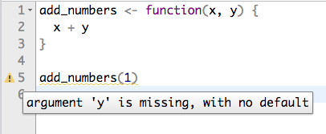
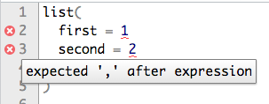

# 4章 ワークフロー：スクリプト

### 4.1 コードを実行する


練習問題はありません


### 4.2 Rstudioの診断

#### 練習問題1 : RStudio Tipsの面白いと思われるヒントを見つけなさい。

[RStudio Tips](https://twitter.com/rstudiotips)はRに関する役立つ情報をつぶやくTwitterアカウントです。フォローしてみて、面白い、役立つヒントを見つけてください。

#### 練習問題2 : RStudioの診断機能は下記以外にどんな間違いを見つけてくれるのか調べなさい。

[RStuidoのコード診断](https://support.rstudio.com/hc/en-us/articles/205753617-Code-Diagnostics)のページに詳細が記載されておりますので、そちらも合わせて確認してください。

* **R関数呼び出しの引数を確認する**

例えば、​​RStudioは関数`add_numbers`に`y`引数がないことを検出します。

同様に、引数が欠落している、欠落しているコンマなどを検出してくれます。

* **使用されている変数のスコープ内に定義がない場合に警告する**

現在、または親のスコープ内で定義なしでシンボルが使用されている場合は警告します。シンボルの名前にタイプミスがあると思われる場合は、診断エンジンが提案を出します。

* **変数が定義されているが使用されていない場合は警告する**

この診断は、変数が作成されたが使用されていないことを識別するのに役立ちます。これは古いコードをクリーンアップしようとしたり、他のエラーを診断するのに役立ちます。次の例では、変数`result`に代入されていますが、使用されていません。代わりに、合計が再計算されてから返されています。そのため、警告がひょうじされます。 

* **Rスタイルの診断を提供します（例：空白）**

スタイル診断は、コードが[Hadley Wickhamのスタイルガイド](http://adv-r.had.co.nz/Style.html)に準拠しているかどうかを確認し、スタイルの警告を報告します。特に、診断エンジンは、空白の不適切な使用を検出します。

