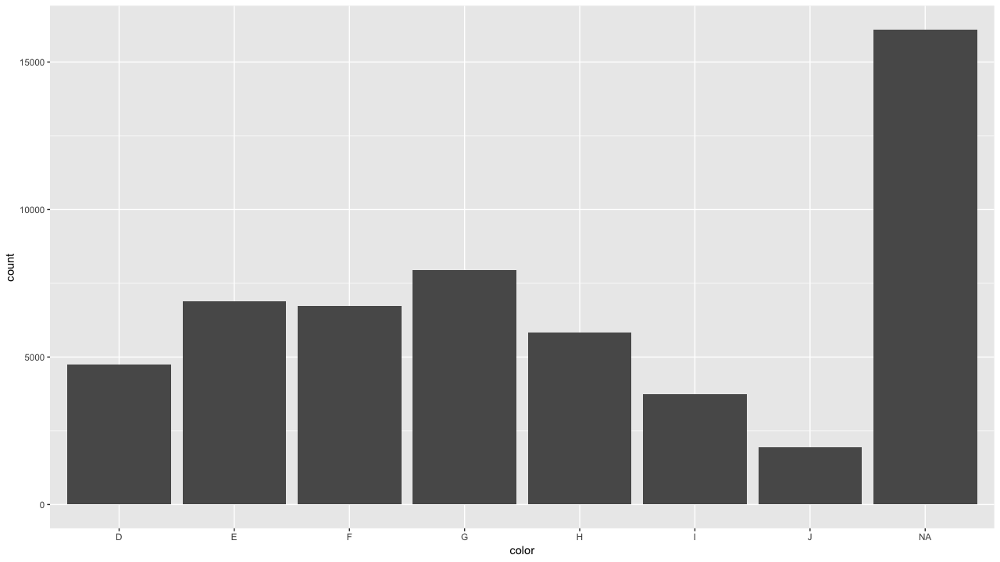
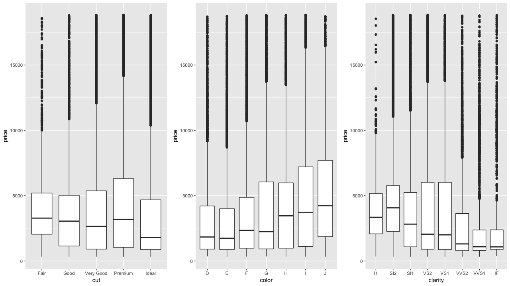
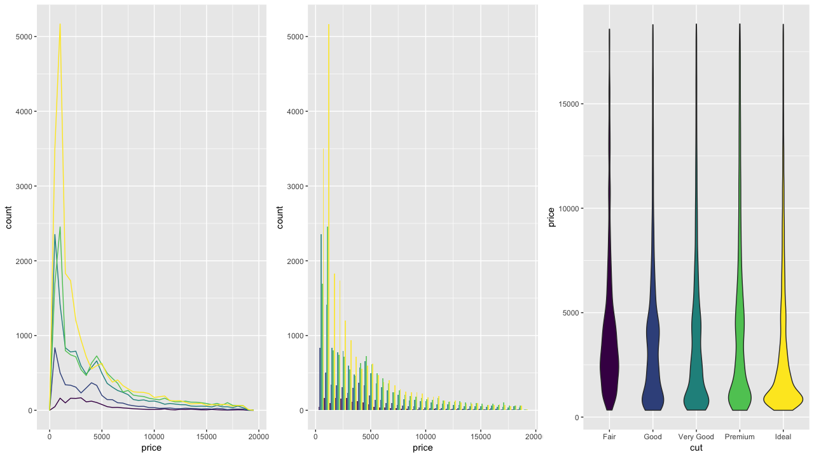

# 5章 探索的データ分析

### 5.0 ライブラリーの読み込み

```text
library("tidyverse")
library("viridis")
library("nycflights13")
library("lvplot")
library("ggbeeswarm")
library("ggstance")
library("gridExtra")
```

### 5.1 はじめに


練習問題はありません


### 5.2 質問


練習問題はありません


### 5.3 変動

#### 練習問題1 : `diamonds`の`x`、`y`、`z`の分布を探索しなさい。また、関係性を考え直さい。

まずは、`summary()`を使って、基本的な要約統計量を確認します。`y`と`z`には外れ値があるように見えます。また、ダイアモンドの形状を表す`x`、`y`と`z`であるにも関わらず、いくつかのダイヤモンドはゼロの値を持っているようです。

```text
diamonds %>% 
   select(x, y, z) %>% 
   summary()
   
       x                y                z         
 Min.   : 0.000   Min.   : 0.000   Min.   : 0.000  
 1st Qu.: 4.710   1st Qu.: 4.720   1st Qu.: 2.910  
 Median : 5.700   Median : 5.710   Median : 3.530  
 Mean   : 5.731   Mean   : 5.735   Mean   : 3.539  
 3rd Qu.: 6.540   3rd Qu.: 6.540   3rd Qu.: 4.040  
 Max.   :10.740   Max.   :58.900   Max.   :31.800  
```

視覚化することでよりわかりやすくなります。

```text
x <- list("x","y","z")
plots <- x %>% 
  map( ~ ggplot(data = diamonds) + 
         geom_histogram(aes_string(x = .x), binwidth = 0.05) + ylab(.x)) 
grid.arrange(plots[[1]], plots[[2]], plots[[3]],
             ncol = 3, nrow = 1)

# これでも同じなので好きなのをどうぞ
# x <- c("x", "y", "z")
# plots <- list()
# for (i in seq_along(x)) {
#   plots[[i]] <-
#     ggplot(diamonds, aes_string(x = x[[i]])) +
#     geom_histogram(binwidth = 0.05) +
#     ylab(x[[i]])
# }
# 
# grid.arrange(plots[[1]], plots[[2]], plots[[3]],
#              ncol = 3, nrow = 1)
```


これだと分布の形状が確認しづらいので、四分位範囲が収まる範囲で`xlim(0,10)`を設定して視覚化してみるとだいぶ見通しが良くなります。これを見る限り、ある特定の閾値まで行くと、意図的に数値が丸められているようです。

```text
x <- list("x","y","z")
plots <- x %>% 
  map( ~ ggplot(data = diamonds) + 
         geom_histogram(aes_string(x = .x), binwidth = 0.05) + ylab(.x) + xlim(0,10)) 
grid.arrange(plots[[1]], plots[[2]], plots[[3]],
             ncol = 3, nrow = 1)
```


外れ値も可視化しておきます。この図を見る限り、`x`は3~10、`y`も3~10、`z`も3~10くらいの範囲があれば、大部分は可視化して傾向を把握できそうです。

```text
x <- list("y","z")
plots <- x %>% 
  map( ~ ggplot(data = diamonds, aes(x = x)) + 
         geom_jitter(aes_string(y = .x)) + ylab(.x))
grid.arrange(plots[[1]], plots[[2]],
             ncol = 2, nrow = 1)
```


3から10の範囲に絞って可視化します。ある閾値まで行くと、意図的に数値がスパイクする様子が先程と同様に確認できます。

```text
diamonds %>% 
  select(x, y, z) %>% 
  gather(key = shape, val = val ,.) %>% 
  filter(val > 0, val < 10) %>% 
  ggplot(., aes(val, fill = shape)) + 
  geom_histogram(position = "identity", binwidth = 0.01) +
  scale_x_continuous(breaks = 1:10) + 
  facet_grid(. ~ shape, scales = "free_x")
```


オーバーラップさせると、`x`と`y`は似たような変動をしていることがわかります。おそらく相関も高いことが予想されます。

```text
diamonds %>% 
  select(x, y, z) %>% 
  gather(key = shape, val = val ,.) %>% 
  filter(val > 0, val < 10) %>% 
  ggplot(., aes(val, fill = shape)) + 
  geom_histogram(position = "identity", binwidth = 0.01, alpha = 1/2) +
  scale_x_continuous(breaks = 1:10)
```


#### 練習問題2 : 価格の分布を調べなさい。何らかの発見を見つけなさい。

`summary()`で要約量統計量を見てみると、平均が3933で、最大値は18823にもなるようです。

```text
diamonds %>%
  select(price) %>% 
  summary()

     price      
 Min.   :  326  
 1st Qu.:  950  
 Median : 2401  
 Mean   : 3933  
 3rd Qu.: 5324  
 Max.   :18823 
```

分布を可視化してみると、価格が突然ジャンプしているように見えます。

```text
diamonds %>% 
  select(price) %>% 
  ggplot(aes(x = price)) +
  geom_histogram(binwidth = 100) +
  scale_x_continuous(breaks = seq(0, 20000, by = 1000))
```


さらに細かく探索すると、1450~1550の間の値がないことがわかります。

```text
diamonds %>% 
  select(price) %>% 
  filter(between(price, 1000, 2000)) %>% 
  ggplot(aes(x = price)) +
  geom_histogram(binwidth = 5) +
  scale_x_continuous(breaks = seq(1000, 2000, by = 50))
```


#### 練習問題3 : 0.99カラットのダイヤモンドはいくつですか？1カラットはいくつですか？違いは何だと思いますか？

0.99カラットのダイアモンドは23個です。0.9~1.0にかけて、谷ができているように見えます。

```text
diamonds %>%
  select(carat) %>% 
  filter(between(carat, 0.90, 1.00)) %>% # filter(carat >= 0.99, carat <= 1)
  count(carat)

# A tibble: 11 x 2
   carat     n
   <dbl> <int>
 1  0.9   1485
 2  0.91   570
 3  0.92   226
 4  0.93   142
 5  0.94    59
 6  0.95    65
 7  0.96   103
 8  0.97    59
 9  0.98    31
10  0.99    23
11  1     1558
```

可視化して確認してみます。caratはどうやら小数点が9に近づくに連れて、切り上げられてラベルされているように見えます。

```text
diamonds %>%
  select(carat) %>% 
  filter(between(carat, 0, 1.00)) %>%
  count(carat) %>% 
  ggplot(aes(carat, n)) +
  geom_histogram(stat = "identity", binwidth = 5) + 
  scale_x_continuous(breaks = seq(0.2, 1.0, by = 0.05))
```


#### 練習問題4 : `coord_cartesian()`と`xlim()`または`ylim()`を使った場合の違いを調べなさい。

`coord_cartesian()`は計算してからズームアップして範囲を切り取るイメージです。反対に、`*lim()`は、計算する前に除外して範囲を切り取るイメージです。したがって、`coord_cartesian()`は範囲外にも値がありますが、`*lim()`の方にはありません。

```text
g1 <- ggplot(diamonds) +
  geom_histogram(mapping = aes(x = price), binwidth = 100) +
  coord_cartesian(xlim = c(1000, 5000), ylim = c(0, 3000))

g2 <- ggplot(diamonds) +
  geom_histogram(mapping = aes(x = price), binwidth = 100) +
  xlim(1000, 5000) + ylim(0, 3000)

grid.arrange(g1, g2, ncol = 2)
```


### 5.4 欠損値

#### 練習問題1 : ヒストグラムの欠損値はどうなりますか？棒グラフの欠損値はどうなりますか？

警告メッセージが表示されます。17502件は`NA`なので、削除されました。値がわからないので、ビンに入れようがありません。

```text
diamonds %>%
  select(carat) %>% 
  mutate(carat = if_else(carat > 1, NA_real_, carat)) %>% 
  ggplot(., aes(x = carat)) +
  geom_histogram()
  
`stat_bin()` using `bins = 30`. Pick better value with `binwidth`.
 
警告メッセージ: 
Removed 17502 rows containing non-finite values (stat_bin). 
```


カテゴリカル変数の場合は`NA`として、欠損値の数をカウントすることができます。

```text
diamonds %>%
  mutate(color = if_else(runif(n()) < 0.3, NA_character_, as.character(color))) %>%
  ggplot() +
  geom_bar(mapping = aes(x = color))
```



#### 練習問題2 : `mean()`と`sum()`の`na.rm = TRUE`の挙動を調べなさい。

これらの関数は`NA`がベクトルの要素として混じっていると、`NA`を返すようになっている。そのため、`NA`を除いて計算させるためには、`na.rm = TRUE`を付ける必要がある。

```text
diamonds %>%
  select(price) %>% 
  mutate(price = if_else(runif(n()) < 0.3, NA_integer_, price)) %>%
  summarise(avg = mean(price),
            sum = sum(price))
            
# A tibble: 1 x 2
    avg   sum
  <dbl> <int>
1    NA    NA

diamonds %>%
  select(price) %>% 
  summarise(avg = mean(price, na.rm = TRUE),
            sum = sum(price, na.rm = TRUE))

# A tibble: 1 x 2
    avg       sum
  <dbl>     <int>
1 3930. 148320930
```

### 5.5 共変動

#### 練習問題1 : キャンセルフライトとフライトの出発時刻の可視化を改善しなさい。

箱ひげ図も使うことができるが、ここはバイオリンプロットと併用してみます。

```text
flights %>%
  select(dep_time, sched_dep_time) %>% 
  mutate(
    cancelled = is.na(dep_time),
    sched_hour = sched_dep_time %/% 100,
    sched_min = sched_dep_time %% 100,
    sched_dep_time = sched_hour + (sched_min / 60)
  ) %>%
  ggplot(aes(x = cancelled, y = sched_dep_time)) +
  geom_violin() + 
  geom_boxplot(width=.1, alpha = 1/2, fill = "#006E4F")
```


#### 練習問題2 : ダイヤモンドの価格を予測する上で、どの変数が最も重要ですか。その変数はカットとどのように関連していますか？これら2つの関係を組み合わせると、低品質のダイヤモンドがより高価になるのはなぜですか？

まずは連続変数と`price`の関係を探索していく。散布図を見る限り`price`と関係がありそうなのは、`carat`と`x`であり、これらは値が大きなるにつれて、pri`c`eも大きくなる傾向がある。`carat`は直感的にもおかしくないが、`x`はダイヤモンドの寸法なので、x軸の大きさのみ、ダイヤモンドの価格と関係しているのかもしてない。

```text
num_plt <- diamonds %>% 
  select(-price) %>% 
  keep(is.numeric) %>% 
  names() %>% 
  map(list()) 

plots <- num_plt %>% 
  map( ~ ggplot(data = diamonds, aes(y = price)) + 
         geom_point(aes_string(x = .x)) + xlab(.x))

grid.arrange(plots[[1]], plots[[2]], plots[[3]],plots[[4]],plots[[5]],plots[[6]],
             ncol = 3, nrow = 2)
```


次はカテゴリカル変数について見ていきます。`color`は`D`よりも`J`のほうが`price`が高い傾向にあります。`clarity`は`l1(最悪)`よりも`IF(最良)`は`price`が低い傾向にあります。

```text
fctr_plt <- diamonds %>% 
  select(-price) %>% 
  keep(is.factor) %>% 
  names() %>% 
  map(list()) 

plots <- fctr_plt %>% 
  map( ~ ggplot(data = diamonds, aes(y = price)) + 
         geom_boxplot(aes_string(x = .x)) + xlab(.x))

grid.arrange(plots[[1]], plots[[2]], plots[[3]],
             ncol = 3, nrow = 1)
```



`cut`との組み合わせを確認します。`cut`と`carat`には否定的な関係があります。最大のカラットダイヤモンドには`Fair(最低)`のカットがあります。大きいダイヤモンドほど低品質のカットでも販売できますが、小さいダイヤモンドほど良いカットが必要なのでしょうか。

```text
diamonds %>% 
  ggplot(aes(cut, carat, col = price)) + 
  geom_jitter(alpha = 0.2)
```


#### 練習問題3 : `{ggstance}`パッケージを利用し、水平箱ひげ図を作成しなさい。`coord_flip()`の違いは何ですか？

まずは、`geom_boxplot()`と`coord_flip()`を使って箱ひげを書きます。`x`に`class`を使用して、座標を変換しています。{ggstance}のgeom\_boxploth\(\)では、素直に`y`に`class`を使用して作図できます

```text
g1 <- ggplot(data = mpg) +
  geom_boxplot(mapping = aes(x = reorder(class, hwy, FUN = median), y = hwy)) +
  coord_flip()

g2 <- ggplot(data = mpg) +
  geom_boxploth(mapping = aes(y = reorder(class, hwy, FUN = median), x = hwy))

grid.arrange(g1, g2, ncol = 2)
```


#### 練習問題4 : `{lvplot}パッケージ`を利用し、`geom_lv()`で`price vs cut`の分布を表示しなさい。

`geom_lv()`は、箱ひげを改良した作図法で、よりも多い分位数を使って作図します。

```text
ggplot(diamonds, aes(x = cut, y = price)) +
  geom_lv()
```


#### 練習問題5 : `geom_violin()`、`geom_histogram()`、`geom_freqpoly()`を比較し、各方法の長所と短所を調べなさい。

`geom_freqpoly()`は、`price`が最もカウント\(`y = ..density..`で密度も可能\)されている場所を特定したり、他のカテゴリとのカウント数の違いを見分けるのは簡単です。`geom_histogram()`も、`position`を工夫すれば、似たようなことは可能です。

`geom_violin()`は、分布の要約値\(歪度、中心値、分散など\)を視覚的に区別するのは簡単です。しかし、カウントの多さなどは比較できません。

```text
g1 <- ggplot(data = diamonds, mapping = aes(x = price)) +
  geom_freqpoly(mapping = aes(color = cut), binwidth = 500) +
  guides(colour = FALSE) 

g2 <- ggplot(data = diamonds, mapping = aes(x = price)) +
  geom_histogram(mapping = aes(fill = cut), position = "dodge", alpha = 0.8, binwidth = 500) +
  guides(fill = FALSE) 

g3 <- ggplot(data = diamonds, mapping = aes(x = cut, y = price)) +
  geom_violin(mapping = aes(fill = cut)) +
  guides(fill = FALSE) 

grid.arrange(g1, g2, g3, ncol = 3)
```



#### 練習問題6 : 小さいデータの場合`geom_jitter()`は、連続変数とカテゴリカル変数の関係を調べるために便利です。`{ggbeeswarm}パッケージ`は似た多くの方法を提供しています。それらをリスト化し、何をするのか簡単に説明してください。

* `geom_quasirandom()`：ジッタープロットとバイオリンプロットを組み合わせたプロットを作成します。`method = c("tukey", "frowney", "smiley")`があります。
* `geom_beeswarm()` ：バイオリンプロットに似たプロットを作成しますが、点をオフセットします。

```text
g1 <- ggplot(data = mpg) +
  geom_quasirandom(
    mapping = aes(
      x = reorder(class, hwy, FUN = median),
      y = hwy
    ),
    method = "tukey"
  )

g2 <- ggplot(data = mpg) +
  geom_beeswarm(mapping = aes(
    x = reorder(class, hwy, FUN = median),
    y = hwy
  ))

grid.arrange(g1, g2,ncol = 2)
```


#### 練習問題7 : `color`内の`cut`の分布をより明確に示すために、データセットをどのようにスケール変更すればよいか。

`cut`内の分布を明確に示すために、ここでは全体に占める`cut`と`color`の組み合わせ数の割合で色をつけてみます。`color:G, cut:ideal`が多いことがわかります。

```text
diamonds %>%
  count(color, cut) %>%
  mutate(prop = n / sum(n)) %>%
  ggplot(mapping = aes(x = color, y = cut)) +
  geom_tile(mapping = aes(fill = prop)) +
  scale_fill_gradient(low = "#FFFFFF", high = "#006E4F")
```


#### 練習問題8 : `geom_tile()`と`{dplyr}`パッケージを一緒に使用し、目的地や年月によって平均飛行遅延がどのように変わるかを調べなさい。

比較する数が多くなると、数字での比較よりも、視覚的に表現するほうがわかりやすい。傾向として、夏は平均遅延時間が長くなる傾向があり、特定のキャリア\(`CAE`\)は一貫して平均遅延時間が長いことがわかります。

```text
flights %>%
  group_by(month, dest) %>%
  summarise(dep_delay = mean(dep_delay, na.rm = TRUE)) %>%
  ggplot(aes(x = factor(month), y = dest, fill = dep_delay)) +
  geom_tile() +
  scale_fill_gradient(low = "#FFFFFF", high = "#006E4F") +
  labs(x = "Month", y = "Destination", fill = "Avg Dep Delay")
```


#### 練習問題9 : さきほどの例では`aes(x = color, y = cut)`なく、`aes(x = cut, y = color)`のほうが、よいのでしょうか。

通常、カテゴリが多い変数をy軸に置くことをお勧めします。

#### 練習問題10 : 条件付きの分布を箱ひげ図で要約する代わりに、度数分布多角形を使用できる。`cut_width()`と`cut_number()`を使うときに何を考慮する必要があるか。

`cut_number()`も`cut_width()`も分類分けする関数です。これらを使用する場合、カットする範囲でプロットの印象が大きく変わるため、カット範囲には注意しなければいけない。

```text
g1 <- ggplot(data = diamonds,　mapping = aes(x = price, color = cut_number(carat, 5))) +
  geom_freqpoly() +
  labs(x = "Price", y = "Count", color = "Carat")

g2 <- ggplot(data = diamonds,mapping = aes(x = price, color = cut_width(carat, 1, boundary = 0))) +
  geom_freqpoly() +
  labs(x = "Price", y = "Count", color = "Carat")

grid.arrange(g1, g2, ncol = 2)
```


#### 練習問題11 : `price`で区分けした`carat`の分布を視覚化しなさい。

さきほど学んだ`cut_width()`で`2000`単位で`price`を区切って視覚化してみます。

```text
ggplot(diamonds, aes(x = cut_width(price, 2000, boundary = 0), y = carat)) +
  geom_boxplot() + coord_flip() + xlab("Price")
```


#### 練習問題12 : 大きいダイヤモンドと小さいダイヤモンドの価格分布を比較しなさい。

大きいダイアモンド\(5,6\]もそもそも数が少なく、分布を把握するのが困難である一方で、\[0,1\]の分布は外れ値のような価格が高いものと低いものが混じっている分布のようです。

```text
ggplot(diamonds, aes(x = cut_width(carat, 1, boundary = 0), y = price)) +
  geom_boxplot() + xlab("carat")
```


`price`を離散化して、ヒートマップで表現してみます。全体的な傾向として、ポジティブな相関が確認でき、caratが小さいのに、priceが高いものや、そもそもcaratが大きいものは全体に占める割合は小さいようです。

```text
diamonds %>% 
  select(carat, price) %>% 
  mutate(carat = cut_width(carat, .5, boundary = 0),
         price = cut_width(price, 1000, boundary = 0)) %>% 
  complete(carat, price, fill = list(n = 0L)) %>%
  group_by(carat, price) %>% 
  summarise(n = n()) %>% 
ggplot(., aes(x = carat, y = price, fill = n)) +
  geom_tile() +
  scale_fill_gradient(low = "#FFFFFF", high = "#006E4F") 
```


#### 練習問題13 : カット、カラット、および価格の組み合わせ分布を視覚化するために、学んだ2つの手法を組み合わせなさい。

散布図で一気に視覚化しつつ、アルファブレンディングを使って、少ないものは透明にしつつ、どこに点が重なっているかを確認するのも1つかもしれませんし、箱ひげ図で表現するもの良いかもしれません。

```text
g1 <- ggplot(diamonds, aes(x = carat, y = price, col = cut)) +
  geom_point(alpha = 0.1)

g2 <- ggplot(diamonds, aes(x = cut_number(carat, 5), y = price, colour = cut)) +
  geom_boxplot()

grid.arrange(g1, g2, ncol = 2)
```


#### 練習問題14 : 2次元プロットは、1次元プロットでは見えない異常値を明らかにします。たとえば、下記のプロットでは、`x`と`y`の異常な組み合わせがあることがわかります。

アルファブレンディングなので、外れ値でも少ないものは透明に近くなりますが、`x:0,y:0`の組み合わせは一定数あることがわかります。

```text
ggplot(data = diamonds) +
  geom_point(mapping = aes(x = x, y = y), alpha = 0.2)
```


### 5.6 パターンとモデル


練習問題はありません


### 5.7 `ggplot2`の呼び出し


練習問題はありません


### 5.8 さらにまなぶために


練習問題はありません


