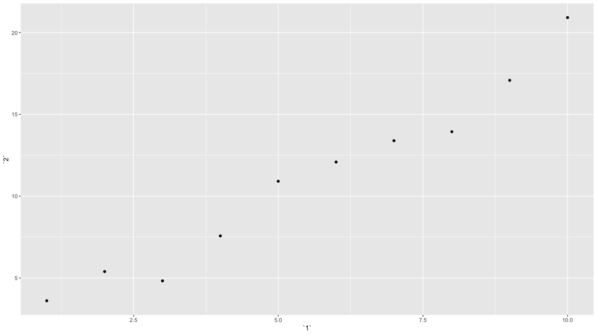

# 7章 tibbleのtibble

### 7.0 ライブラリーの読み込み

```text
library("tidyverse")
```

### 7.1 はじめに


練習問題はありません


### 7.2 `tibble`を作る


練習問題はありません


### 7.3 `tibble`と`data.frame`


練習問題はありません


### 7.4 古いコードとの関わり

#### 練習問題1 : オブジェクトが`tibble`かどうか、どうやって判断しますか。

表示させれば、tibbleかどうか判別できます。または`class()`や`is_tibble()`でも判別可能です

```text
diamonds
# A tibble: 53,940 x 10
   carat cut       color clarity depth table price     x     y     z
   <dbl> <ord>     <ord> <ord>   <dbl> <dbl> <int> <dbl> <dbl> <dbl>
 1 0.23  Ideal     E     SI2      61.5    55   326  3.95  3.98  2.43
 2 0.21  Premium   E     SI1      59.8    61   326  3.89  3.84  2.31
 3 0.23  Good      E     VS1      56.9    65   327  4.05  4.07  2.31
 4 0.290 Premium   I     VS2      62.4    58   334  4.2   4.23  2.63
 5 0.31  Good      J     SI2      63.3    58   335  4.34  4.35  2.75
 6 0.24  Very Good J     VVS2     62.8    57   336  3.94  3.96  2.48
 7 0.24  Very Good I     VVS1     62.3    57   336  3.95  3.98  2.47
 8 0.26  Very Good H     SI1      61.9    55   337  4.07  4.11  2.53
 9 0.22  Fair      E     VS2      65.1    61   337  3.87  3.78  2.49
10 0.23  Very Good H     VS1      59.4    61   338  4     4.05  2.39
# … with 53,930 more rows

class(diamonds)

[1] "tbl_df"     "tbl"        "data.frame"

is_tibble(diamonds)
[1] TRUE
```

#### 練習問題2 : `data.frame`と`tibble`の演算の違いを比較対照しなさい。

同じようなコマンドを書いても、`dataframe`の省略しても検索されるが、`tibble`の場合はこのようなことが起こりません。

```text
df <- data.frame(num = 1, chr = "a")
df$c
[1] a
Levels: a
df$ch
[1] a
Levels: a
 
tb <- as_tibble(df)
tb$c
NULL
 警告メッセージ: 
Unknown or uninitialised column: 'c'. 

tb$ch
NULL
 警告メッセージ: 
Unknown or uninitialised column: 'ch'. 
```

1列のみを指定した場合、`dataframe`はベクトルで返されますが、`tibble`の場合はこのようなことが起こりません。

```text
df[,"num"]
[1] 1

tb[,"num"]
# A tibble: 1 x 1
    num
  <dbl>
1     1
```

#### 練習問題3 : 例えば`var <- "mpg"`のようにオブジェクトに格納されている変数名を持っている場合、どのように`tibble`から参照変数を抽出できるか。

tibbleの場合、tibble\[\[var\]\]または、tibble\[, var\]で抽出可能です。

```text
mt_tbl <- as_tibble(mtcars)
var <- "mpg"
#----------------------------------------
mtcars[[var]]
 [1] 21.0 21.0 22.8 21.4 18.7 18.1 14.3 24.4 22.8 19.2 17.8 16.4 17.3 15.2 10.4
[16] 10.4 14.7 32.4 30.4 33.9 21.5 15.5 15.2 13.3 19.2 27.3 26.0 30.4 15.8 19.7
[31] 15.0 21.4

mt_tbl[[var]]
 [1] 21.0 21.0 22.8 21.4 18.7 18.1 14.3 24.4 22.8 19.2 17.8 16.4 17.3 15.2 10.4
[16] 10.4 14.7 32.4 30.4 33.9 21.5 15.5 15.2 13.3 19.2 27.3 26.0 30.4 15.8 19.7
[31] 15.0 21.4
#----------------------------------------
mtcars[, var]
 [1] 21.0 21.0 22.8 21.4 18.7 18.1 14.3 24.4 22.8 19.2 17.8 16.4 17.3 15.2 10.4
[16] 10.4 14.7 32.4 30.4 33.9 21.5 15.5 15.2 13.3 19.2 27.3 26.0 30.4 15.8 19.7
[31] 15.0 21.4

mt_tbl[, var]
# A tibble: 32 x 1
     mpg
   <dbl>
 1  21  
 2  21  
 3  22.8
 4  21.4
 5  18.7
 6  18.1
 7  14.3
 8  24.4
 9  22.8
10  19.2
# … with 22 more rows
#----------------------------------------
mtcars[["var"]]
NULL

mt_tbl[["var"]]
NULL
#----------------------------------------
mtcars$var
NULL

mt_tbl$var
NULL
 警告メッセージ: 
Unknown or uninitialised column: 'var'. 
```

#### 練習問題4 : 次のデータフレームで非構文名を参照する練習をしなさい

```text
annoying <- tibble(
  `1` = 1:10,
  `2` = `1` * 2 + rnorm(length(`1`))
)
```

* `1`という変数を抽出。
* `1`と`2`の散布図をプロットする。
* `2`を`1`で割った、`3`という新しい列を作成する。
* 列の名前を`one`、`two`、`three`に変更する。

```text
annoying[["1"]]
 [1]  1  2  3  4  5  6  7  8  9 10
annoying$`1`
 [1]  1  2  3  4  5  6  7  8  9 10
#----------------------------------------
ggplot(annoying, aes(x = `1`, y = `2`)) +
  geom_point()
#----------------------------------------
annoying %>% 
  mutate(`3` = `2` / `1`)
# A tibble: 10 x 3
     `1`   `2`   `3`
   <int> <dbl> <dbl>
 1     1  3.61  3.61
 2     2  5.39  2.70
 3     3  4.82  1.61
 4     4  7.57  1.89
 5     5 10.9   2.18
 6     6 12.1   2.01
 7     7 13.4   1.91
 8     8 13.9   1.74
 9     9 17.1   1.90
10    10 20.9   2.09
#----------------------------------------
annoying[["3"]] <- annoying$`2` / annoying$`1`
annoying[["3"]] <- annoying[["2"]] / annoying[["1"]]
#----------------------------------------
annoying %>% 
  rename(one = `1`, two = `2`, three = `3`)
# A tibble: 10 x 3
     one   two three
   <int> <dbl> <dbl>
 1     1  3.61  3.61
 2     2  5.39  2.70
 3     3  4.82  1.61
 4     4  7.57  1.89
 5     5 10.9   2.18
 6     6 12.1   2.01
 7     7 13.4   1.91
 8     8 13.9   1.74
 9     9 17.1   1.90
10    10 20.9   2.09
```



#### 練習問題5 : `tibble::enframe()`はいつ使用しますか。

`tibble::enframe()`は名前付きのベクトルに対して、名前と値を持つ`tibble`に変換します。

```text
enframe(c(x1 = 1, 
          x2 = 2,
          x3 = 3))

# A tibble: 3 x 2
  name  value
  <chr> <dbl>
1 x1        1
2 x2        2
3 x3        3
```

#### 練習問題6 :`tibble`のフッターに追加の列名を追加するオプションは何ですか。

consoleに`tibble`の変数名が収まりきらない場合、残っている変数名がフッターに表示される仕様になっています。この`tibble`の変数名の数をコントロールするのが`n_extra`です。

```text
print(nycflights13::flights)
# A tibble: 336,776 x 19
    year month   day dep_time sched_dep_time
   <int> <int> <int>    <int>          <int>
 1  2013     1     1      517            515
 2  2013     1     1      533            529
 3  2013     1     1      542            540
 4  2013     1     1      544            545
 5  2013     1     1      554            600
 6  2013     1     1      554            558
 7  2013     1     1      555            600
 8  2013     1     1      557            600
 9  2013     1     1      557            600
10  2013     1     1      558            600
# … with 336,766 more rows, and 14 more
#   variables: dep_delay <dbl>,
#   arr_time <int>, sched_arr_time <int>,
#   arr_delay <dbl>, carrier <chr>,
#   flight <int>, tailnum <chr>,
#   origin <chr>, dest <chr>, air_time <dbl>,
#   distance <dbl>, hour <dbl>, minute <dbl>,
#   time_hour <dttm>

print(nycflights13::flights, n_extra = 5)
# A tibble: 336,776 x 19
    year month   day dep_time sched_dep_time
   <int> <int> <int>    <int>          <int>
 1  2013     1     1      517            515
 2  2013     1     1      533            529
 3  2013     1     1      542            540
 4  2013     1     1      544            545
 5  2013     1     1      554            600
 6  2013     1     1      554            558
 7  2013     1     1      555            600
 8  2013     1     1      557            600
 9  2013     1     1      557            600
10  2013     1     1      558            600
# … with 336,766 more rows, and 14 more
#   variables: dep_delay <dbl>,
#   arr_time <int>, sched_arr_time <int>,
#   arr_delay <dbl>, carrier <chr>, …

print(nycflights13::flights, n_extra = 0)
# A tibble: 336,776 x 19
    year month   day dep_time sched_dep_time
   <int> <int> <int>    <int>          <int>
 1  2013     1     1      517            515
 2  2013     1     1      533            529
 3  2013     1     1      542            540
 4  2013     1     1      544            545
 5  2013     1     1      554            600
 6  2013     1     1      554            558
 7  2013     1     1      555            600
 8  2013     1     1      557            600
 9  2013     1     1      557            600
10  2013     1     1      558            600
# … with 336,766 more rows, and 14 more
```

