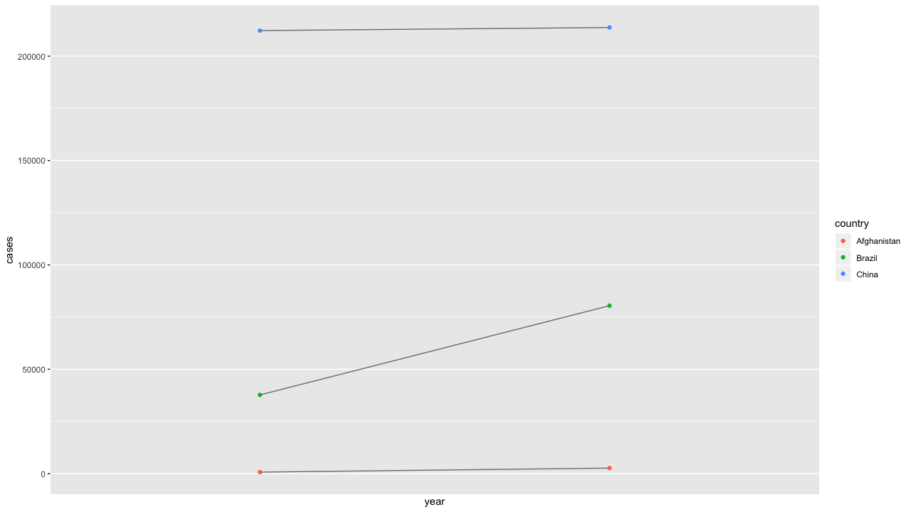
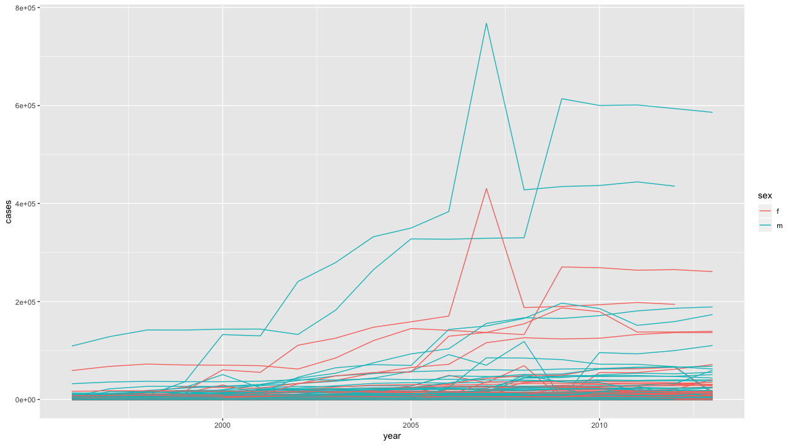
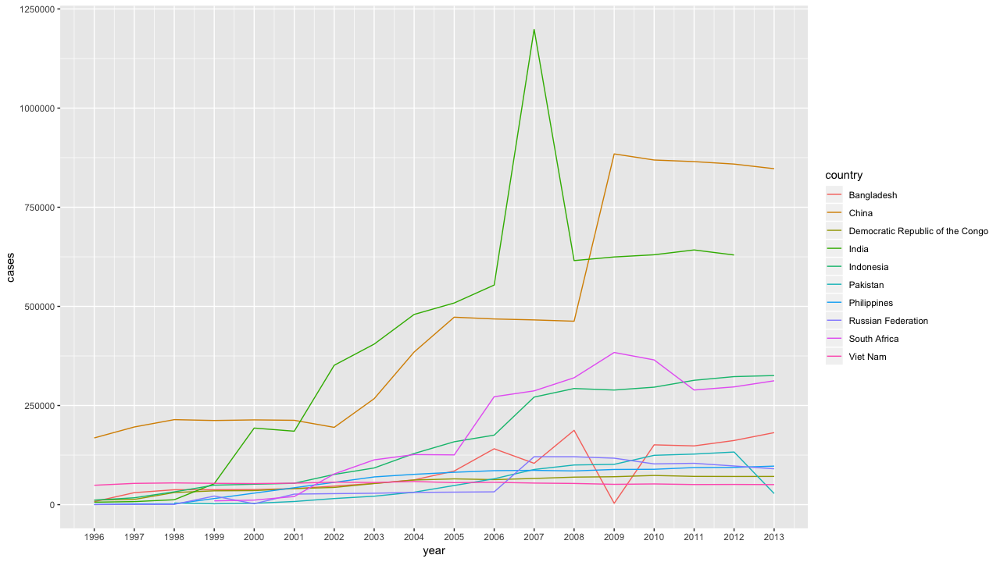

# 9章 tidyrによるデータの整理

### 9.0 ライブラリーの読み込み

```text
library("tidyverse")
```

### 9.1 はじめに


練習問題はありません


### 9.2 整理データ

#### 練習問題1 例に上げた表について、変数と観測値がどのように組織されているか答えなさい。

各行は\(国、年\)の組み合わせを表します。列`cases`と`population`は、それらの変数の値を含みます。いわゆる`tidy`な形式です。

```text
table1
# A tibble: 6 x 4
  country      year  cases population
  <chr>       <int>  <int>      <int>
1 Afghanistan  1999    745   19987071
2 Afghanistan  2000   2666   20595360
3 Brazil       1999  37737  172006362
4 Brazil       2000  80488  174504898
5 China        1999 212258 1272915272
6 China        2000 213766 1280428583
```

各行は\(国、年、タイプ\)の組み合わせを表します。`count`には、各`type`の値を含みます。

```text
table2
# A tibble: 12 x 4
  country      year type           count
  <chr>       <int> <chr>          <int>
1 Afghanistan  1999 cases            745
2 Afghanistan  1999 population  19987071
3 Afghanistan  2000 cases           2666
4 Afghanistan  2000 population  20595360
5 Brazil       1999 cases          37737
6 Brazil       1999 population 172006362
# … with 6 more rows
```

各行は\(国、年\)の組み合わせを表します。カラムは、`cases`と`population`の値を文字列として持つ`rate`があります。

```text
table3
# A tibble: 6 x 3
  country      year rate             
* <chr>       <int> <chr>            
1 Afghanistan  1999 745/19987071     
2 Afghanistan  2000 2666/20595360    
3 Brazil       1999 37737/172006362  
4 Brazil       2000 80488/174504898  
5 China        1999 212258/1272915272
6 China        2000 213766/1280428583
```

変数ごとに表が分かれています。この表`table4a`には`cases`が`table4b`には`population`の値が含まれています。日本のお役所のデータによく見られる形式で、人間には見やすいが、機械には読みにくい形式です。

```text
able4a
# A tibble: 3 x 3
  country     `1999` `2000`
* <chr>        <int>  <int>
1 Afghanistan    745   2666
2 Brazil       37737  80488
3 China       212258 213766

table4b
# A tibble: 3 x 3
  country         `1999`     `2000`
* <chr>            <int>      <int>
1 Afghanistan   19987071   20595360
2 Brazil       172006362  174504898
3 China       1272915272 1280428583
```

#### 練習問題2 `table2`と`table4a+table4b`について`rate`を計算しなさい。下記、4つの操作を実行する必要がある。どの表現が最も簡単で、どれが一番難しいか？

* 国ごとの年間の結核の症例数を抽出します。
* 1年ごとに国ごとに一致する人口を抽出します。
* ケースを母集団で割り、10000を掛けます。
* 適切な場所に戻して保管してください。

本来はこのように加工したいですね。`spread()`を使い、素直にカラムを横に展開すれば3行で計算できます。以下は、あまり推奨されない加工です。

```text
table2 %>% 
  spread(key = type, val = count) %>% 
  mutate(rate = cases/population * 10000)

# A tibble: 6 x 5
  country      year  cases population  rate
  <chr>       <int>  <int>      <int> <dbl>
1 Afghanistan  1999    745   19987071 0.373
2 Afghanistan  2000   2666   20595360 1.29 
3 Brazil       1999  37737  172006362 2.19 
4 Brazil       2000  80488  174504898 4.61 
5 China        1999 212258 1272915272 1.67 
6 China        2000 213766 1280428583 1.67 

table4a %>% 
  gather(key = year, val = cases, -country) %>% 
  arrange(country, year) %>% 
  bind_cols(table4b %>% 
              gather(key = year, val = population, -country) %>% 
              arrange(country, year) %>% 
            select(population)) %>% 
  mutate(rate = cases/population * 10000)
  
# A tibble: 6 x 5
  country      year  cases population  rate
  <chr>       <int>  <int>      <int> <dbl>
1 Afghanistan  1999    745   19987071 0.373
2 Afghanistan  2000   2666   20595360 1.29 
3 Brazil       1999  37737  172006362 2.19 
4 Brazil       2000  80488  174504898 4.61 
5 China        1999 212258 1272915272 1.67 
6 China        2000 213766 1280428583 1.67 
```

1人当たりの症例数を計算するには、国と年の単位で、症例数を人口で割る必要があるので、そこを目標に`table2`を加工します。`table2`を分割してbind\_cols\(\)で結合し直してますが、このような簡単にデータを揃えられない場合もビジネスのデータでは多いので、その際は`**_join()`を使ったほうがいいと思います。`**_join()`はデータが多くなると、検索で処理が重くなるので、その点はトレードオフです。

```text
table2 %>% 
  filter(type == "cases") %>%
  rename(cases = count) %>%
  arrange(country, year) %>% 
  bind_cols(table2 %>% # joinでも良い
              filter(type == "population") %>%
              rename(population = count) %>%
              arrange(country, year)) %>% 
  select(country, year, cases, population) %>% 
  mutate(rate = cases/population * 10000)
  
  # A tibble: 6 x 5
  country      year  cases population  rate
  <chr>       <int>  <int>      <int> <dbl>
1 Afghanistan  1999    745   19987071 0.373
2 Afghanistan  2000   2666   20595360 1.29 
3 Brazil       1999  37737  172006362 2.19 
4 Brazil       2000  80488  174504898 4.61 
5 China        1999 212258 1272915272 1.67 
6 China        2000 213766 1280428583 1.67 
```

`tablea4a`と`table4b`を使う方はこのような感じでしょうか。わざと`%>%`と`{dplyr}`を使っているのでくどいですね。このように計算するのであれば、`{dplyr}`は使わないほうが簡潔かもしれません。

```text
tibble(
  country = table4a %>% 
    select(country) %>% 
    pull(country),
  `1999` = (table4a %>%
              select(`1999`) %>%
              pull(`1999`) / 
            table4b %>% 
              select(`1999`) %>% 
              pull(`1999`)) * 10000,
  `2000` = (table4a %>%
              select(`2000`) %>%
              pull(`2000`) /
            table4b %>% 
              select(`2000`) %>%
              pull(`2000`)) * 10000
)

      country    X1999    X2000
1 Afghanistan 0.372741 1.294466
2      Brazil 2.193930 4.612363
3       China 1.667495 1.669488

# tibble(
#   country = table4a$country,
#   `1999` = table4a[["1999"]] / table4b[["1999"]] * 10000,
#   `2000` = table4a[["2000"]] / table4b[["2000"]] * 10000
# )
```

#### 練習問題3 `table1`の代わりに`table2`を使用して、`cases`の時系列プロットを再作成しなさい。

```text
table2 %>%
  filter(type == "cases") %>%
  ggplot(aes(year, count)) +
  geom_line(aes(group = country), colour = "grey50") +
  geom_point(aes(colour = country)) +
  scale_x_continuous(breaks = table2 %>% 
                       distinct(year) %>% 
                       pull(year)) +
  ylab("cases")
```



### 9.3 広げたり集めたり

#### 練習問題1 `gather()`と`spread()`はなぜ対象ではないのか。

gather\(\)を適用する際に、列のデータ型の情報が失われます。その点で対象ではありません。

```text
stocks <- tibble(
  year = c(2015, 2015, 2016, 2016),
  half = c(1, 2, 1, 2),
  return = c(1.88, 0.59, 0.92, 0.17)
)

stocks
# A tibble: 4 x 3
   year  half return
  <dbl> <dbl>  <dbl>
1  2015     1   1.88
2  2015     2   0.59
3  2016     1   0.92
4  2016     2   0.17

stocks %>%
  spread(year, return) %>%
  gather(`2015`:`2016`, key = "year", value = "return") %>% 
  select(year, half, return)
  
# A tibble: 4 x 3
  year   half return
  <chr> <dbl>  <dbl>
1 2015      1   1.88
2 2015      2   0.59
3 2016      1   0.92
4 2016      2   0.17
```

`convert = TRUE`を設定すれば、ベクトルを適切な型に変換してれますが、この変換は単に変数の型を推測しているだけなので、常に元の変数型を返すわけではありません。

```text
stocks %>%
  spread(key = "year", value = "return") %>%
  gather(key = "year", value = "return", `2015`:`2016`, convert = TRUE) %>% 
  select(year, half, return)

# A tibble: 4 x 3
　 year  half return
　<dbl> <dbl>  <dbl>
1  2015     1   1.88
2  2015     2   0.59
3  2016     1   0.92
4  2016     2   0.17
```

#### 練習問題2 このコードが失敗するのはなぜですか？

```text
table4a %>%
  gather(1999, 2000, key = "year", value = "cases")
Error in inds_combine(.vars, ind_list): Position must be between 0 and n
```

データフレームから変数を選択するとき、`gather()`は1999や2000のような数を列番号として解釈します。この場合、`gather()`はデータフレームの1999番目と2000番目の列を選択しようとします。1999と2000のような非構文変数名を選択するには、名前をバッククォート\(`````\)で囲むか、文字列として指定します。

```text
table4a %>%
  gather(`1999`, `2000`, key = "year", value = "cases")

table4a %>%
  gather("1999", "2000", key = "year", value = "cases")
```

#### 練習問題3 なぜこの`tibble`を広げると失敗するのでしょうか。

spread\(\)でkeyを展開した際に、1行目と3行目のPhillip Woodsのageを一意に特定できないので、どちらの行にvalueが入れば適切なのか判別できません。

```text
people <- tribble(
  ~name, ~key, ~value,
  #-----------------|--------|------
  "Phillip Woods", "age", 45,
  "Phillip Woods", "height", 186,
  "Phillip Woods", "age", 50,
  "Jessica Cordero", "age", 37,
  "Jessica Cordero", "height", 156
)

people %>% 
  spread(key = key, value = value)

エラー: Each row of output must be identified by a unique combination of keys.
Keys are shared for 2 rows:
* 1, 3
Do you need to create unique ID with tibble::rowid_to_column()?
Call `rlang::last_error()` to see a backtrace
```

このような場合は、一意に特定するための複合主キーを作成します。

```text
people %>%
  group_by(name, key) %>%
  mutate(id = row_number()) %>% 
  spread(key = key, value = value, fill = NA)
  
# A tibble: 3 x 4
# Groups:   name [2]
  name               id   age height
  <chr>           <int> <dbl>  <dbl>
1 Jessica Cordero     1    37    156
2 Phillip Woods       1    45    186
3 Phillip Woods       2    50     NA
```

#### 練習問題4 この`tibble`を整理しなさい。

```text
preg <- tribble( ~pregnant, ~male, ~female, "yes", NA, 10, "no", 20, 12 )
```

こんな感じに`tidy`にするのはどうでしょうか。

```text
preg <- tribble(
    ~pregnant, ~male, ~female,
    "yes", NA, 10,
    "no", 20, 12
)

preg
# A tibble: 2 x 3
  pregnant  male female
  <chr>    <dbl>  <dbl>
1 yes         NA     10
2 no          20     12

preg %>%
    gather(male, female, key = "sex", value = "count")

# A tibble: 4 x 3
  pregnant sex    count
  <chr>    <chr>  <dbl>
1 yes      male      NA
2 no       male      20
3 yes      female    10
4 no       female    12
```

### 9.4 分割と接合

#### 練習問題1 `separate()`の`extra`と`fill`は何をするのでしょうか。

```text
tibble(x = c("a,b,c", "d,e,f,g", "h,i,j")) %>%
    separate(x, c("one", "two", "three"))
# A tibble: 3 x 3
  one   two   three
  <chr> <chr> <chr>
1 a     b     c    
2 d     e     f    
3 h     i     j    
 警告メッセージ: 
Expected 3 pieces. Additional pieces discarded in 1 rows [2]. 

tibble(x = c("a,b,c", "d,e", "f,g,i")) %>%
    separate(x, c("one", "two", "three"))
# A tibble: 3 x 3
  one   two   three
  <chr> <chr> <chr>
1 a     b     c    
2 d     e     NA   
3 f     g     i    
 警告メッセージ: 
Expected 3 pieces. Missing pieces filled with `NA` in 1 rows [2]. 
```

`separate()`の`extra = "drop"`はカラムが不足している場合、その値をドロップします。

```text
tibble(x = c("a,b,c", "d,e,f,g", "h,i,j")) %>%
  separate(x, c("one", "two", "three"), extra = "drop")

# A tibble: 3 x 3
  one   two   three
  <chr> <chr> <chr>
1 a     b     c    
2 d     e     f    
3 h     i     j   
```

`separate()`の`extra = "merge"`はカラムが不足している場合、その値を残します。

```text
tibble(x = c("a,b,c", "d,e,f,g", "h,i,j")) %>%
    separate(x, c("one", "two", "three"), extra = "merge")

# A tibble: 3 x 3
  one   two   three
  <chr> <chr> <chr>
1 a     b     c    
2 d     e     f,g  
3 h     i     j    
```

この例では、2行目の要素が少ないため、`NA`が発生します。

```text
tibble(x = c("a,b,c", "d,e", "f,g,i")) %>%
    separate(x, c("one", "two", "three"))

# A tibble: 3 x 3
  one   two   three
  <chr> <chr> <chr>
1 a     b     c    
2 d     e     NA   
3 f     g     i    
 警告メッセージ: 
Expected 3 pieces. Missing pieces filled with `NA` in 1 rows [2]. 
```

`separate()`の`fill = "right"`は要素が少ない場合、どちらから値を埋めるかを設定できます。

```text
tibble(x = c("a,b,c", "d,e", "f,g,i")) %>%
    separate(x, c("one", "two", "three"), fill = "right")
# A tibble: 3 x 3
  one   two   three
  <chr> <chr> <chr>
1 a     b     c    
2 d     e     NA   
3 f     g     i    

tibble(x = c("a,b,c", "d,e", "f,g,i")) %>%
    separate(x, c("one", "two", "three"), fill = "left")
# A tibble: 3 x 3
  one   two   three
  <chr> <chr> <chr>
1 a     b     c    
2 NA    d     e    
3 f     g     i 
```

#### 練習問題2 `unite()`と`separate()`には、引数`remove`があります。それは何をするためのものか？

デフォルトでは、`remove = TRUE`となっており、結合または分割の対象カラムを残すかどうかを設定できます。

```text
tibble(x = c("a,b,c", "d,e", "f,g,i")) %>%
  separate(x, c("one", "two", "three"), remove = FALSE)

# A tibble: 3 x 4
  x     one   two   three
  <chr> <chr> <chr> <chr>
1 a,b,c a     b     c    
2 d,e   d     e     NA   
3 f,g,i f     g     i    
 警告メッセージ: 
Expected 3 pieces. Missing pieces filled with `NA` in 1 rows [2].
```

#### 練習問題3 `separate()`と`extract()`を比較しなさい。

`extract()`は正規表現を使用して文字ベクトル内のグループを指定し、その単一文字ベクトルを複数の列に分割します。`separate()`と比べると、共通の区切り記号や特定の列位置を必要としないので、柔軟です。

### 9.5 欠損値

#### 練習問題1 `fill`引数を`spread()`や`complete()`で比較しなさい。

`spread()`の`fill`は、特定の値で欠損値を補完することが可能です。

```text
tibble(x = c("a,b,c", "d,e", "h,i,j")) %>%
  separate(x, c("one", "two", "three")) %>% 
  gather(key = no, value = val, one:three) %>% 
  mutate(id = row_number(),
         noid = paste(no, id)) %>% 
  select(-id) %>% 
  spread(key = no, val = val, fill = 0)
  
# A tibble: 9 x 4
  noid    one   three two  
  <chr>   <chr> <chr> <chr>
1 one 1   a     0     0    
2 one 2   d     0     0    
3 one 3   h     0     0    
4 three 7 0     c     0    
5 three 8 0     0     0    
6 three 9 0     j     0    
7 two 4   0     0     b    
8 two 5   0     0     e    
9 two 6   0     0     i    
```

`complete()`の`fill`は、特定の値をリストで指定し、欠損値を補完することが可能です。

```text
tibble(group = c(1:2, 1),
       id = c(1:2, 2),
       val1 = 1:3,
       val2 = 1:3) %>%
  complete(group, id, 
           fill = list(val1 = 100, val2 = 1000))

# A tibble: 4 x 4
  group    id  val1  val2
  <dbl> <dbl> <dbl> <dbl>
1     1     1     1     1
2     1     2     3     3
3     2     1   100  1000
4     2     2     2     2
```

#### 練習問題2 `fill()`の`.dirction`は何をするのか。

`fill()`の`.direction`は、欠損値をレコードの上の値を使って補完するのか、下の値を使って補完するのかを設定します。

```text
tibble(Month = c(rep(1:3, 2), 1),
       Year = c(2000, rep(NA, 2), 2001, rep(NA, 2), 2002)) %>% 
  fill(Year, .direction = "up")
  
# A tibble: 7 x 2
  Month  Year
  <dbl> <dbl>
1     1  2000
2     2  2001
3     3  2001
4     1  2001
5     2  2002
6     3  2002
7     1  2002

tibble(Month = c(rep(1:3, 2), 1),
       Year = c(2000, rep(NA, 2), 2001, rep(NA, 2), 2002)) %>% 
  fill(Year, .direction = "down")

# A tibble: 7 x 2
  Month  Year
  <dbl> <dbl>
1     1  2000
2     2  2000
3     3  2000
4     1  2001
5     2  2001
6     3  2001
7     1  2002
```

### 9.6 ケーススタディ

この章で使われているコードを先に実行しておきます。

```text
who1 <- who %>%
  gather(new_sp_m014:newrel_f65, key = "key", value = "cases", na.rm = TRUE)

who2 <- who1 %>%
  mutate(key = str_replace(key, "newrel", "new_rel"))

who3 <- who2 %>%
  separate(key, c("new", "type", "sexage"), sep = "_")

who4 <- who3 %>%
  select(-new, -iso2, -iso3)

who5 <- who4 %>%
  separate(sexage, c("sex", "age"), sep = 1)
```

#### 練習問題1 このケーススタディでは欠損値を`na.rm = TRUE`で削除したが、これは妥当か。

妥当かどうかの判断はデータから判断できるのかもしれません。0自体はデータに含まれているので、欠損値は結核が0件ということを意味するのではなく、データが取得できない欠損といえます。なので、欠損値を除外しても良いのではないでしょうか。

また、欠損値として認識できる行もありますが、全ての国で、全ての年代があるわけでないようです。なので暗黙的な欠損がデータ自体に存在しています。

```text
nrow(who)
[1] 7240

who %>%
    complete(country, year) %>%
    nrow()
[1] 7446
```

調べてみると、たくさんの国のデータが暗黙的に欠損しているというよりも、特定の国のデータがごそっと抜けていてるようですね。

```text
who %>% 
  select(country, year) %>% 
  complete(country, year) %>% 
  anti_join(who, by = c("country", "year")) %>%
  select(country, year) %>%
  group_by(country) %>%
  summarise(min_year = min(year), 
            max_year = max(year),
            cnt = n())
 
# A tibble: 9 x 4
  country                           min_year max_year   cnt
  <chr>                                <int>    <int> <int>
1 Bonaire, Saint Eustatius and Saba     1980     2009    30
2 Curacao                               1980     2009    30
3 Montenegro                            1980     2004    25
4 Netherlands Antilles                  2010     2013     4
5 Serbia                                1980     2004    25
6 Serbia & Montenegro                   2005     2013     9
7 Sint Maarten (Dutch part)             1980     2009    30
8 South Sudan                           1980     2010    31
9 Timor-Leste                           1980     2001    22
```

#### 練習問題2 `mutate(key = str_replace(key, "newrel", "new_rel")`を無視するとどうなるのか。

`separate()`は、分割後の要素が少ないというエラーが発生します。

```text
who1 %>%
  select(key) %>% 
  separate(key, c("new", "type", "sexage"), sep = "_") %>% 
  filter(is.na(sexage))
  
# A tibble: 2,580 x 3
   new    type  sexage
   <chr>  <chr> <chr> 
 1 newrel m014  NA    
 2 newrel m014  NA    
 3 newrel m014  NA    
 4 newrel m014  NA    
 5 newrel m014  NA    
 6 newrel m014  NA    
 7 newrel m014  NA    
 8 newrel m014  NA    
 9 newrel m014  NA    
10 newrel m014  NA    
# … with 2,570 more rows
 警告メッセージ: 
Expected 3 pieces. Missing pieces filled with `NA` in 2580 rows 
[73467, 73468, 73469, 73470, 73471, 73472, 73473, 73474, 73475, 73476, 73477,
 73478, 73479, 73480, 73481, 73482, 73483, 73484, 73485, 73486, ...]. 
```

#### 練習問題3 `iso2`、`iso3`が`country`と重複していたが、これを確認しなさい。

`group_by()`の単位に`country`をいれても入れなくてもカーディナリティは変わりません。なので、`country`と`iso2` or `iso3`は同じような値を持っています。

```text
who3 %>% 
  select(iso2, iso3) %>%
  distinct() %>%
  dim()
[1] 219   2

who3 %>% 
  select(country, iso2, iso3) %>%
  distinct() %>%
  dim()
[1] 219   3
```

#### 練習問題4 各国、年、性別について結核の総症例数を計算し、可視化しなさい。

国の数を考えるとファセットや色分けは難しいので、一旦国ごとに男女でわけで時系列推移を確認します。特定の年代にスパイクが確認できます。

```text
who5 %>%
  filter(year > 1995) %>%
  group_by(country, year, sex) %>%
  summarise(cases = sum(cases)) %>%
  unite(country_sex, country, sex, remove = FALSE) %>%
  ggplot(aes(x = year, y = cases, group = country_sex, colour = sex)) +
  geom_line()
```



性別に関わらず、総結核数が多い上位10カ国を抜き出して見てみます。インドと中国の増加の仕方は異なります。インドは突発的に結核が増えた一方で、中国は増加したまま結核数が減少していないようです。

```text
top10 <- who5 %>%
  filter(year > 1995) %>%
  group_by(country) %>%
  summarise(ttl = sum(cases)) %>% 
  top_n(10, ttl) %>% 
  pull(country)
  
who5 %>%
  select(country, year, cases) %>% 
  filter(year > 1995) %>% 
  filter(country %in% top10) %>% 
  group_by(country, year) %>%
  summarise(cases = sum(cases)) %>% 
  mutate(year = lubridate::ymd(paste(year, "/01/01"))) %>% 
  ggplot(aes(x = year, y = cases, col = country, group = country)) +
  geom_line() + 
  scale_x_date(labels = date_format("%Y"), breaks = '1 year')
```



### 9.7 非整理データ


練習問題はありません


