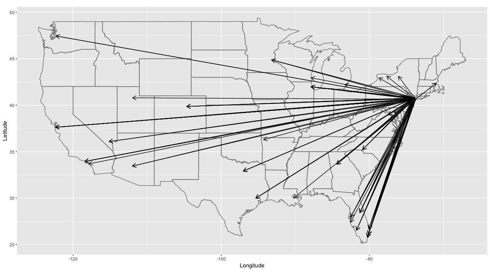
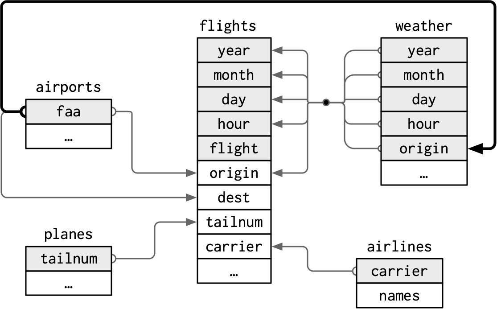
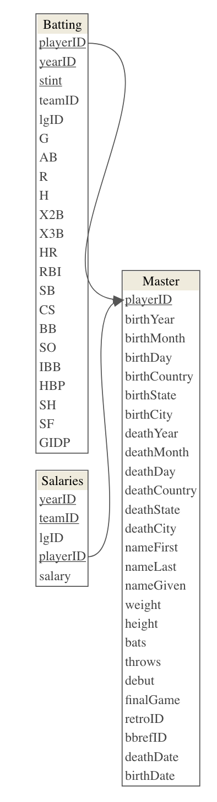
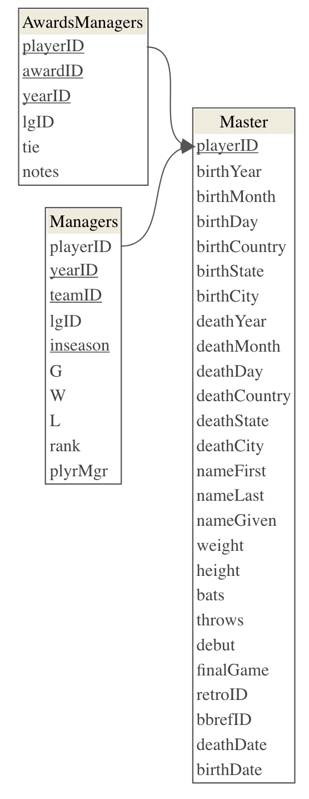
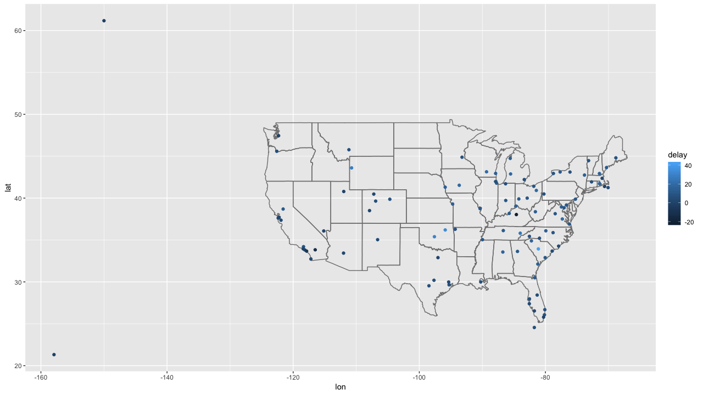
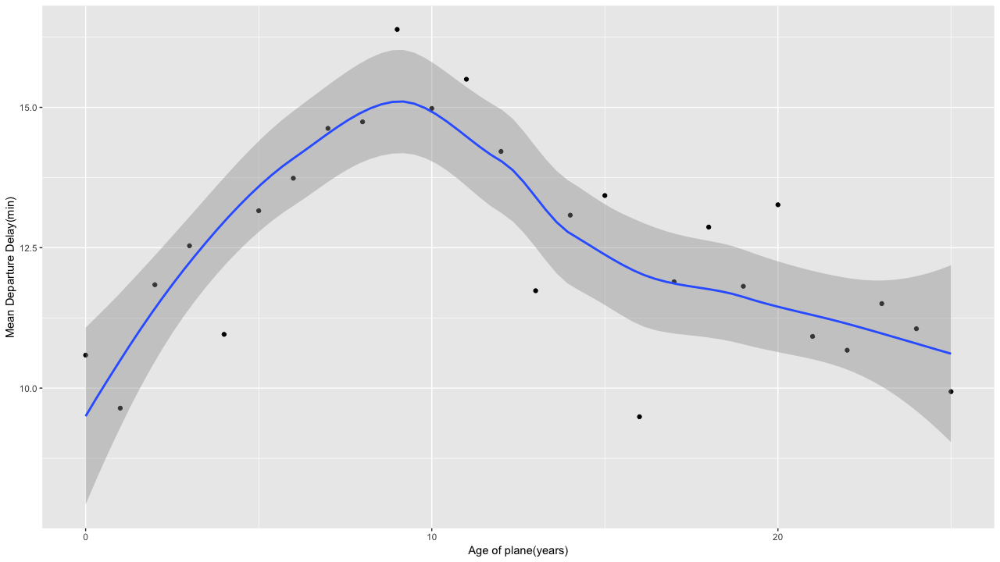
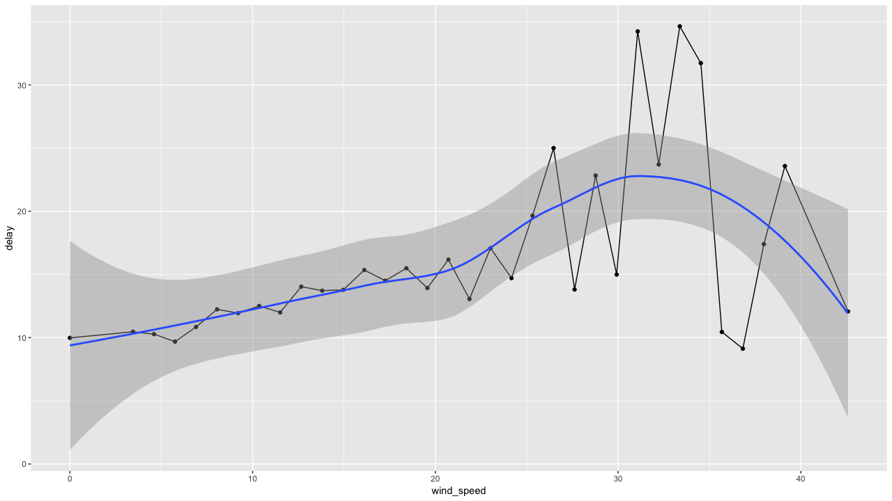
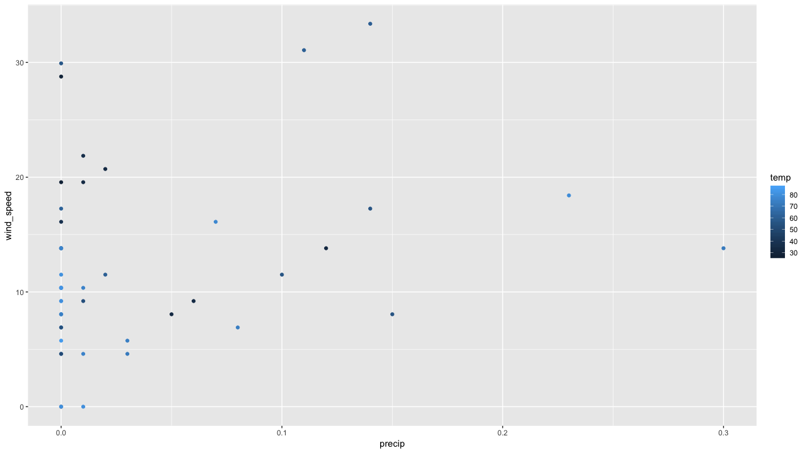

# 10章 dplyrによる関係データ

### 10.0 ライブラリの読み込み

```text
library("tidyverse")
library("nycflights13")
library("viridis")
library("datamodelr")
library("DiagrammeR")
library("fueleconomy")
 
library("nasaweather")
library("babynames")
library("Lahman")
```

### 10.1 はじめに


練習問題はありません


### 10.2 nycflights13

#### 練習問題1 各飛行機が出発地から目的地まで飛ぶ経路を描きたい場合、どのような変数が必要ですか？

出発地と目的地の緯度経度があれば線を結ぶことができるので、緯度経度の情報が必要になります。

```text
flights %>%
  select(origin, dest) %>% 
  inner_join(airports %>% 
               select(origin = faa, origin_lat = lat, origin_lon = lon),
             by = "origin") %>%
  inner_join(airports %>% select(dest = faa, dest_lat = lat, dest_lon = lon),
             by = "dest") %>%
  slice(1:100) %>%
  ggplot(.) +
  borders("state") +
  geom_segment(aes(
    x = origin_lon, xend = dest_lon,
    y = origin_lat, yend = dest_lat),
    arrow = arrow(length = unit(0.3, "cm"))) +
  coord_quickmap() +
  labs(y = "Latitude", x = "Longitude")
```



#### 練習問題2 `weather`と`airports`の関係を書き忘れたので、図で表現しなさい。

次の図は、この関係を含むように[セクション13.2](https://r4ds.had.co.nz/relational-data.html#nycflights13-relational)のものを更新したものです。`faa$airports`は、`weather$origin`の外部キーです。



#### 練習問題3 天気には、NYC空港の情報しか含まない。アメリカすべての空港の天気情報を含んでいたならば、`flights`にはどのような関係が追加されるのか？

米国のすべての空港の天気が含まれている場合は、各フライトの目的地の天気の情報がわかることになりますが、`weather`には、ニューヨークの空港しか含まれていない場合、`weather`には表示されていないフライトが（`year`, `month`, `day`, `hour`, `dest`）の値が多数ありました。

したがって、それは外部キーではありませんでしたが、`flight`で定義されている`year`, `month`, `day`, `hour`, `airports`のすべての組み合わせが天気表に追加された後で初めて、これらの表の間にこの関係が存在します。

#### 練習問題4 通常よりも人数が少なくなる「特別な日」があります。そのデータをデータフレームとしてどのように表現できますか。 そのテーブルの主キーは何でしょうか。 既存のテーブルにどのように接続しますか？

`year`, `month`, `day`をキーとして、`flight`に結合すれば、祝日の情報を追加できます。

```text
special_days <- tribble(
  ~year, ~month, ~day, ~holiday,
  2013, 01, 01, "New Years Day",
  2013, 07, 04, "Independence Day",
  2013, 11, 29, "Thanksgiving Day",
  2013, 12, 25, "Christmas Day"
)
```

### 10.3 キー

#### 練習問題1 `flights`に代理キーを追加しなさい。

`row_number()`を使って連番を降ることでキーを作成します。`arrange()`はどちらでも良いけど、並びに意味があると思ったら、並び替えたらいいと思います。個人的には、時系列で並んでいるほうがいいので、処理に時間がかからないのであれば、実行しておきます。

```text
flights %>%
  arrange(year, month, day, sched_dep_time, carrier, flight) %>%
  mutate(id = row_number()) %>%
  select(id, everything()) %>% 
  head()
  
# A tibble: 6 x 20
     id  year month   day dep_time sched_dep_time dep_delay arr_time
  <int> <int> <int> <int>    <int>          <int>     <dbl>    <int>
1     1  2013     1     1      517            515         2      830
2     2  2013     1     1      533            529         4      850
3     3  2013     1     1      542            540         2      923
4     4  2013     1     1      544            545        -1     1004
5     5  2013     1     1      554            558        -4      740
6     6  2013     1     1      559            559         0      702
# … with 12 more variables: sched_arr_time <int>, arr_delay <dbl>,
#   carrier <chr>, flight <int>, tailnum <chr>, origin <chr>, dest <chr>,
#   air_time <dbl>, distance <dbl>, hour <dbl>, minute <dbl>,
#   time_hour <dttm>
```

#### 練習問題2 以下のデータセットのキーを識別します

キーを特定するためには、組み合わせで一意になる必要があります。つまり、重複がない状態であれば、それは一意に特定できている状態です。`group_by(key) %>% summarise(n())`でも、`count(key)`でも結果は同じなので、どちらでも良いと思います。

```text
Lahman::Batting %>%
  group_by(playerID, yearID, stint) %>%
  summarise(n = n()) %>% 
  filter(n > 1) %>%
  nrow()
[1] 0

babynames::babynames %>%
  count(year, sex, name) %>%
  filter(n > 1) %>%
  nrow()
[1] 0

nasaweather::atmos %>%
  count(lat, long, year, month) %>%
  filter(n > 1) %>%
  nrow()
[1] 0

fueleconomy::vehicles %>%
  count(id) %>%
  filter(n > 1) %>%
  nrow()
[1] 0
```

`diamonds`にはキーが存在しません。キーが存在していない理由としては、データのカラムすべてを使って、重複を確認した行数と元の行数が減っているからです。つまり、重複する行がいくつかあります。この状態では主キーはありえません。

```text
ggplot2::diamonds %>%
  distinct() %>%
  nrow()
[1] 53794

nrow(ggplot2::diamonds)
[1] 53940
```

#### 練習問題3 Lahmanパッケージで、`Batting`、`Master`および`Salaries`の関係テーブルを示しなさい。また、`Master`、`Managers`、`AwardsManagers`の関係図も書きなさい。

| テーブル | 主キー | 外部キー |
| :--- | :--- | :--- |
| Master | playerID | ---- |
| Batting | playerID、yearID、stint | playerID= Master$playerID（多対1） |
| Salaries | playerID、yearID、teamID | playerID= Master$playerID（多対1） |

```text
Lahman::Master %>%
  count(playerID) %>%
  filter(n > 1) %>%
  nrow()
[1] 0

Lahman::Batting %>%
  count(playerID, yearID, stint) %>%
  filter(n > 1) %>%
  nrow()
[1] 0

Lahman::Salaries %>%
  count(playerID, yearID, teamID) %>%
  filter(n > 1) %>%
  nrow()
[1] 0
```

`{datamodelr}`を使ってER図も書いておきます。

```text
dm_from_data_frames(list(
  Batting = Lahman::Batting,
  Master = Lahman::Master,
  Salaries = Lahman::Salaries)) %>%
  dm_set_key("Batting", c("playerID", "yearID", "stint")) %>%
  dm_set_key("Master", "playerID") %>%
  dm_set_key("Salaries", c("yearID", "teamID", "playerID")) %>%
  dm_add_references(
    Batting$playerID == Master$playerID,
    Salaries$playerID == Master$playerID
  ) %>% 
  dm_create_graph(., rankdir = "LR", columnArrows = TRUE) %>%
  dm_render_graph()
```



もう1つの関係図も書きます。

| テーブル | 主キー | 外部キー |
| :--- | :--- | :--- |
| Master | playerID | ---- |
| Managers | yearID、teamID、inseason | playerIDはMaster$playerIDを参照（多対1） |
| Salaries | playerID、awardID、yearID | playerIDはMaster$playerIDを参照（多対1） |

```text
dm_from_data_frames(list(
  Master = Lahman::Master,
  Managers = Lahman::Managers,
  AwardsManagers = Lahman::AwardsManagers)) %>%
  dm_set_key("Master", "playerID") %>%
  dm_set_key("Managers", c("yearID", "teamID", "inseason")) %>%
  dm_set_key("AwardsManagers", c("playerID", "awardID", "yearID")) %>%
  dm_add_references(
    Managers$playerID == Master$playerID,
    AwardsManagers$playerID == Master$playerID) %>%
  dm_create_graph(., rankdir = "LR", columnArrows = TRUE) %>%
  dm_render_graph()
```



### 10.4 更新ジョイン

#### 練習問題1 目的地別の平均遅延時間を計算し、`airports`データフレームに結合し、遅延の空間分布を表現しなさい。

加工の順番的には、目的地別に平均遅延時間を計算し、目的地をキーに`airports`を結合することで緯度経度を入手し、あとは地図をマッピングします。

```text
flights %>%
  group_by(dest) %>%
  summarise(delay = mean(arr_delay, na.rm = TRUE)) %>%
  inner_join(airports, by = c(dest = "faa")) %>%
  ggplot(aes(lon, lat, colour = delay)) +
  borders("state") +
  geom_point() +
  coord_quickmap()
```



#### 練習問題2 出発地と目的地の場所に\(`lat`と`lon`\)を追加しなさい。

似たような加工を先程もしたような気がしますが、それはさておき、ここでは愚直に結合して、`suffix`という引数でカラムの衝突を防ぎます。`**_join`は、名前が衝突していると先に結合したものを`.x`、次に結合したものを`.y`としてカラム名に付与します。

```text
flights %>%
  select(origin, dest) %>%
  left_join(airports %>%
              select(faa, lat, lon),
    by = c("origin" = "faa")
  ) %>%
  left_join(airports %>%
                select(faa, lat, lon),
              by = c("dest" = "faa"))
              
# A tibble: 336,776 x 6
   origin dest  lat.x lon.x lat.y lon.y
   <chr>  <chr> <dbl> <dbl> <dbl> <dbl>
 1 EWR    IAH    40.7 -74.2  30.0 -95.3
 2 LGA    IAH    40.8 -73.9  30.0 -95.3
 3 JFK    MIA    40.6 -73.8  25.8 -80.3
 4 JFK    BQN    40.6 -73.8  NA    NA  
 5 LGA    ATL    40.8 -73.9  33.6 -84.4
 6 EWR    ORD    40.7 -74.2  42.0 -87.9
 7 EWR    FLL    40.7 -74.2  26.1 -80.2
 8 LGA    IAD    40.8 -73.9  38.9 -77.5
 9 JFK    MCO    40.6 -73.8  28.4 -81.3
10 LGA    ORD    40.8 -73.9  42.0 -87.9
# … with 336,766 more rows

flights %>%
  select(origin, dest) %>%
  left_join(airports %>%
              select(faa, lat, lon),
    by = c("origin" = "faa")
  ) %>%
  left_join(airports %>%
                select(faa, lat, lon),
              by = c("dest" = "faa"),
    suffix = c("_origin", "_dest"))

# A tibble: 336,776 x 6
   origin dest  lat_origin lon_origin lat_dest lon_dest
   <chr>  <chr>      <dbl>      <dbl>    <dbl>    <dbl>
 1 EWR    IAH         40.7      -74.2     30.0    -95.3
 2 LGA    IAH         40.8      -73.9     30.0    -95.3
 3 JFK    MIA         40.6      -73.8     25.8    -80.3
 4 JFK    BQN         40.6      -73.8     NA       NA  
 5 LGA    ATL         40.8      -73.9     33.6    -84.4
 6 EWR    ORD         40.7      -74.2     42.0    -87.9
 7 EWR    FLL         40.7      -74.2     26.1    -80.2
 8 LGA    IAD         40.8      -73.9     38.9    -77.5
 9 JFK    MCO         40.6      -73.8     28.4    -81.3
10 LGA    ORD         40.8      -73.9     42.0    -87.9
# … with 336,766 more rows
```

#### 練習問題3 機体年数と出発遅延平均時間に関係はあるか。

まず飛行機の機体年齢が含まれている`planes`と結合します。そして、飛行機の年齢と出発遅延の関係を調べるために、飛行機の各機体年齢の平均到着遅延と出発遅延を計算します。30年以上前の飛行機はほとんどないので、それらを25歳としてカテゴリにまとめます。

```text
flights %>% 
    select(year, tailnum, arr_delay, dep_delay) %>% 
    inner_join(planes %>% 
                   select(tailnum, plane_year = year),
               by = "tailnum") %>%
    mutate(age = year - plane_year) %>%
    filter(!is.na(age)) %>%
    mutate(age = pmin(25, age)) %>%
    group_by(age) %>%
    summarise(
        dep_delay_mean = mean(dep_delay, na.rm = TRUE)) %>% 
    ggplot(., aes(x = age, y = dep_delay_mean)) +
    geom_point() +
    geom_smooth(method = "loess") +
    scale_x_continuous("Age of plane(years)", 
                       breaks = seq(0, 50, by = 10)) +
    scale_y_continuous("Mean Departure Delay(min)")
```

平均出発遅延時間は10歳まで増加傾向にあります。その後、減少に転じています。または横ばいになります。出発遅延の減少の要因の1つとして、航空会社がこれらの飛行機を遅らせないように十分な時間をかけて、飛行機の確認や調整ができるスケジューリングを行うからでしょうか。



#### 練習問題4 天候と遅延は関係あるのか。

天候について指定がないので、例えば、絶対に関係してそうな`wind_speed`で関係を可視化してみると、天候と遅延は関係していることがわかります。

```text
flights %>%
  select(origin, year, month, day, hour, dep_delay) %>% 
  inner_join(weather, by = c(
    "origin" = "origin",
    "year" = "year",
    "month" = "month",
    "day" = "day",
    "hour" = "hour")) %>% 
  group_by(wind_speed) %>%
  summarise(delay = mean(dep_delay, na.rm = TRUE)) %>%
  ggplot(., aes(x = wind_speed, y = delay)) +
  geom_line() + 
  geom_point() + 
  geom_smooth(method = "loess")
```



#### 練習問題5 2013年6月13日に何が起こったのか。

例えば、2013年6月13日はハリケーンが発生していた日ですが、その日だけで平均遅延時間をプロットすると、東海岸では、多くの出発地で100分ほど遅れているように見えます。なので、天候と遅延は関係がありそうです。

```text
flights %>%
  select(year, month, day, dest, arr_delay) %>% 
  filter(year == 2013, month == 6, day == 13) %>%
  group_by(dest) %>%
  summarise(delay = mean(arr_delay, na.rm = TRUE)) %>%
  inner_join(airports, by = c("dest" = "faa")) %>%
  ggplot(aes(y = lat, x = lon, size = delay, colour = delay)) +
  borders("state") +
  geom_point() +
  coord_quickmap() 
```


### 10.5 フィルタジョイン

#### 練習問題1 `tailnum`が欠損しているフライトの意味は何ですか？`planes`に一致するレコードを持たない機体に共通しているのは何か。

アメリカン航空（AA）およびエンボイ航空（MQ）は`tailnum`がないようです。

```text
flights %>%
  anti_join(planes, by = "tailnum") %>%
  count(carrier, sort = TRUE)
  
# A tibble: 10 x 2
  carrier     n
  <chr>   <int>
1 MQ      25397
2 AA      22558
3 UA       1693
4 9E       1044
5 B6        830
6 US        699
# … with 4 more rows
```

#### 練習問題2 少なくとも100便が飛んでいる飛行機のフライトのみを表示します。

```text
flights %>%
  semi_join(filter(flights) %>%
              group_by(tailnum) %>%
              count() %>%
              filter(n >= 100), by = "tailnum")

# A tibble: 230,902 x 19
   year month   day dep_time sched_dep_time dep_delay arr_time
  <int> <int> <int>    <int>          <int>     <dbl>    <int>
1  2013     1     1      517            515         2      830
2  2013     1     1      533            529         4      850
3  2013     1     1      544            545        -1     1004
4  2013     1     1      554            558        -4      740
5  2013     1     1      555            600        -5      913
6  2013     1     1      557            600        -3      709
# … with 2.309e+05 more rows, and 12 more variables: sched_arr_time <int>,
#   arr_delay <dbl>, carrier <chr>, flight <int>, tailnum <chr>,
#   origin <chr>, dest <chr>, air_time <dbl>, distance <dbl>, hour <dbl>,
#   minute <dbl>, time_hour <dttm>
```

#### 練習問題3 `fueleconomy::vehicles`と`fueleconomy::common`を結合し、最も一般的なモデルのレコードを検索しなさい。

```text
fueleconomy::vehicles %>%
  semi_join(fueleconomy::common, by = c("make", "model"))
# A tibble: 14,531 x 12
     id make  model   year class  trans drive   cyl displ fuel    hwy   cty
  <int> <chr> <chr>  <int> <chr>  <chr> <chr> <int> <dbl> <chr> <int> <int>
1  1833 Acura Integ…  1986 Subco… Auto… Fron…     4   1.6 Regu…    28    22
2  1834 Acura Integ…  1986 Subco… Manu… Fron…     4   1.6 Regu…    28    23
3  3037 Acura Integ…  1987 Subco… Auto… Fron…     4   1.6 Regu…    28    22
4  3038 Acura Integ…  1987 Subco… Manu… Fron…     4   1.6 Regu…    28    23
5  4183 Acura Integ…  1988 Subco… Auto… Fron…     4   1.6 Regu…    27    22
6  4184 Acura Integ…  1988 Subco… Manu… Fron…     4   1.6 Regu…    28    23
# … with 1.452e+04 more rows
```

#### 練習問題4 最悪の遅延がある48時間（年間を通して）を見つけます。天気データと相互参照してください。パターンは見えますか？

定義に曖昧な部分があるので、[r4ds-exercise-solutions](https://jrnold.github.io/r4ds-exercise-solutions/relational-data.html#introduction-7)の定義に従います。

> 1. What is meant by “delay”? I will use departure delay. Since the `weather` data only contains data for the New York City airports, and departure delays will be more sensitive to New York City weather conditions than arrival delays.
> 2. What is meant by “worst”? I define worst delay as the average departure delay per flight for flights _scheduled_ to depart in that hour. For hour, I will use the scheduled departure time rather than the actual departure time. If planes are delayed due to weather conditions, the weather conditions during the scheduled time are more important than the actual departure time, at which point, the weather could have improved.
> 3. What is meant by “48 hours over the course of the year”? This could mean two days, a span of 48 contiguous hours, or 48 hours that are not necessarily contiguous hours. I will find 48 not-necessarily contiguous hours. That definition makes better use of the methods introduced in this section and chapter.
> 4. What is the unit of analysis? Although the question mentions only hours, I will use airport hours. The weather dataset has an observation for each airport for each hour. Since all the departure airports are in the vicinity of New York City, their weather should be similar, it will not be the same.

```text
weather %>%
  semi_join(
    .,
    flights %>%
      mutate(hour = sched_dep_time %/% 100) %>%
      group_by(origin, year, month, day, hour) %>%
      summarise(dep_delay = mean(dep_delay, na.rm = TRUE)) %>%
      ungroup() %>%
      arrange(desc(dep_delay)) %>%
      slice(1:48),
    by = c("origin", "year",
           "month", "day", "hour")
  ) %>%
  ggplot(., aes(x = precip, y = wind_speed, color = temp)) +
  geom_point()
```




#### 練習問題5 `anti_join(flights, airports, by = c("dest" = "faa"))`と`anti_join(airports, flights, by = c("faa" = "dest"))`から何がわかるか。

`anti_join(flights, airports, by = c("dest" = "faa"))`は、FAAの目的地リストに載っていない空港へ行く便が表示されます。FAAリストには国内空港しかないので、おそらく外国便?かもしれません。

`anti_join(airports, flights, by = c("faa" = "dest"))`は、データ内のどのフライトの目的地でもなかった米国の空港です。データにはニューヨーク市の空港からのすべてのフライトが含まれているので、2013年にニューヨークからの直行便がなかった米国の空港のリストです。

#### 練習問題6 飛行機と航空会社の間に暗黙の関係\(各飛行機は1つの航空会社によって飛ばされる\)があることを期待するかもしれません。上記で学んだツールを使用して、この仮説を確認するか却下します。

各飛行機は単一の航空会社によって飛行されますが、1つの飛行機を複数の航空会社が購入して飛行することはできます。すべての航空会社と飛行機の組み合わせを調べると、1つの飛行機を複数の航空会社が飛ばしていることがわかります。なので、この仮説は認められません。

```text
flights %>%
  filter(!is.na(tailnum)) %>%
  distinct(tailnum, carrier) %>%
  count(tailnum) %>%
  filter(n > 1)

# A tibble: 17 x 2
   tailnum     n
   <chr>   <int>
 1 N146PQ      2
 2 N153PQ      2
 3 N176PQ      2
 4 N181PQ      2
 5 N197PQ      2
 6 N200PQ      2
 7 N228PQ      2
 8 N232PQ      2
 9 N933AT      2
10 N935AT      2
11 N977AT      2
12 N978AT      2
13 N979AT      2
14 N981AT      2
15 N989AT      2
16 N990AT      2
17 N994AT      2

flights %>%
  filter(!is.na(tailnum)) %>%
  distinct(tailnum, carrier) %>%
  group_by(tailnum) %>%
  filter(n() > 1) %>%
  left_join(airlines, by = "carrier") %>%
  arrange(tailnum, carrier)

# A tibble: 34 x 3
# Groups:   tailnum [17]
  tailnum carrier name                    
    <chr>   <chr>   <chr>                   
 1 N146PQ  9E      Endeavor Air Inc.       
 2 N146PQ  EV      ExpressJet Airlines Inc.
 3 N153PQ  9E      Endeavor Air Inc.       
 4 N153PQ  EV      ExpressJet Airlines Inc.
 5 N176PQ  9E      Endeavor Air Inc.       
 6 N176PQ  EV      ExpressJet Airlines Inc.
 7 N181PQ  9E      Endeavor Air Inc.       
 8 N181PQ  EV      ExpressJet Airlines Inc.
 9 N197PQ  9E      Endeavor Air Inc.       
10 N197PQ  EV      ExpressJet Airlines Inc.
```

### 10.6 ジョインの問題


練習問題はありません


### 10.7 集合演算


練習問題はありません


