# 12章 forcatsでファクタ


### 12.0 ライブラリの読み込み

```text
library("tidyverse")
library("gridExtra")
library("stringr")
```

### 12.1 はじめに


練習問題はありません


### 12.2 ファクタを作る


練習問題はありません


### 12.3 総合的社会調査

#### 練習問題1 `rincome`\(報告所得\)の分布を調べなさい。デフォルトの棒グラフを理解するのが難しい理由も答えなさい。

デフォルト設定でgeom\_bar\(\)を使うと、ラベルが重なってしまい、なんのカテゴリかわかりません。

```text
ggplot(gss_cat, aes(rincome)) +
  geom_bar()
```

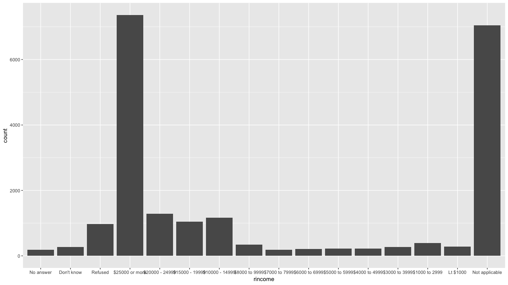

このような場合はラベルを回転させると、テキストが見やすくなります。

```text
ggplot(gss_cat, aes(rincome)) +
  geom_bar() +
  theme(axis.text.x = element_text(angle = 45, hjust = 1))
```

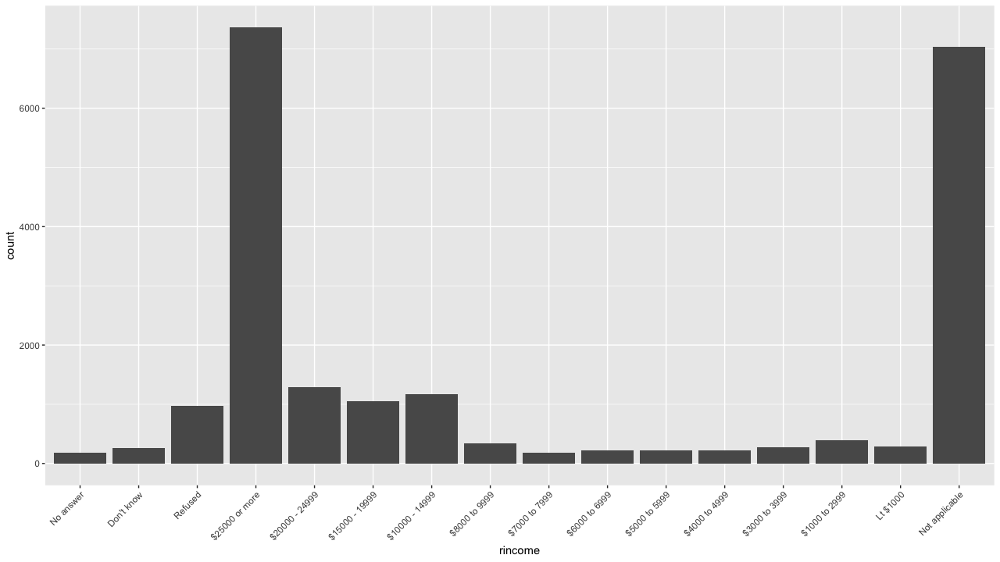

棒グラフにカウント数を表示させたい場合は`geom_text()`を使います。テキストの位置は、`vjust`でも座標を指定してもどちらでもよいかと思います。カテゴリで色分けして、棒グラフを作る場合は、座標位置を指定したほうが柔軟かもしれません。

```text
ggplot(gss_cat %>% count(rincome), aes(rincome , n, label = n)) +
  geom_bar(stat = "identity") +
  geom_text(aes(rincome , n + 200)) +
  theme(axis.text.x = element_text(angle = 45, hjust = 1))

# ggplot(gss_cat %>% count(rincome), aes(rincome, n, label = n)) +
#   geom_bar(stat = "identity") +
#   geom_text(aes(rincome, n, vjust = -0.1), size = 2)+
#   theme(axis.text.x = element_text(angle = 45, hjust = 1))
```

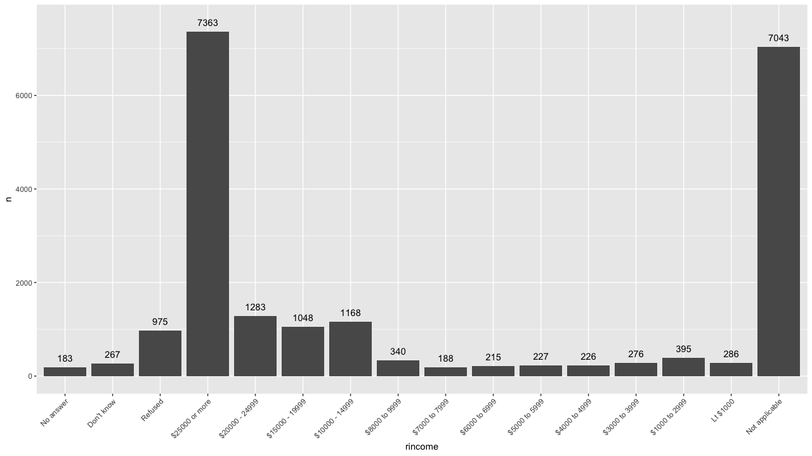

もう少し改善するために`fct_recode()`を使います。この関数は、カテゴリの値を修正することができます。ここでは、"Lt $1000"を"Less than $1000"に変更しています。また、ラベル名が長いので、見やすくするために座標を回転させています。

```text
gss_cat %>%
  filter(!rincome %in% c("Not applicable")) %>%
  mutate(rincome = fct_recode(rincome,
                              "Less than $1000" = "Lt $1000")) %>%
  mutate(flg = rincome %in% c("Refused", "Don't know", "No answer")) %>%
  ggplot(aes(x = rincome, fill = flg)) +
  geom_bar() +
  coord_flip() +
  scale_y_continuous("Number of Respondents", labels = scales::comma) +
  scale_x_discrete("Respondent's Income") +
  scale_fill_manual(values = c("FALSE" = "#006E4F", "TRUE" = "gray")) + 
  theme_bw()
```

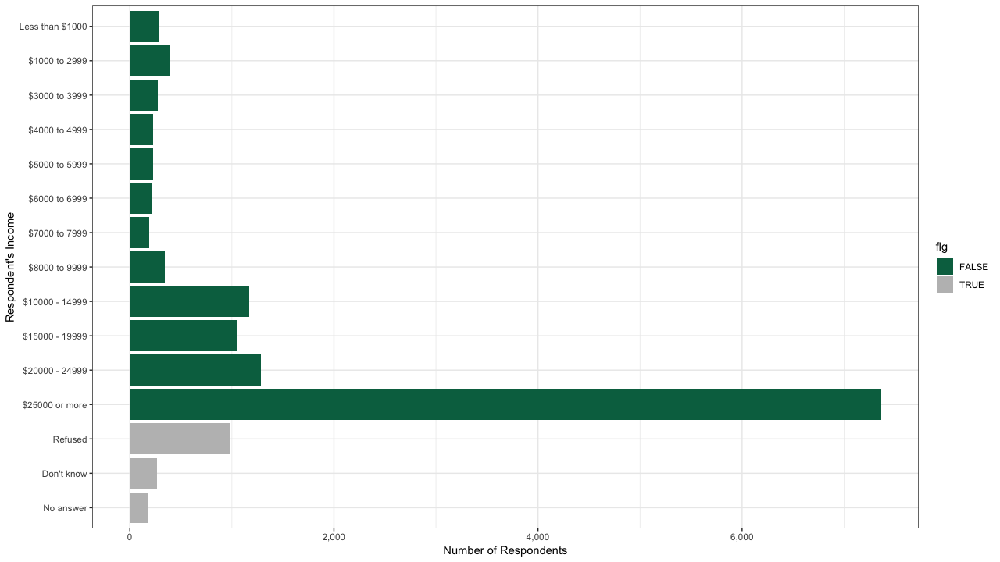

#### 練習問題2 総合的社会調査で最も多い`relig`、`partyid`は何か。

`relig`は`Protestant`で、`partyid`は`Independent`が最も多いようです。

```text
gss_cat %>%
  count(relig) %>%
  arrange(desc(n))

# A tibble: 15 x 2
   relig                       n
   <fct>                   <int>
 1 Protestant              10846
 2 Catholic                 5124
 3 None                     3523
 4 Christian                 689
 5 Jewish                    388
 6 Other                     224
 7 Buddhism                  147
 8 Inter-nondenominational   109
 9 Moslem/islam              104
10 Orthodox-christian         95
11 No answer                  93
12 Hinduism                   71
13 Other eastern              32
14 Native american            23
15 Don't know                 15

gss_cat %>%
  count(partyid) %>%
  arrange(desc(n))

# A tibble: 10 x 2
   partyid                n
   <fct>              <int>
 1 Independent         4119
 2 Not str democrat    3690
 3 Strong democrat     3490
 4 Not str republican  3032
 5 Ind,near dem        2499
 6 Strong republican   2314
 7 Ind,near rep        1791
 8 Other party          393
 9 No answer            154
10 Don't know             1

```

`fct_infreq`や`fct_rev`を使うことで簡単にファクタの水準を操作することが可能です。

```text
p1 <- gss_cat %>% 
  ggplot(., aes(partyid %>% fct_infreq)) + geom_bar() +
  theme(axis.text.x = element_text(angle = 45, hjust = 1))

p2 <- gss_cat %>% 
  ggplot(., aes(partyid %>% fct_infreq %>% fct_rev)) + geom_bar() +
  theme(axis.text.x = element_text(angle = 45, hjust = 1))

grid.arrange(p1, p2, ncol = 2, nrow = 1)
```

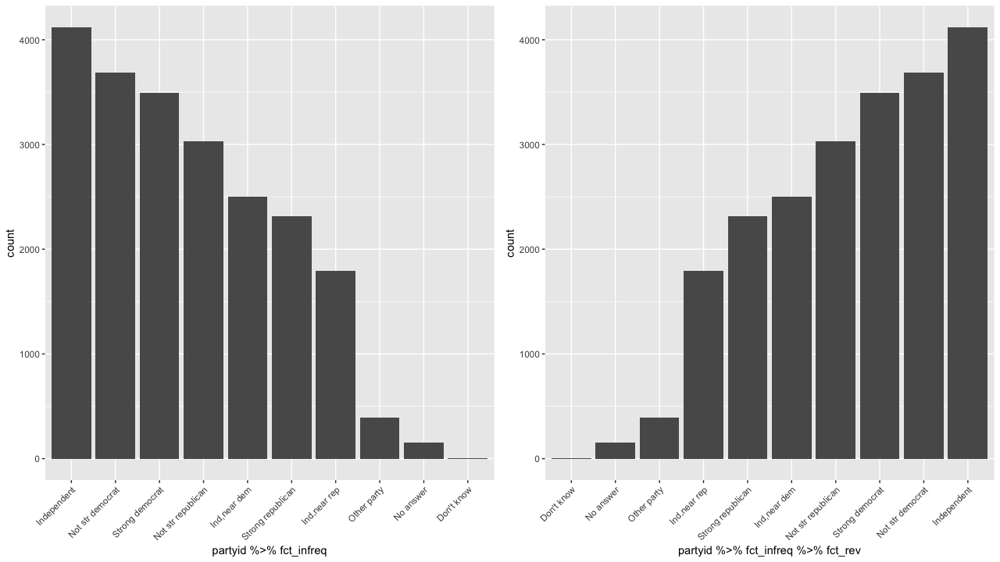

#### 練習問題3 どの`relig`に`denom`が適用されるのか。表からどうやって見つけるか？どう視覚化するべきか？

文脈から`denom`は、「プロテスタント」を指すことは明らかです

```text
levels(gss_cat$denom)
 [1] "No answer"            "Don't know"          
 [3] "No denomination"      "Other"               
 [5] "Episcopal"            "Presbyterian-dk wh"  
 [7] "Presbyterian, merged" "Other presbyterian"  
 [9] "United pres ch in us" "Presbyterian c in us"
[11] "Lutheran-dk which"    "Evangelical luth"    
[13] "Other lutheran"       "Wi evan luth synod"  
[15] "Lutheran-mo synod"    "Luth ch in america"  
[17] "Am lutheran"          "Methodist-dk which"  
[19] "Other methodist"      "United methodist"    
[21] "Afr meth ep zion"     "Afr meth episcopal"  
[23] "Baptist-dk which"     "Other baptists"      
[25] "Southern baptist"     "Nat bapt conv usa"   
[27] "Nat bapt conv of am"  "Am bapt ch in usa"   
[29] "Am baptist asso"      "Not applicable"     
```

視覚化するのであれば、カテゴリの散布図でよいと思います。

```text
gss_cat %>%
  count(relig, denom) %>%
  ggplot(aes(x = relig, y = denom, size = n)) +
  geom_point() +
  theme(axis.text.x = element_text(angle = 90))
```

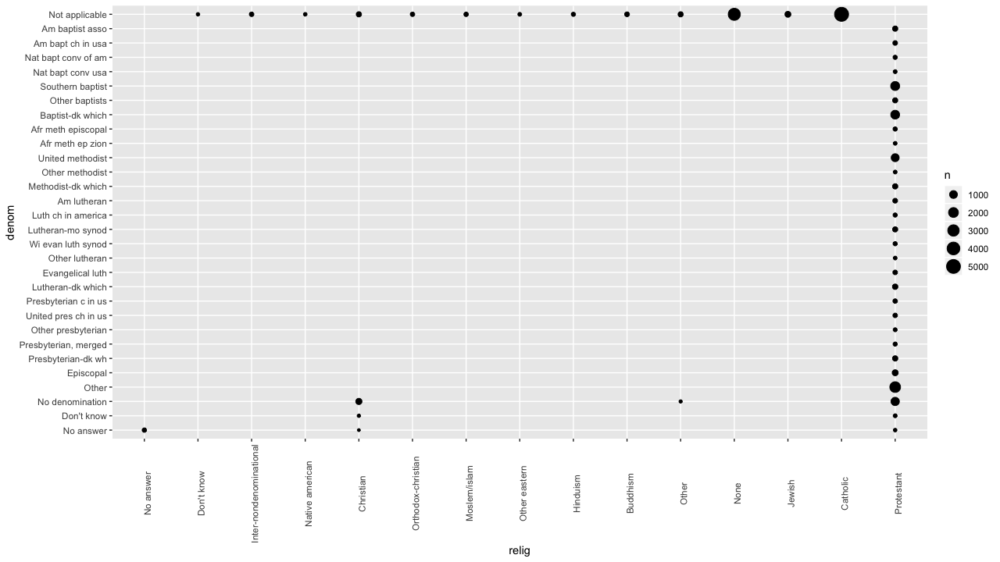

### 12.4 ファクタの順序の変更

#### 練習問題1 `tvhours`の高い値は疑わしい。平均は適切なのか。

視覚化してみると、確かに10時間を超えるtv視聴時間があります。

```text
gss_cat %>%
  filter(!is.na(tvhours)) %>%
  ggplot(aes(x = tvhours)) +
  geom_histogram(bins = gss_cat %>% 
                   filter(!is.na(tvhours)) %>% 
                   distinct(tvhours) %>% 
                   pull() %>% 
                   length())
```

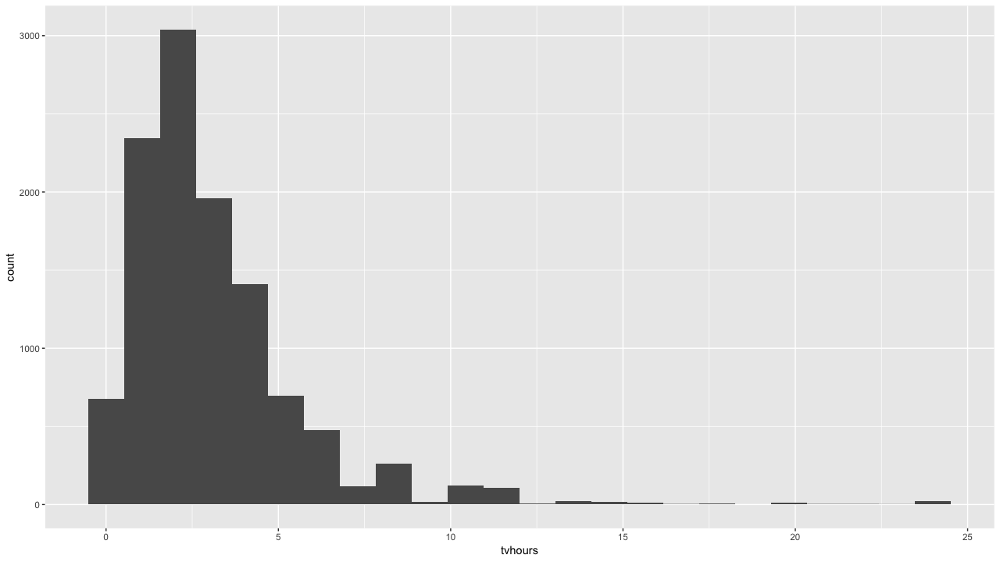

このような場合、平均は外れ値に引っ張らてしまうため、中央値のほうが望ましいかもしれません。

```text
m <- mean(gss_cat$tvhours, na.rm = TRUE)
md <- median(gss_cat$tvhours, na.rm = TRUE)

gss_cat %>%
  filter(!is.na(tvhours)) %>%
  ggplot(., aes(x = tvhours)) +
  geom_histogram(bins = gss_cat %>% 
                   filter(!is.na(tvhours)) %>% 
                   distinct(tvhours) %>% 
                   pull() %>% 
                   length()) +
  geom_vline(xintercept = m, col = "red") + 
  geom_vline(xintercept = md, col = "blue") 
```

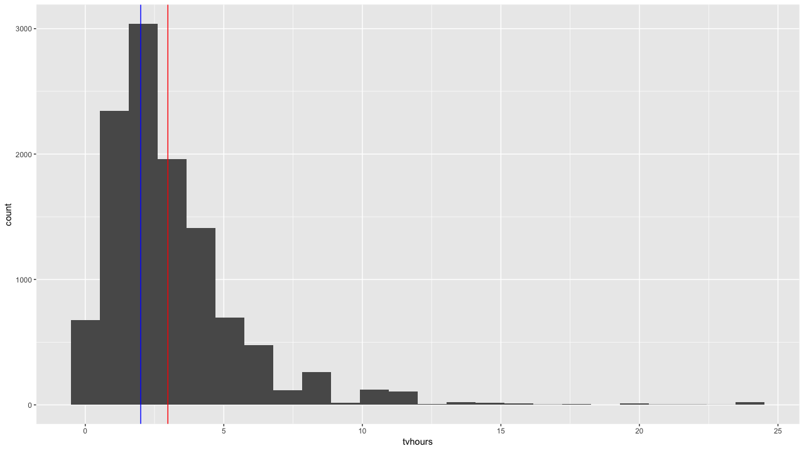

#### 練習問題2 `gss_cat`の各ファクタについて、水準の順序が定まっているか調べなさい。

このデータセットには6個のファクタ型のカラムが存在しています。ここでは、`levels()`を使えば、水準を確認できますが、ここでは一気に視覚化して、内容を確認します。このプロットを見る限り、`race`はカウント数で順序付けられており、`rincome`は値の順番で順序付けられています。

```text
x <- gss_cat %>% 
  keep(is.factor) %>% 
  names() %>%
  as.list()
            
plots <- x %>% 
  map( ~ ggplot(data = gss_cat) + 
         geom_bar(aes_string(x = .x)) + ylab(.x)+ 
         coord_flip()) 

grid.arrange(plots[[1]], plots[[2]], plots[[3]],
             plots[[4]], plots[[5]], plots[[6]], 
             ncol = 3, nrow = 2)
```

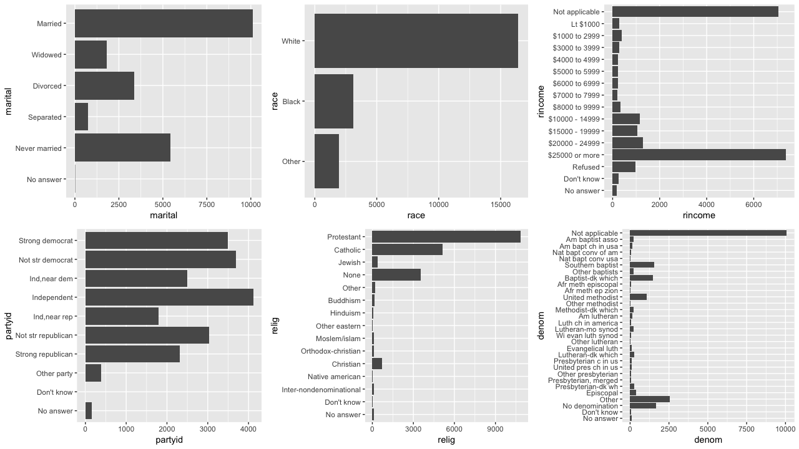

#### 練習問題3 `Not applicable`をレベルの前に移動し、プロットの最下段に移動したのはなぜか。

質問の意図がいまいちよくわかっていません。書籍の中では下記のコードを利用し、"Not applicable"を最下層に配置しています。

```text
gss_cat %>% 
  group_by(rincome) %>% 
  summarise(age = mean(age, na.rm = TRUE)) %>% 
  mutate(rincome = fct_relevel(rincome, "Not applicable")) %>% 
  ggplot(., aes(rincome, age)) + 
  geom_point() +
  coord_flip()
```

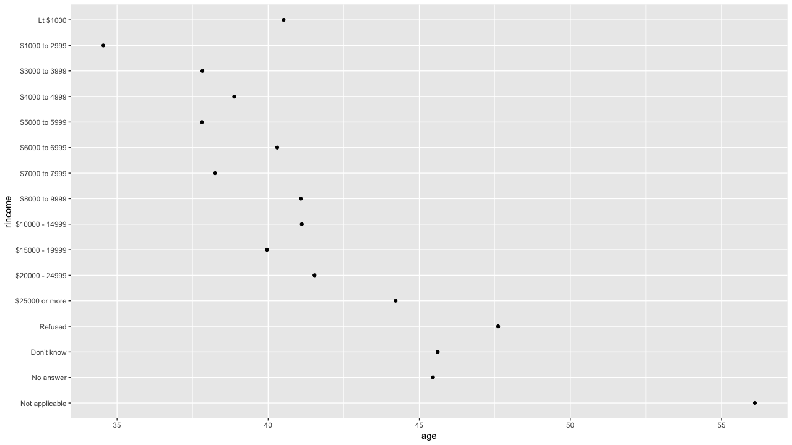

`fct_relevel()`自体は、指定したレベル順で水準を並び替えます。

```text
mon <- paste0(1:12, "月")
factor(mon, levels = mon)
 [1] 1月  2月  3月  4月  5月  6月  7月  8月  9月  10月 11月 12月
Levels: 1月 2月 3月 4月 5月 6月 7月 8月 9月 10月 11月 12月

fct_relevel(mon, paste0(12:1, "月"))
 [1] 1月  2月  3月  4月  5月  6月  7月  8月  9月  10月 11月 12月
Levels: 12月 11月 10月 9月 8月 7月 6月 5月 4月 3月 2月 1月
```

### 12.5 ファクタの水準の変更

#### 練習問題1 民主党員、共和党員、および独立党員として分類される人々の割合は、時間経過とともにどのように変化したか？

まず`partyid`の内容が細かいので、指定されている粒度に変換します。`fct_collapse()`でカテゴリを丸めることが可能です。あとは年別に、割合を求めてプロットすれば推移が確認できます。

```text
gss_cat %>%
  select(partyid, year) %>% 
  mutate(partyid =
      fct_collapse(partyid,
                   Other = c("No answer", "Don't know", "Other party"),
                   Republican = c("Strong republican", "Not str republican"),
                   Independent = c("Ind,near rep", "Independent", "Ind,near dem"),
                   Democrat = c("Not str democrat", "Strong democrat"))) %>%
  count(year, partyid) %>%
  group_by(year) %>%
  mutate(ratio = n / sum(n)) %>%
  ggplot(aes(year, ratio, col = fct_reorder2(partyid, year, ratio))) +
  geom_line() +
  labs(colour = "Party") + 
  theme_bw()
```

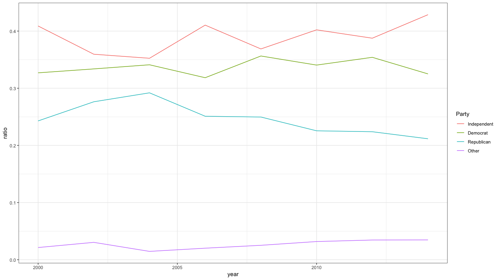

#### 練習問題2 `rincome`をより少数のカテゴリにまとめるにはどうすればよいか。

`fct_collapse()`と`str_c()`を組み合わせることで、カテゴリを効率的に丸めることができます。ここでは5000単位で丸めます。

```text
gss_cat %>%
  mutate(rincome =
      fct_collapse(rincome,
        `Unknown` = c("No answer", "Don't know", "Refused", "Not applicable"),
        `Lt $5000` = c("Lt $1000", str_c("$", c("1000", "3000", "4000"), " to ", c("2999", "3999", "4999"))),
        `$5000 to 10000` = str_c("$", c("5000", "6000", "7000", "8000"), " to ", c("5999", "6999", "7999", "9999")))) %>%
  ggplot(aes(x = rincome)) +
  geom_bar() +
  theme(axis.text.x = element_text(angle = 45, hjust = 1))
```

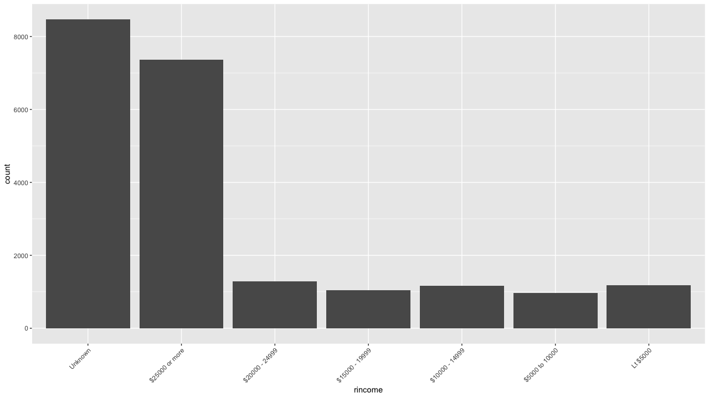

