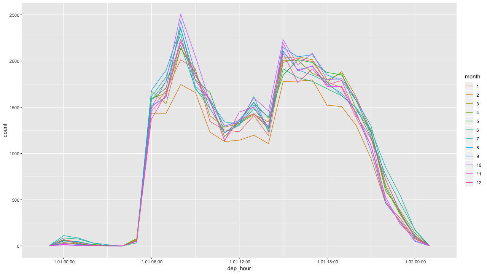
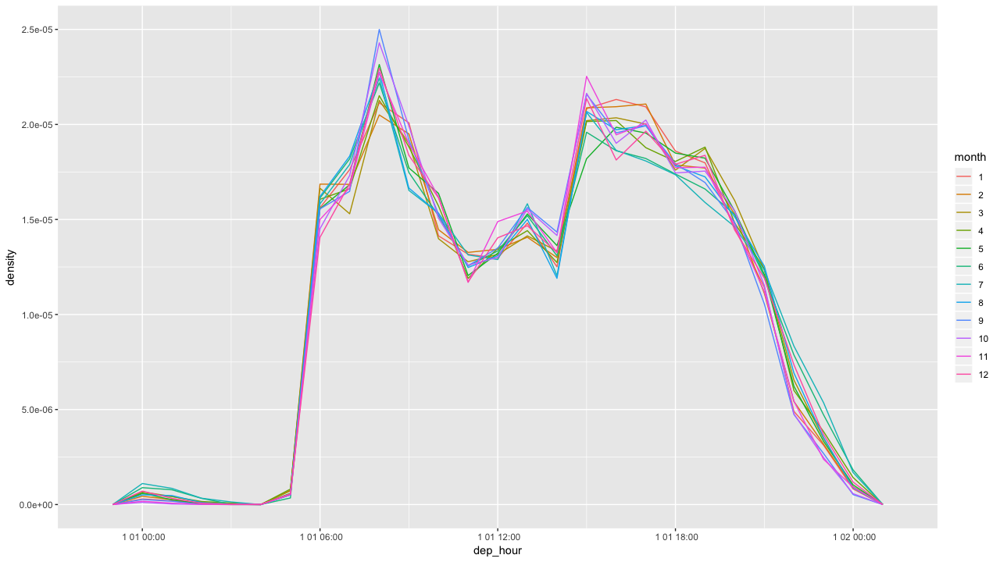
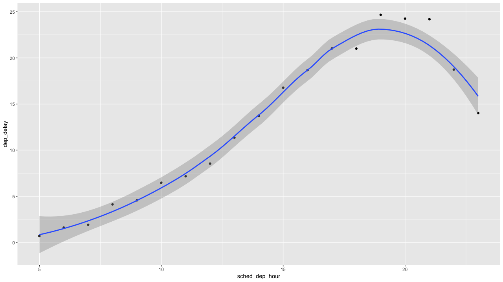
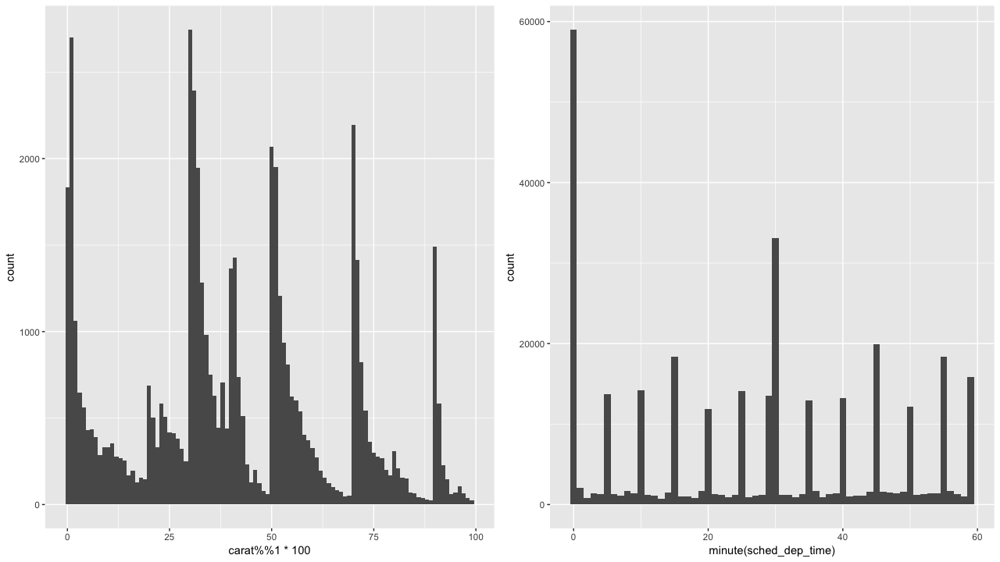
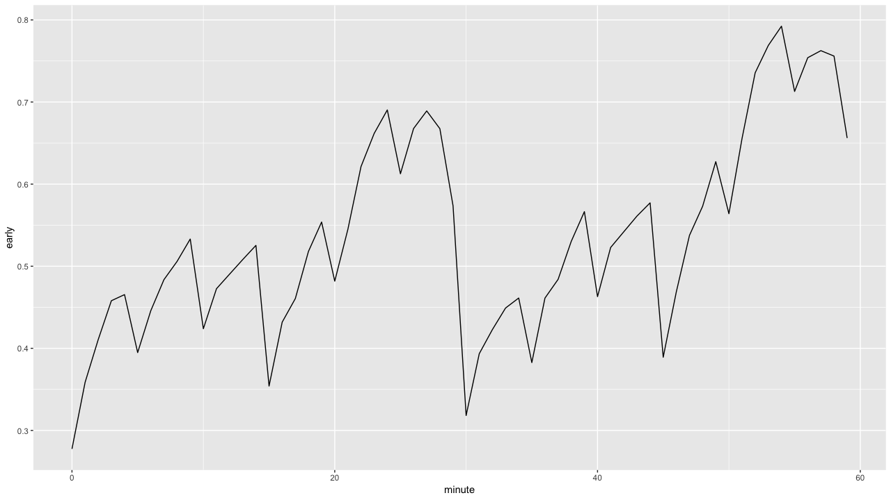

# 13章 lubridateによる日付と時刻

### 13.0 ライブラリの読み込み

```text
library("tidyverse")

library("lubridate")
library("nycflights13")
```

この章で利用するデータです。

```text
make_datetime_100 <- function(year, month, day, time) {
  make_datetime(year, month, day, time %/% 100, time %% 100)
}

flights_dt <- flights %>%
  filter(!is.na(dep_time), !is.na(arr_time)) %>%
  mutate(
    dep_time = make_datetime_100(year, month, day, dep_time),
    arr_time = make_datetime_100(year, month, day, arr_time),
    sched_dep_time = make_datetime_100(year, month, day, sched_dep_time),
    sched_arr_time = make_datetime_100(year, month, day, sched_arr_time)) %>%
  select(origin, dest, ends_with("delay"), ends_with("time"))

sched_dep <- flights_dt %>%
    mutate(minute = minute(sched_dep_time)) %>%
    group_by(minute) %>%
    summarise(
      avg_delay = mean(arr_delay, na.rm = TRUE),
      n = n())
```

### 13.1 はじめに


練習問題はありません。


### 13.2 日付と時刻の作成

#### 練習問題1 不適切な日付を含む文字列をパースした場合はどうなるか？

`NA`として変換されます。

```text
ymd(c("2010-10-10", "bananas"))
[1] "2010-10-10" NA          
 
警告メッセージ: 
 1 failed to parse. 
```

#### 練習問題2 `today()`の`tzone`はどんな役割があるのか。それは重要なのか？

タイムゾーンによって返される値は異なります。

```text
Sys.timezone()
[1] 
"Asia/Tokyo"
 
today(tzone = "")
[1] "2019-06-29"

today(tzone = "UTC")
[1] "2019-06-28"

today(tzone = "GMT")
[1] "2019-06-28"
```

#### 練習問題3 適切な`lubridate`関数で下記の日付をパースしなさい。

`lubridate`の関数はYear, Month, Dayの頭文字をパースしたい文字列の規則に当てはめるだけで、日付型に変換できる便利な関数が用意されています。

```text
mdy(d1)
[1] "2010-01-20"

d2 <- "2015-Mar-07"
ymd(d2)
[1] "2015-03-07"

d3 <- "06-Jun-2017"
dmy(d3)
[1] "2017-06-06"

d4 <- c("August 19 (2015)", "July 1 (2015)")
mdy(d4)
[1] "2015-01-09" "2015-01-20"

d5 <- "12/30/14"
mdy(d5)
[1] "2014-12-30"
```

### 13.3 日付時刻の要素

#### 練習問題1 1日のフライト時刻の分布は、1年間を通じてどのように変わったか？

月ごとにプロットしてみると、2月のフライト回数が減っているだけで、目立った傾向はありません。また、2月は日数が少ないからかもしれません。

```text
flights_dt %>%
  select(dep_time) %>% 
  filter(!is.na(dep_time)) %>%
  mutate(dep_hour = update(dep_time, yday = 1),
         month = factor(month(dep_time))) %>% 
  ggplot(., aes(dep_hour, color = month)) +
  geom_freqpoly(binwidth = 60 * 60) 
```



密度に変えてみたところ、日数が少ない2月については、日数が少なかっただけだったということがわかります。

```text
flights_dt %>%
  select(dep_time) %>% 
  filter(!is.na(dep_time)) %>%
  mutate(dep_hour = update(dep_time, yday = 1),
         month = factor(month(dep_time))) %>% 
  ggplot(.,aes(dep_hour, color = month)) +
  geom_freqpoly(aes(y = ..density..), binwidth = 60 * 60)
```



#### 練習問題2 `dep_time`、`sched_dep_time`および`dep_delay`を比較しなさい。一貫した変化はあるのか。

一致はしていないが、これは日付がずれることで発生するレコードかもしれません。`make_datetime_100()`関数を使用して日時を作成するときに、これは考慮されていません。

```text
flights_dt %>%
  mutate(dep_time_ = sched_dep_time + dep_delay * 60) %>%
  filter(dep_time_ != dep_time) %>%
  select(dep_time_, dep_time, sched_dep_time, dep_delay)
# A tibble: 1,205 x 4
  dep_time_           dep_time            sched_dep_time      dep_delay
  <dttm>              <dttm>              <dttm>                  <dbl>
1 2013-01-02 08:48:00 2013-01-01 08:48:00 2013-01-01 18:35:00       853
2 2013-01-03 00:42:00 2013-01-02 00:42:00 2013-01-02 23:59:00        43
3 2013-01-03 01:26:00 2013-01-02 01:26:00 2013-01-02 22:50:00       156
4 2013-01-04 00:32:00 2013-01-03 00:32:00 2013-01-03 23:59:00        33
5 2013-01-04 00:50:00 2013-01-03 00:50:00 2013-01-03 21:45:00       185
6 2013-01-04 02:35:00 2013-01-03 02:35:00 2013-01-03 23:59:00       156
# … with 1,199 more rows
```

#### 練習問題3 `air_time`を出発から到着までの時間差を比較しなさい。

一致はしていない。

```text
flights_dt %>%
  select(origin, dest, arr_time, dep_time, air_time) %>% 
  mutate(flight_duration = as.numeric(arr_time - dep_time),
         air_time_mins = air_time,
         diff = flight_duration - air_time_mins) 
# A tibble: 328,063 x 8
   origin dest  arr_time            dep_time            air_time
   <chr>  <chr> <dttm>              <dttm>                 <dbl>
 1 EWR    IAH   2013-01-01 08:30:00 2013-01-01 05:17:00      227
 2 LGA    IAH   2013-01-01 08:50:00 2013-01-01 05:33:00      227
 3 JFK    MIA   2013-01-01 09:23:00 2013-01-01 05:42:00      160
 4 JFK    BQN   2013-01-01 10:04:00 2013-01-01 05:44:00      183
 5 LGA    ATL   2013-01-01 08:12:00 2013-01-01 05:54:00      116
 6 EWR    ORD   2013-01-01 07:40:00 2013-01-01 05:54:00      150
 7 EWR    FLL   2013-01-01 09:13:00 2013-01-01 05:55:00      158
 8 LGA    IAD   2013-01-01 07:09:00 2013-01-01 05:57:00       53
 9 JFK    MCO   2013-01-01 08:38:00 2013-01-01 05:57:00      140
10 LGA    ORD   2013-01-01 07:53:00 2013-01-01 05:58:00      138
# … with 328,053 more rows, and 3 more variables: flight_duration <dbl>,
#   air_time_mins <dbl>, diff <dbl>
```

#### 練習問題4 平均遅延時間は1日の間にどのように変わりますか？`dep_time`または`sched_dep_time`のいずれを使うべきなのか？

`dep_time`はフライトを遅らせると、それが積み重なって、遅延時間が大きくなる傾向がわかります。実際、視覚化するとこの関係が説明できます。

`dep_time`はフライトを遅らせると時間が遅れますが、`sched_dep_time`は、フライトをスケジュールする人にとって重要な指標なので、こちらを使います。

```text
flights_dt %>%
  select(sched_dep_time, dep_delay) %>% 
  mutate(sched_dep_hour = hour(sched_dep_time)) %>%
  group_by(sched_dep_hour) %>%
  summarise(dep_delay = mean(dep_delay, na.rm = TRUE)) %>%
  ggplot(aes(sched_dep_hour, dep_delay)) +
  geom_point() +
  geom_smooth()
```



#### 練習問題5 遅延の可能性を最小限に抑えたい場合は、何曜日に出発すべきか。

土曜日は平均出発遅延時間が少ないようです。遅延の可能性を下げたいのであれば、土曜日にフライトするべきです。

```text
flights_dt %>%
  select(sched_dep_time, dep_delay) %>% 
  mutate(dow = wday(sched_dep_time)) %>%
  group_by(dow) %>%
  summarise(dep_delay = mean(dep_delay))
# A tibble: 7 x 2
    dow dep_delay
  <dbl>     <dbl>
1     1     11.5 
2     2     14.7 
3     3     10.6 
4     4     11.7 
5     5     16.1 
6     6     14.7 
7     7      7.62
```

#### 練習問題6 `diamonds$carat`と`flights$sched_dep_time`の分布が似ているのはなぜか？

分布が似ているのは、ある閾値を設定し、その点を超えると、繰りあげ処理が行なわれているようです。そのため、双方の分布が似てきます。

```text
p1 <- ggplot(diamonds, aes(x = carat %% 1 * 100)) +
  geom_histogram(binwidth = 1)

p2 <- ggplot(flights_dt, aes(x = minute(sched_dep_time))) +
  geom_histogram(binwidth = 1)
  
grid.arrange(p1, p2,  ncol = 2, nrow = 1)
```



#### 練習問題7 20〜30分および50〜60分でのフライトは出発遅延が少ない。それよりも早く出発する便による影響という私の仮説を確認しなさい。

出発の分数ごとにフライトをグループ化すると、早い出発の割合が20〜30、50〜60分の間で最も高いことがわかります。

```text
flights_dt %>%
  mutate(minute = minute(dep_time),
        early = dep_delay < 0) %>%
  group_by(minute) %>%
  summarise(early = mean(early, na.rm = TRUE),
            n = n()) %>%
  ggplot(aes(minute, early)) +
  geom_line()
```



### 13.4 タイムスパン

#### 練習問題1 `months()`があるのに`dmonths()`がないのはなぜか。

`d**()`は`duration`を表す関数です。月の日数が異なるため、秒単位の値は定まりません。

* 31日：1月、3月、5月、7月、8月、10月
* 30日：4月、6月、9月、11月、12月
* 28または29日：2月

```text
ddays(28:31)
[1] "2419200s (~4 weeks)"    "2505600s (~4.14 weeks)"
[3] "2592000s (~4.29 weeks)" "2678400s (~4.43 weeks)"
```

#### 練習問題2 Rを学び始めたばかりの人に`days(overnight * 1)`を説明しなさい。

このように夜間フライトの場合、dep\_timeよりもarr\_timeのほうが早くなります。夜間飛行の場合、日付のカウントは+1日されていないようです。

```text
flights_dt %>%
  filter(arr_time < dep_time) %>% 
  select(arr_time, dep_time)
# A tibble: 10,633 x 2
   arr_time            dep_time           
   <dttm>              <dttm>             
 1 2013-01-01 00:03:00 2013-01-01 19:29:00
 2 2013-01-01 00:29:00 2013-01-01 19:39:00
 3 2013-01-01 00:08:00 2013-01-01 20:58:00
 4 2013-01-01 01:46:00 2013-01-01 21:02:00
 5 2013-01-01 00:25:00 2013-01-01 21:08:00
 6 2013-01-01 00:16:00 2013-01-01 21:20:00
 7 2013-01-01 00:06:00 2013-01-01 21:21:00
 8 2013-01-01 00:26:00 2013-01-01 21:28:00
 9 2013-01-01 00:20:00 2013-01-01 21:34:00
10 2013-01-01 00:25:00 2013-01-01 21:36:00
# … with 10,623 more rows
```

`overnight`という`TRUE`か`FALSE`をとるフラグを作成し、`TRUE`の場合は+1日することでこの問題を解決します。

```text
flights_dt %>%
  filter(arr_time < dep_time) %>% 
  select(arr_time, dep_time) %>% 
  mutate(overnight = arr_time < dep_time,
         arr_time = arr_time + days(overnight * 1)) 
# A tibble: 10,633 x 3
   arr_time            dep_time            overnight
   <dttm>              <dttm>              <lgl>    
 1 2013-01-02 00:03:00 2013-01-01 19:29:00 TRUE     
 2 2013-01-02 00:29:00 2013-01-01 19:39:00 TRUE     
 3 2013-01-02 00:08:00 2013-01-01 20:58:00 TRUE     
 4 2013-01-02 01:46:00 2013-01-01 21:02:00 TRUE     
 5 2013-01-02 00:25:00 2013-01-01 21:08:00 TRUE     
 6 2013-01-02 00:16:00 2013-01-01 21:20:00 TRUE     
 7 2013-01-02 00:06:00 2013-01-01 21:21:00 TRUE     
 8 2013-01-02 00:26:00 2013-01-01 21:28:00 TRUE     
 9 2013-01-02 00:20:00 2013-01-01 21:34:00 TRUE     
10 2013-01-02 00:25:00 2013-01-01 21:36:00 TRUE     
# … with 10,623 more rows
```

#### 練習問題3 2015年の毎月の最初の日を示す日付のベクトルを作成しなさい。また、今年の毎月の最初の日を示す日付のベクトルを作成します。

基準日を作成し、それに1月ごとに足していけば作成できます。months\(1:12\)にすると、2月はじまりで翌年の1月終わりのベクトルになるので注意してください。

```text
ymd("2015-01-01") + months(0:11)
 [1] "2015-01-01" "2015-02-01" "2015-03-01" "2015-04-01"
 [5] "2015-05-01" "2015-06-01" "2015-07-01" "2015-08-01"
 [9] "2015-09-01" "2015-10-01" "2015-11-01" "2015-12-01"
```

今年の日付ベクトルが必要な場合は、`floor_date(today(), unit = "year")`として丸めて、ベクトルの足し算を実行します。

```text
floor_date(today(), unit = "year") + months(0:11)
 [1] "2019-01-01" "2019-02-01" "2019-03-01" "2019-04-01"
 [5] "2019-05-01" "2019-06-01" "2019-07-01" "2019-08-01"
 [9] "2019-09-01" "2019-10-01" "2019-11-01" "2019-12-01"
```

#### 練習問題4 誕生日\(日付として\)を与えて、何歳かを年数で返す関数を書きなさい。

物理的な時間量がほしいのであれば`duration`を使い、人間の感覚を表現したいなら`period`を使い、タイムスパンを表す場合は`interval`を使います。`interval`は開始時点付きの`duration`です。

```text
age <- function(bday) {
  (bday %--% today()) %/% years(1)
}

today()
[1] "2019-06-29"

age(ymd(c("1989-06-28", "1989-06-29", "1989-06-30")))
[1] 30 30 29
```

#### 練習問題5 `(today() %--% (today() + years(1)) / months(1)`はなぜうまく動かないのか。

括弧が足りていません。

```text
(today() %--% (today() + years(1))) / months(1)

[1] 12
```

### 13.5 タイムゾーン


練習問題はありません。


