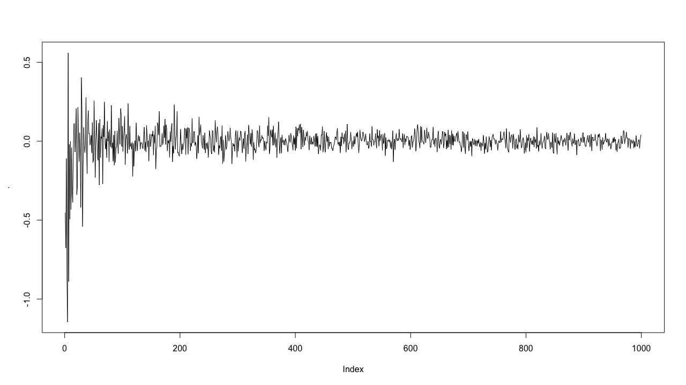

# 17章 purrrでイテレーション

### 17.0 ライブラリの読み込み

```text
library("tidyverse")
library("stringr")
library("microbenchmark")
```

### 17.1 はじめに


練習問題はありません


### 17.2 for-loop

#### 練習問題1 for-loopを書く

* `mtcars`の各列の平均を計算。

```text
output <- vector("double", ncol(mtcars))
names(output) <- names(mtcars)
for (i in names(mtcars)) {
  output[[i]] <- mean(mtcars[[i]])
}

output
       mpg        cyl       disp         hp       drat         wt       qsec         vs 
 20.090625   6.187500 230.721875 146.687500   3.596563   3.217250  17.848750   0.437500 
        am       gear       carb 
  0.406250   3.687500   2.812500 
  
# apply(mtcars, 2, mean)
# map_dbl(mtcars, mean)
# mtcars %>%
#   map_dbl(.x = ., .f = function(data){mean(data)}) 
```

* `nycflights13::flights`の各列の型を調べる。

```text
output <- vector("list", ncol(nycflights13::flights))
names(output) <- names(nycflights13::flights)
for (i in names(nycflights13::flights)) {
  output[[i]] <- class(nycflights13::flights[[i]])
}

output

$year
[1] "integer"

$month
[1] "integer"

[略]

$minute
[1] "numeric"

$time_hour
[1] "POSIXct" "POSIXt" 

# lapply(nycflights13::flights, class)
# map(nycflights13::flights, class)
# nycflights13::flights %>%
#   map(.x = ., .f = function(data){class(data)})
```

* `iris`の各列のユニークな値の数を計算。

```text
output <- vector("double", ncol(iris))
names(output) <- names(iris)
for (i in names(iris)) {
  output[[i]] <- length(unique(iris[[i]]))
}

output
Sepal.Length  Sepal.Width Petal.Length  Petal.Width      Species 
          35           23           43           22            3 
          
# apply(iris, 2, unique) %>% lapply(., length)
# map(iris, unique) %>% map_int(., length)
# iris %>% 
#   map(.x = ., .f = function(data){length(unique(data))})
```

* `μ = -10、0、10、100`のそれぞれに対して10個の乱数を生成。 

```text
n <- 10
mu <- c(-10, 0, 10, 100)
output <- vector("list", length(mu))
names(output) <- paste0("No", 1:4)
for (i in seq_along(output)) {
  output[[i]] <- rnorm(n, mean = mu[[i]])
}

output
$No1
 [1] -10.334037  -8.604852  -9.363326 -10.108432  -9.486237  -9.600728  -8.337144  -9.724107
 [9]  -9.493727  -9.652448

$No2
 [1] -0.37723765  0.09761946  1.63874465 -0.87559247  0.12176000  1.36213066 -0.23462109
 [8] -1.05338281 -0.86978361 -0.39012703

$No3
 [1]  9.152650  9.739361  9.585580  9.816949 10.407056 10.624633 11.678206  9.931306  9.679160
[10] 11.471006

$No4
 [1] 101.70433 100.04324  99.66734  98.17776 101.41126  99.16242  98.87624 103.04377 100.23502
[10]  99.96674

# n <- 10
# mu <- list(-10, 0, 10, 100)
# sig <- list(1, 10, 100, 1000)
# seq_along(mu) %>%
#   map(~rnorm(n = n, mean = mu[[.]], sd = sig[[.]]))
# seq_along(mu) %>% 
#   map(.x = ., .f = function(data){
#     rnorm(n = n, mean = mu[[data]], sd = sig[[data]])
#   })
```

`matrix()`をうまく付けばfor-loopを書かなくても同じようなことはできます。

```text
n <- 10
mu <- c(-10, 0, 10, 100)
matrix(rnorm(n * length(mu), mean = mu), 
       ncol = length(mu), nrow = n, byrow = TRUE)

            [,1]       [,2]      [,3]      [,4]
 [1,]  -9.104828  0.6602126 12.273484 101.17350
 [2,]  -9.712290 -0.6597701 12.919140 100.67742
 [3,] -10.684320  0.1864921  9.675607  99.72530
 [4,] -10.933503  0.1168453 10.319160  98.92246
 [5,] -13.233152 -0.2548747 10.029518 100.59427
 [6,]  -9.940865  0.4133989  8.902228 100.71118
 [7,]  -9.281111  0.2516511 11.357274 100.40447
 [8,]  -9.735636  0.2680439 10.436931 101.06012
 [9,]  -9.547810  0.6631986  8.863626  99.62950
[10,]  -8.523030 -1.2239038 10.258068 100.40500
```

#### 練習問題2 ベクトルを扱う既存の関数を利用して、以下の各例のforループを排除しなさい。

```text
out <- ""
for (x in letters) {
  out <- str_c(out, x)
}

out
[1] "abcdefghijklmnopqrstuvwxyz"
```

`str_c()`でも`paste0()`のいずれの関数もベクトルを扱います。

```text
str_c(letters, collapse = "")
[1] "abcdefghijklmnopqrstuvwxyz"

paste0(letters, collapse = "")
[1] "abcdefghijklmnopqrstuvwxyz"
```

仮にこれがデータフレームで各行に文字が保持されているような場合でも、`summarise()`を使うことで、文字列の結合が可能です。

```text
df <- data.frame(letters = letters)
df %>% 
  mutate(group = "key") %>% 
  group_by(group) %>% 
  summarise(Listagg = paste0(letters, collapse = ""))

# A tibble: 1 x 2
  group Listagg                   
  <chr> <chr>                     
1 key   abcdefghijklmnopqrstuvwxyz
```

書籍では`sd`ですがここではわかりやすくするために`sd2`とします。`sd2`は、for-loop内で偏差平方和を計算しているので、これを`ベクトルの長さ-1`で割ったものが分散。平方根をとれば標準偏差です。なので、`sd()`を使えば済みます。

```text
x <- sample(100)
sd2 <- 0
for (i in seq_along(x)) {
  sd2 <- sd2 + (x[i] - mean(x))^2
}
sd2 <- sqrt(sd2 / (length(x) - 1))
sd2
[1] 29.01149

sd(x)
[1] 29.01149
```

これは累積和を計算しています。`cumsum()`で計算可能です。

```text
x <- 1:100
output <- vector("numeric", length(x))
output[1] <- x[1]
for (i in 2:length(x)) {
  output[i] <- output[i - 1] + x[i]
}
output
  [1]    1    3    6   10   15   21   28   36   45   55   66   78   91  105  120  136  153  171
 [19]  190  210  231  253  276  300  325  351  378  406  435  465  496  528  561  595  630  666
 [37]  703  741  780  820  861  903  946  990 1035 1081 1128 1176 1225 1275 1326 1378 1431 1485
 [55] 1540 1596 1653 1711 1770 1830 1891 1953 2016 2080 2145 2211 2278 2346 2415 2485 2556 2628
 [73] 2701 2775 2850 2926 3003 3081 3160 3240 3321 3403 3486 3570 3655 3741 3828 3916 4005 4095
 [91] 4186 4278 4371 4465 4560 4656 4753 4851 4950 5050
 
cumsum(x)
  [1]    1    3    6   10   15   21   28   36   45   55   66   78   91  105  120  136  153  171
 [19]  190  210  231  253  276  300  325  351  378  406  435  465  496  528  561  595  630  666
 [37]  703  741  780  820  861  903  946  990 1035 1081 1128 1176 1225 1275 1326 1378 1431 1485
 [55] 1540 1596 1653 1711 1770 1830 1891 1953 2016 2080 2145 2211 2278 2346 2415 2485 2556 2628
 [73] 2701 2775 2850 2926 3003 3081 3160 3240 3321 3403 3486 3570 3655 3741 3828 3916 4005 4095
 [91] 4186 4278 4371 4465 4560 4656 4753 4851 4950 5050
```

#### 練習問題3 関数の作成とforループのスキルを組み合わせなさい。

* "Alice the camel"に歌詞を付けたforループを書き、`prints()`しなさい。

これが"Alice the camel"の歌詞です。

```text
Alice the camel has five humps.
Alice the camel has five humps.
Alice the camel has five humps.
So go, Alice, go.

[略]

Alice the camel has no humps.
Alice the camel has no humps.
Alice the camel has no humps.
Now Alice is a horse
```

`five, four, three, two, one, no, Now Alice is a horse`の部分が変動している部分なので、ここを変化させます。

```text
humps <- c("five", "four", "three", "two", "one", "no")
for (i in humps) {
  cat(paste0("Alice the camel has ", rep(i, 3), " humps.",collapse = "\n"), "\n")
  if (i == "no") {
    cat("Now Alice is a horse.\n")
  } else {
    cat("So go, Alice, go.\n")
  }
  cat("\n")
}

Alice the camel has five humps.
Alice the camel has five humps.
Alice the camel has five humps. 
So go, Alice, go.

[略]

Alice the camel has no humps.
Alice the camel has no humps.
Alice the camel has no humps. 
Now Alice is a horse.
```

* “ten in the bed” を関数に変換し、何人でも対応できるように一般化しなさい。

これが“ten in the bed” の歌詞です。

```text
There were ten in a bed
And the little one said
"Roll over, roll over"
So they all rolled over
And one fell out

[略]

There were two in a bed
And the little one said
"Roll over, roll over"
So they all rolled over
And one fell out

There was one in a bed
And the little one said
"Good night!"
```

変動する部分は、ベッドに入る人間の数なので、そこをforループで回します。

```text
numbers <- c("ten", "nine", "eight", "seven", "six", "five","four", "three", "two", "one")
for (i in numbers) {
  cat(paste0("There were ", i, " in the bed\n"), collapse = "")
  cat("And the little one said\n")
  if (i == "one") {
    cat("Good night!")
  } else {
    cat("Roll over, roll over\n")
    cat("So they all rolled over\n")
    cat("And one fell out\n")
  }
  cat("\n")
}

There were ten in the bed
 And the little one said
Roll over, roll over
So they all rolled over
And one fell out.

[略]

There were two in the bed
 And the little one said
Roll over, roll over
So they all rolled over
And one fell out.

There were one in the bed
 And the little one said
Good night!
```

* “99 bottles of beer on the wall”を歌を関数にしなさい。表面に液体が入っている容器を一般化しなさい。

“99 bottles of beer on the wall”の歌詞はこのとおりです。

99本のビールから始まり、0本になったら買い出しに行く歌です。

```text
99 bottles of beer on the wall, 99 bottles of beer. 
Take one down, pass it around, 98 bottles of beer on the wall...

[略]

No more bottles of beer on the wall, no more bottles of beer. 
Go to the store and buy some more, 99 bottles of beer on the wall...
```

変動するのはビールの本数です。

```text
bottles <- function(n) {
  if (n > 1) {
    str_c(n, " bottles")
  } else if (n == 1) {
    "1 bottle"
  } else {
    "no more bottles"
  }
}

beer_bottles <- function(total_bottles) {
  for (current_bottles in seq(total_bottles, 0)) {
    cat(str_to_sentence(str_c(bottles(current_bottles),
                              " of beer on the wall, ",
                              bottles(current_bottles),
                              " of beer.\n")))
    if (current_bottles > 0) {
      cat(paste0("Take one down and pass it around, ", 
                 bottles(current_bottles - 1),
                 " of beer on the wall.\n"), collapse = "")
    } else {
      cat(paste0("Go to the store and buy some more, ", 
                 bottles(total_bottles), 
                 " of beer on the wall.\n"), collapse = "")
    }
    cat("\n")
  }
}

99 bottles of beer on the wall, 99 bottles of beer.
Take one down and pass it around, 98 bottles of beer on the wall.
 
98 bottles of beer on the wall, 98 bottles of beer.
Take one down and pass it around, 97 bottles of beer on the wall.
 
[略]
 
1 bottle of beer on the wall, 1 bottle of beer.
Take one down and pass it around, no more bottles of beer on the wall.
 
No more bottles of beer on the wall, no more bottles of beer.
Go to the store and buy some more, 99 bottles of beer on the wall.
```

**練習問題4 アウトプットを事前に割り当てず、代わりに各ステップでベクトルの長さを増やしながらループさせるのが一般的ですが、これはパフォーマンスにどのように影響するのか？**

```text
output <- vector("integer", 0)
for (i in seq_along(x)) {
output <- c(output, lengths(x[[i]]))
}
output
```

`{microbenchmark}`パッケージを使って、最初から入れ物を用意\(事前に割り当てる\)した`f2()`と毎回、入れ物を拡大して`f1()`で100回繰り返し、時間を計測してみます。だいたい258倍くらいはやくなりました。

```text
f1 <- function(n) {
  output <- vector("integer", 0)
  for (i in seq_len(n)) {
    output <- c(output, i)
  }
  output
}

f2 <- function(n) {
  output <- vector("integer", n)
  for (i in seq_len(n)) {
    output[[i]] <- i
  }
  output
}

microbenchmark(f1(10000), f2(10000), times = 100)
Unit: microseconds
      expr        min         lq       mean      median         uq        max neval cld
 f1(10000) 175539.305 195167.496 231633.532 215343.7535 246137.422 490868.733   100   b
 f2(10000)    672.217    720.079    895.549    798.3655    857.542   4203.147   100  a 
```

### 17.3 重要なアトミックベクトル

#### 練習問題1 `files <- dir("data/", pattern = "\\.csv$", full.names = TRUE)`のパスを使い、`read_csv()`で連続的にデータを読み込みなさい。また、単一のデータフレームにしなさい。

ここでは`/Users/**/Desktop/sample/`のディレクトリに`data*.csv`というデータがあるとします。

```text
files <- dir("/Users/**/Desktop/sample/", 
             pattern = "\\.csv$", 
             full.names = TRUE)

files
[1] "/Users/**/Desktop/sample//data01.csv" 
    "/Users/**/Desktop/sample//data02.csv"

[3] "/Users/**/Desktop/sample//data03.csv"
    "/Users/**/Desktop/sample//data04.csv"
[5] "/Users/**/Desktop/sample//data05.csv"

df <- data.frame()
for(i in 1:length(files)){
    tmp <- read_csv(files[[i]])
    df <- rbind(df, tmp)
}

df
  id
1  1
2  2
3  3
4  4
5  5

# df <- lapply(files, read_csv)
# do.call(rbind, df)
---------------
# map_dfr(files, read_csv)
```

#### 練習問題2 `for (nm in names(x))`で`x`に名前がない場合、どうなるのか。

ベクトルの名前がない場合は、イタレーション回数が`NULL`なので、ループ内でコードが実行されません。

```text
x <- 1:10
print(names(x))
NULL

for (nm in names(x)) {
  print(nm)
  print(x[[nm]])
}
```

`NULL`の長さは0です。

```text
length(NULL)
[1] 0
```

#### 練習問題3 データフレーム内の各数値列の平均とその名前を表示する関数を作成しなさい。たとえば、`show_mean(iris)`は次のように出力される。変数名の長さが異なっていても、数字がうまく並ぶようにするためにはどうするか。

```text
show_mean(iris)

Sepal.Length: 5.84
Sepal.Width:  3.06
Petal.Length: 3.76
Petal.Width:  1.20
```

`str_c()`と`str_pad()`を上手く組み合わせてレイアウトを作ります。

```text
show_mean <- function(df, digits = 2) {
  maxstr <- max(str_length(names(df)))
  for (nm in names(df)) {
    if (is.numeric(df[[nm]])) {
      cat(
        str_c(str_pad(str_c(nm, ":"), maxstr + 1L, side = "right"),
          format(mean(df[[nm]]), digits = digits, nsmall = digits),
          sep = " "
        ),
        "\n"
      )
    }
  }
}

show_mean(iris)
Sepal.Length: 5.84 
Sepal.Width:  3.06 
Petal.Length: 3.76 
Petal.Width:  1.20
```

#### 練習問題4 このコードはどのように機能するのか。

```text
trans <- list(
  disp = function(x) x * 0.0163871,
  am = function(x) {
    factor(x, labels = c("auto", "manual"))
  }
)

for (var in names(trans)) {
  mtcars[[var]] <- trans[[var]](mtcars[[var]])
}
```

このコードは`disp`と `am`列を変更します。

* `disp` を0.0163871倍
* `am` をファクタ変数に置き換え

コードは関数の名前付きリストをループすることによって機能します。`trans`のリストにある名前付き関数を`mtcars`の同じ名前で呼び出し、その列の値を置き換えます。

### 17.4 for-loopと汎関数

#### 練習問題1 `apply()`のドキュメントを読んで、2つのfor-loopを一般化しなさい。

`apply()`関数は`apply(X, MARGIN, FUN, ...)`のように使用されます。ここ`X`は行列または配列、`FUN`は適用する関数、および`...`追加の引数として渡されます。`MARGIN`は関数を適用する方向を示します。

```text
x <- matrix(rnorm(15), nrow = 5)
x
           [,1]      [,2]       [,3]
[1,] -1.0326191 0.6020565  1.0974420
[2,] -0.6493561 0.5290555 -0.5884604
[3,] -1.0020073 1.4456958  0.7513013
[4,] -0.1658810 0.5973093  0.4535143
[5,]  0.1466563 1.2563169  0.1191782

apply(x, 1, mean)
[1]  0.2222932 -0.2362537  0.3983300  0.2949809  0.5073838

apply(x, 2, mean)
[1] -0.5406414  0.8860868  0.3665951
```

これは下記とやっていることは同じです。これが`apply()`を使えば1行でかけます。また`apply()`を進化させたものが、`map()`です。

```text
output <- vector("numeric", length = nrow(x))
for (i in seq_len(nrow(x))) {
  output[[i]] <- mean(x[i, ])
}
output
[1]  0.2222932 -0.2362537  0.3983300  0.2949809  0.5073838


output <- vector("numeric", length = ncol(x))
for (i in seq_len(ncol(x))) {
  output[[i]] <- mean(x[ , i])
}
output
[1] -0.5406414  0.8860868  0.3665951
```

#### 練習問題2 `col_summary()`が数値列にのみ適用されるようにしなさい。

現状の`col_summary()`はこの状態です。数値列にのみ使用できるようにするためには、データ型を判定し、数値だけ抽出し、それを計算する、という方向性で進める必要があります。

```text
col_summary <- function(df, fun) {
  out <- vector("double", length(df))
  for (i in seq_along(df)) {
    out[i] <- fun(df[[i]])
  }
  out
}
```

さきほどの方向性に乗っ取り、関数を作成します。各列を`is.numeric()`で判定し、`TRUE`の列のみ`which()`で列番号を取得します。その列番号を指定し、データフレームの該当列を抽出し、計算します。

```text
col_summary2 <- function(df, fun, ...) {
  
  num_cols <- vector("logical", ncol(df))
  num_cols <- df %>% 
    map_lgl(.x = ., .f = function(data){is.numeric(data)}) 
  num_ind <- which(num_cols)
  
  output <- vector("double", length(num_ind))
  output <- df %>% 
    dplyr::select(num_ind) %>% 
    map_dbl(.x = ., .f = function(data){fun(data, ...)})
  print(output)
}

col_summary2(iris, sum, na.rm = TRUE)
Sepal.Length  Sepal.Width Petal.Length  Petal.Width 
       876.5        458.6        563.7        179.9
```

ちょっと改良してみます。`{dplyr}`や`{purrr}`の関数たちを使うことで、少し短くできます。

```text
col_summary2 <- function(df, fun, ...) {
  
  num_cols <- vector("logical", ncol(df))
  num_cols <- df %>% map_lgl(.x = ., 
                             .f = function(data){is.numeric(data)}) 
  num_ind <- which(num_cols)
  
  output <- vector("double", length(num_ind))
  output <- df %>% 
    dplyr::select(num_ind) %>% 
    map_dbl(.x = ., .f = function(data){fun(data, ...)})
  print(output)
}

col_summary2(iris, sum, na.rm = TRUE)
Sepal.Length  Sepal.Width Petal.Length  Petal.Width 
       876.5        458.6        563.7        179.9
```

さらに改良します。実のところもっと改良できますが、最後の練習問題がこの関数を改良することなので、そちらに改良版の`col_summary4()`を記載します。

```text
col_summary3 <- function(df, fun, ...) {
  output <- df %>%
    dplyr::select_if(is.numeric) %>%
    map_dbl(.x = ., .f = function(data){fun(data, ...)})
  print(output)
}

col_summary3(iris, sum, na.rm = TRUE)
Sepal.Length  Sepal.Width Petal.Length  Petal.Width 
       876.5        458.6        563.7        179.9
```

`{tidyverse}`の関数群を使って関数を作るときには`tidyeval`という評価の枠ぐみのもとで関数を作成することが望ましいです。

### 17.5 Map関数

#### 練習問題1 `map()`で下記を書きなさい。

`map()`には様々な書き方が用意されています。結果はどれも同じです。上から通常関数、ラムダ記法、無名関数を使った記法です。

* `mtcars`の各列の平均を計算。

```text
# mtcars %>% map_dbl(., mean)
# mtcars %>% map_dbl(., ~ mean(.))
mtcars %>% map_dbl(.x = ., .f = function(x){mean(x)})

    mpg     cyl    disp      hp    drat      wt    qsec      vs      am 
 20.091   6.188 230.722 146.688   3.597   3.217  17.849   0.438   0.406 
   gear    carb 
  3.688   2.812

```

* `nycflights13::flights`の各列の型を調べる。

```text
# nycflights13::flights %>% map_chr(., typeof)
# nycflights13::flights %>% map_chr(., ~ typeof(.))
nycflights13::flights %>% map_chr(.x = ., .f = function(x){typeof(x)})

     year          month            day       dep_time sched_dep_time 
"integer"      "integer"      "integer"      "integer"      "integer" 
dep_delay       arr_time sched_arr_time      arr_delay        carrier 
 "double"      "integer"      "integer"       "double"    "character" 
   flight        tailnum         origin           dest       air_time 
"integer"    "character"    "character"    "character"       "double" 
　distance           hour         minute      time_hour 
　"double"       "double"       "double"       "double"
```

* `iris`の各列のユニークな値の数を計算。

```text
# iris %>% map(., unique) %>% map_int(., length)
# iris %>% map(., ~ unique(.)) %>% map_int(., ~ length(.))
iris %>% map(.x = ., .f = function(x){unique(x)}) %>% map_int(.x = ., .f = function(x){length(x)})

Sepal.Length  Sepal.Width Petal.Length  Petal.Width      Species 
          35           23           43           22            3
          
iris %>% map_int(n_distinct)
Sepal.Length  Sepal.Width Petal.Length  Petal.Width      Species 
          35           23           43           22            3
```

* `μ = -10、0、10、100`のそれぞれに対して10個の乱数を生成。 

```text
x <- c(-10, 0, 10, 100)

# x %>% map(., rnorm, n = 10)
# x %>% map(., ~ rnorm(n = 10, mean = (.)))
x %>% map(.x = ., .f = function(x){rnorm(n = 10, mean = (x))})

[[1]]
 [1]  -9.56  -9.87 -10.83 -10.50 -11.19 -10.75  -8.54 -10.83  -9.71 -10.48

[[2]]
 [1] -0.6048  1.4601  0.1497 -1.4333 -0.0103 -0.2122 -0.9063 -2.1022
 [9]  1.8934 -0.9681

[[3]]
 [1]  9.90 10.24 10.06  7.82  9.88 10.11 10.01 11.88 12.16 10.71

[[4]]
 [1] 100.8  99.7 101.0  99.1 100.6 100.3 100.4 101.1  99.1 100.2
 
# n <- 10
# mu <- list(-10, 0, 10, 100)
# sig <- list(1, 10, 100, 1000)
# seq_along(mu) %>%
#   map(~rnorm(n = n, mean = mu[[.]], sd = sig[[.]]))
# seq_along(mu) %>% 
#   map(.x = ., .f = function(data){
#     rnorm(n = n, mean = mu[[data]], sd = sig[[data]])
#   })
```

#### 練習問題2 データフレームの各列に対して、それが`factor`であるかどうかを示す単一のベクトルを作成しなさい。

`map_lgl()`を使えば1行で済みます。

```text
map_lgl(.x = iris, .f = function(x){is.factor(x)})
Sepal.Length  Sepal.Width Petal.Length  Petal.Width      Species 
       FALSE        FALSE        FALSE        FALSE         TRUE 
       
fac_cols <- vector("logical", ncol(iris))
for (i in seq_along(iris)) {
  fac_cols[[i]] <- is.factor(iris[[i]])
}
names(fac_cols) <- names(iris)
print(fac_cols)
Sepal.Length  Sepal.Width Petal.Length  Petal.Width      Species 
       FALSE        FALSE        FALSE        FALSE         TRUE 
```

#### 練習問題3 リストではないベクトルに対して`map()`を使うとどうなるのか？`map(1:5, runif)`はどうなるのか。

`map()`は、リストだけでなくベクトルでも機能します。リストと同様に、`map()`は関数をベクトルの各要素に適用します。

```text
# c(TRUE, FALSE, TRUE) %>% map(., ~ !.) %>% flatten_lgl()
c(TRUE, FALSE, TRUE) %>%
  map(.x = ., .f = function(x){!x}) %>%
  flatten_lgl()
[1] FALSE  TRUE FALSE

# c("a", "b", "c") %>% map(., str_to_upper) %>% flatten_chr()
c("a", "b", "c") %>% 
  map(.x = ., .f = function(x){str_to_upper(x)}) %>%
  flatten_chr()
[1] "A" "B" "C"

# c(-100, 0, 100) %>% map(., ~ rnorm(1, mean = .)) %>% flatten_dbl()
c(-100, 0, 100) %>%
  map(.x = .,
      .f = function(x){rnorm(1, mean = x)}) %>%
  flatten_dbl()
[1] -101.8261755    0.6822386   98.7742978

# 1:3 %>% map(., rnorm, mean = 0, sd = 1)
1:3 %>% map(.x = .,
            .f = function(data){rnorm(n = data, mean = 0, sd = 1)})
[[1]]
[1] -1.077316

[[2]]
[1] -0.9013605 -1.5211124

[[3]]
[1] 1.484694 1.033703 1.371266
```

`map()`を使えば、大数の法則も簡単にシミュレーションできます。

```text
1:1000 %>% 
  map(.x = ., .f = function(x){rnorm(n = x, mean = 0, sd = 1)}) %>%
  map_dbl(.x = ., .f = function(x){mean(x)}) %>%
  plot(type="l")

```



`map()`という関数は、繰り返し回数と引数の値を同時に実行できる優れた関数です。反対に、回数と引数は別の値を使いたい場合は下記のように`[[.]]`で囲んで上げれば、実現できます。

```text
n <- 5
mu <- list(-1000, 0, 10, 100)
sig <- list(1, 10, 100, 100000)

seq_along(mu) %>%
   map(.x = .,
       .f = function(x){rnorm(n = n, mean = mu[[x]], sd = sig[[x]])})
       
[[1]]
[1]  -999.7221 -1000.8231 -1000.0688 -1001.1677 -1000.0083

[[2]]
[1]  1.288554 -1.458756 -1.639110 17.635520  7.625865

[[3]]
[1] 121.143108 -82.320695  26.434184 125.482519   4.347858

[[4]]
[1] -212836.06   34584.58 -190395.54  -81017.02  132500.43
```

#### 練習問題4 `map(-2:2, rnorm, n = 5)`と`map_dbl(-2:2, rnorm, n = 5)`はどう違うのか。

前者は実行可能で、後者はエラーが表示されてしまいます。これは、出力形式がリストなのか、ベクトルなのかの違いによるものです。map\_dbl\(\)で想定されるの出力は、ループ回数に対して単一のスカラです。したがって、1回のループで5個の乱数が生成されてしまったために、このような結果となります。

```text
map(-2:2, rnorm, n = 5)
[[1]]
[1] -0.5509795 -1.0422597 -1.4757813 -1.9529016 -3.2545082

[[2]]
[1] -2.3074857 -1.4447170 -1.1996902 -0.1583318 -2.2515860

[[3]]
[1]  1.64871977 -1.85119385 -0.55031481 -1.23102704 -0.04830605

[[4]]
[1] 0.6467072 0.8726355 0.8078741 0.4491169 1.7669015

[[5]]
[1] 2.4313631 3.1140937 3.2033418 1.4510298 0.6051465

map_dbl(-2:2, rnorm, n = 5)
 
エラー: Result 1 must be a single double, not a double vector of length 5
Call `rlang::last_error()` to see a backtrace
```

この厳密さは、`map_dbl()`が入力ベクトルと同じ長さの数値ベクトルを返すことを保証するためです。そのため、下記のような使い方であれば、入力ベクトルと同じ長さの数値ベクトルを返せるため、実行可能です。

```text
map_dbl(-2:2, rnorm, n = 1)

[1] -2.3588420  0.1561459 -0.5858901  0.7692267  2.4902158
```

エラーが表示されたコードで実現したいことが、-2、-1、0、1、2の平均を持つ5つの正規分布からサイズ5のサンプルを発生させたいのであれば、下記のように実現可能です。

```text
-2:2 %>% 
  map(.x = ., 
      .f = function(x){rnorm(n = 5, mean = 0, sd = 1)}) %>%
  flatten_dbl()
 [1] -1.54597921 -1.29801022 -0.39200124 -2.05383859 -1.92903333 -2.10121725
 [7]  0.62689244 -0.42300027 -0.81816082 -0.14905308 -1.89636548  0.60302823
[13] -0.96026225 -0.90146430  0.05970077  1.02114173  1.45848466  1.61195233
[19]  1.08350147  1.13990789  1.28318434  1.49081551  2.72988477  1.00380849
[25]  3.30278874

-2:2 %>% 
  map_dfc(.x = ., 
          .f = function(x){rnorm(n = 5, mean = 0, sd = 1)}) %>%
  set_names(., paste0("iter", 1:5))

# A tibble: 5 x 5
   iter1  iter2  iter3 iter4 iter5
   <dbl>  <dbl>  <dbl> <dbl> <dbl>
1 -1.81  -1.03   0.640 2.26  0.835
2 -0.415 -0.651  0.839 0.268 3.24 
3 -2.89  -0.379  0.573 1.18  2.38 
4 -1.79  -1.14   0.781 0.585 1.96 
5 -1.05  -1.29  -1.11  3.54  2.24 
```

#### 練習問題5 `map(x, function(df) lm(mpg ~ wt, data = df))`の無名関数を削除するように書き直しなさい。

そもそも質問文のコードはxが定義されていないので実行できません。そこで下記のように場面を考えます。

```text
x <- split(mtcars, mtcars$am)
map(x, function(df) lm(mpg ~ wt, data = mtcars))
$`0`

Call:
lm(formula = mpg ~ wt, data = mtcars)

Coefficients:
(Intercept)           wt  
     37.285       -5.344  

$`1`

Call:
lm(formula = mpg ~ wt, data = mtcars)

Coefficients:
(Intercept)           wt  
     37.285       -5.344  
```

ここから無名関数を取り除きます。ラムダ式で書いてみます。

```text
map(x, ~ lm(mpg ~ wt, data = .))
$`0`

Call:
lm(formula = mpg ~ wt, data = mtcars)

Coefficients:
(Intercept)           wt  
     37.285       -5.344  

$`1`

Call:
lm(formula = mpg ~ wt, data = mtcars)

Coefficients:
(Intercept)           wt  
     37.285       -5.344  
```

もしくは名前付きの関数`do_regress`を定義して利用することも可能です。

```text
do_regress <- function(df) {
  lm(mpg ~ wt, data = df)
}

x %>% map(., do_regress)

$`0`

Call:
lm(formula = mpg ~ wt, data = mtcars)

Coefficients:
(Intercept)           wt  
     37.285       -5.344  

$`1`

Call:
lm(formula = mpg ~ wt, data = mtcars)

Coefficients:
(Intercept)           wt  
     37.285       -5.344  
```

### 17.6 失敗への対処


練習問題はありません


### 17.7 複数の引数へのマッピン


練習問題はありません


### 17.7 Walk


練習問題はありません


### 17.8 for-loopの他のパタ​​ーン

#### 練習問題1 for-loopを使用して独自の`every()`を実装します。`purrr::every()`と比較しなさい。

`purrr::every()`は、すべての要素が判定をパス、つまり`TRUE`となるかを調べる関数です。

```text
list("a",1,TRUE) %>% every(., .p = is.character)
[1] FALSE

c("a","1","TRUE") %>% every(., .p = is.character)
[1] TRUE

my_every <- function(x, cond){
　　output <- vector("logical", length = length(x))
　　for (i in seq_along(x)) {
 　　 output[[i]] <- cond(x[[i]])
　　}
　　res <- all(output)
　　print(res)
}
```

無名関数を使えば、より柔軟な判定が可能です。

```text
my_every(x = list("a",1,TRUE), cond = is.character)
[1] FALSE

my_every(x = c("a","1","TRUE"), cond = is.character)
[1] TRUE

my_every(x = 1:5, cond = function(x){x > 1})
[1] FALSE

my_every(x = 2:5, cond = function(x){x > 1})
[1] TRUE

purrr::every(.x = 1:5, .p = function(x){x 1})
[1] FALSE

purrr::every(.x = 2:5, .p = function(x){x 1})
[1] TRUE
```

よりシンプルな実装はこちらです。

```text
my_every <- function(x, p, ...) {
  for (i in x) {
    if (!p(i, ...)) {
      return(FALSE)
    }
  }
  TRUE
}
```

#### 練習問題2 `col_summary()`をデータフレーム内のすべての数値列に集計関数を適用する機能を作成しなさい。

`keep()`という関数は論理判定が`TRUE`の要素のみを残します。したがって、数値列のみを**keep**することで、集計関数を数値のみに適用できます。

```text
col_summary4 <- function(df, fun, ...) {
  df %>% 
    keep(., is.numeric) %>%
    map_dbl(.x = ., .f = function(data){fun(data, ...)})
}
col_summary4(df = iris, fun = sum, na.rm = TRUE)

col_summary4(iris, sum, na.rm = TRUE)
Sepal.Length  Sepal.Width Petal.Length  Petal.Width 
       876.5        458.6        563.7        179.9
```

#### 練習問題3 `col_summary()`を`base`で考えるとどうなるのか。

`sapply()`を使うことで同じことは実装可能です。

```text
col_summary5 <- function(df, fun, ...) {
  num_ind <- sapply(df, is.numeric)
  df_num <- df[, num_ind]
  sapply(df_num, fun, ...)
}

col_summary5(iris, sum, na.rm = TRUE)
Sepal.Length  Sepal.Width Petal.Length  Petal.Width 
       876.5        458.6        563.7        179.9
```

