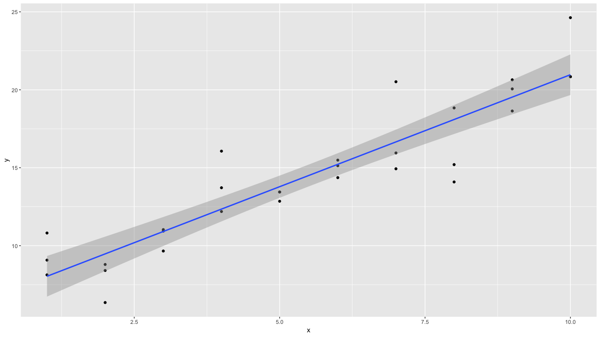
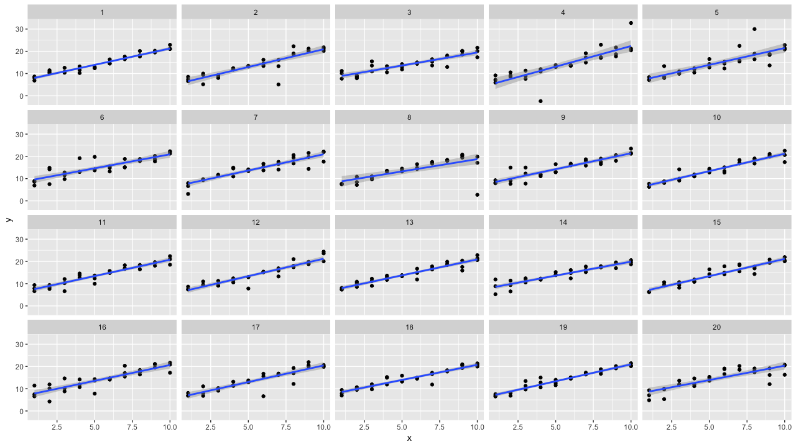
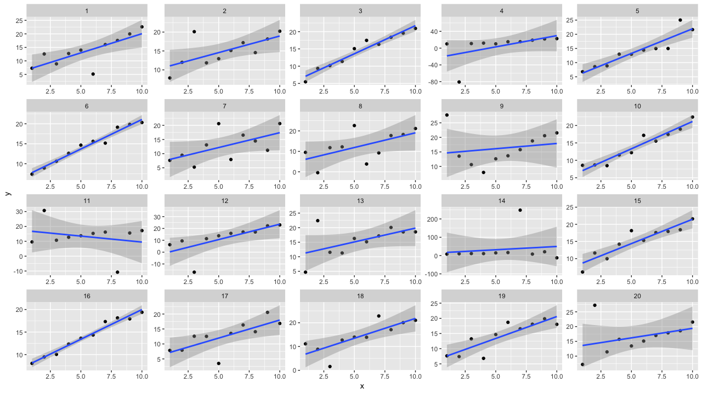
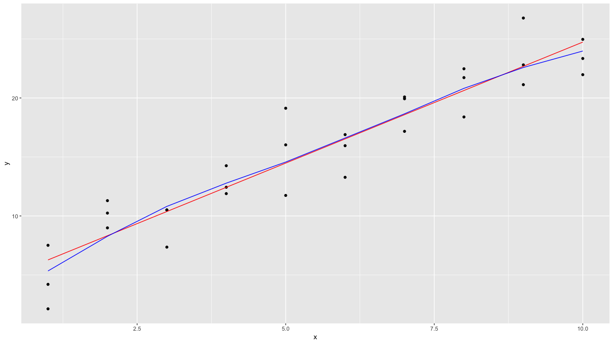
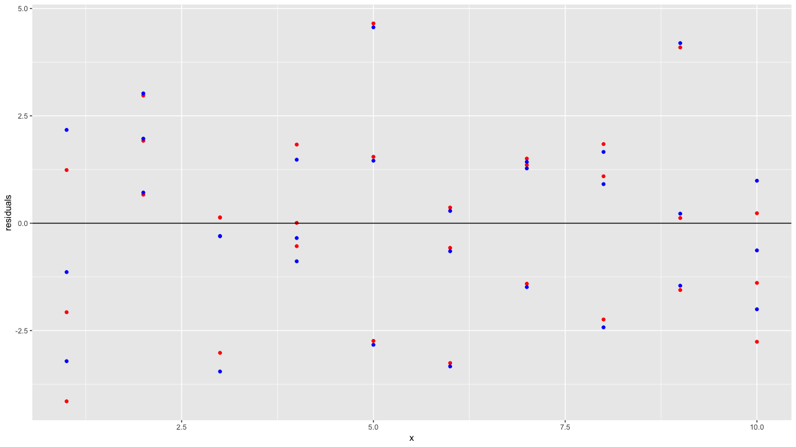
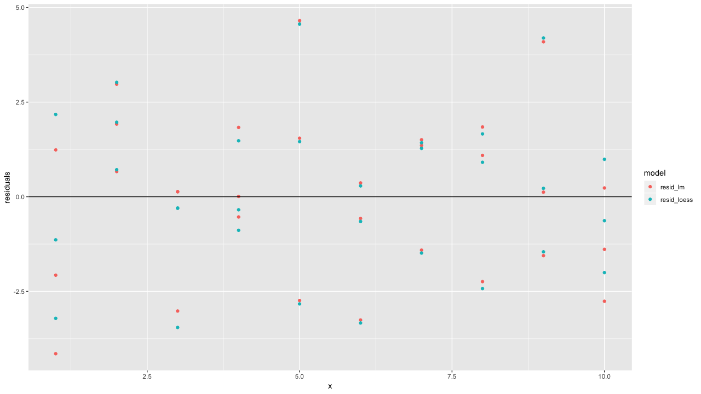
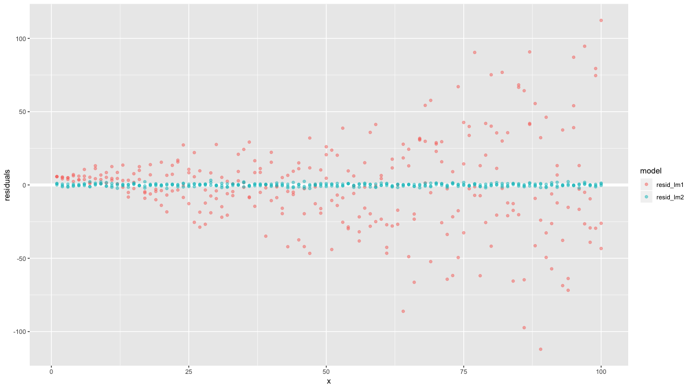
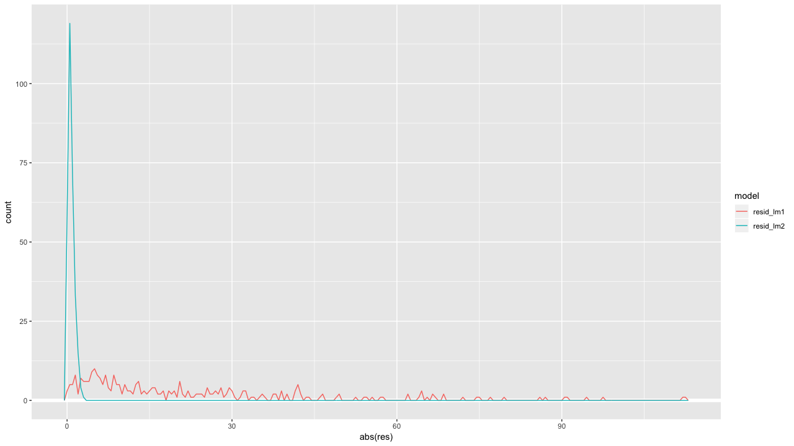
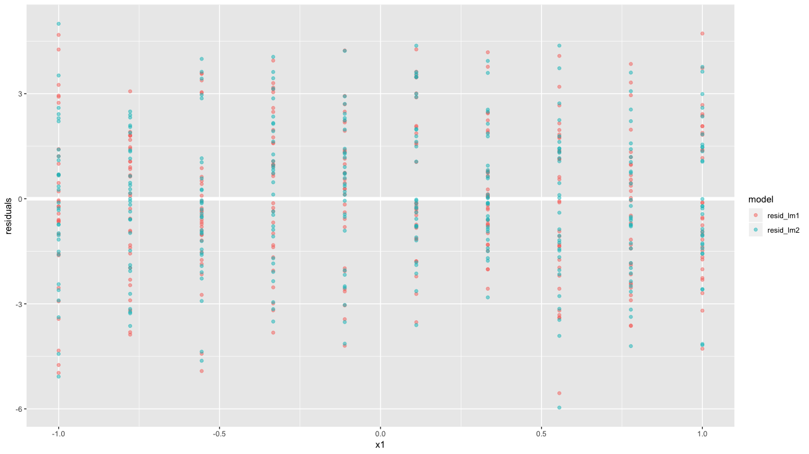
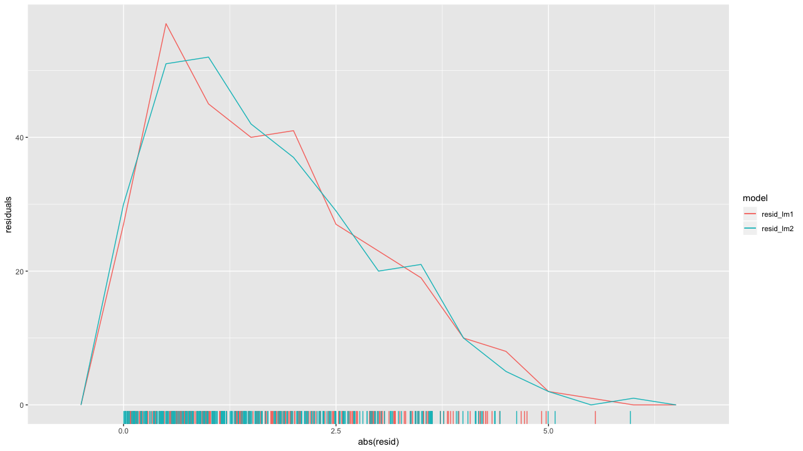

# 18章 modelrを使ったモデルの基本

### 18.0 ライブラリの読み込み

```text
library("tidyverse")
library("modelr")
```

### 18.1 はじめに


練習問題はありません。


### 18.2 シンプルなモデル

#### 練習問題1 線形モデルの1つの欠点は、計算過程に平方項があるので、異常値に敏感なこと。以下のシミュレーションデータに線形モデルを当てはめて、結果を視覚化しなさい。

```text
sim1a <- tibble(
  x = rep(1:10, each = 3),
  y = x * 1.5 + 6 + rt(length(x), df = 2)
)

sim1a
# A tibble: 30 x 2
       x     y
   <int> <dbl>
 1     1 10.8 
 2     1  8.13
 3     1  9.07
 4     2  8.41
 5     2  8.79
 6     2  6.35
 7     3 11.0 
 8     3 10.9 
 9     3  9.66
10     4 16.1 
# … with 20 more rows
```

視覚化してみます。

```text
ggplot(sim1a, aes(x, y)) +
  geom_point() +
  geom_smooth(method = "lm", se = TRUE)
```



20回くらいシュミレーションしてみて、結果がどうなる見てみたところ、外れ値が少なければ、そこまで過学習しているような感じはありません。

```text
sim_df <- function(i) {
  tibble(x = rep(1:10, each = 3),
         y = x * 1.5 + 6 + rt(length(x), df = 2),
         id = i)
}

ggplot(1:20 %>% map_df(., sim_df), aes(x, y)) +
  geom_point() +
  geom_smooth(method = "lm", se = TRUE) +
  facet_wrap( ~id, ncol = 5)
```



コーシー分布という突然外れ値を生成する少し特殊な分布を使ってシュミレーションしてみます。例えば11番の画像は、外れ値によって大きく傾きが引っ張られていることがわかります。これが、質問文にあった外れ値に影響を受けやすいという直感的なイメージです。

```text
sim_df2 <- function(i) {
 tibble(x = rep(1:20, each = 1),
        y = x * 1.5 + 6 + rcauchy(length(x)),
        id = i)
}

ggplot(1:20 %>% map_df(., sim_df2), aes(x, y)) +
 geom_point() +
 geom_smooth(method = "lm", se = TRUE) +
 facet_wrap( ~id, ncol = 5, scales = "free")
```



通常の線形回帰分析では正規分布を仮定していますが、それの代わりに裾が重いt分布を使うことでロバストな回帰分析が実行できます。

#### 練習問題2 線形モデルをよりロバストにする1つの方法は、mean-absolute distanceを使用できます。

```text
sim1a <- tibble(
  x = rep(1:10, each = 3),
  y = x * 1.5 + 6 + rcauchy(length(x))
)

sim1a
# A tibble: 30 x 2
       x     y
   <int> <dbl>
 1     1  8.11
 2     1 11.9 
 3     1  7.50
 4     2  9.63
 5     2  7.84
 6     2  8.24
 7     3 91.6 
 8     3  9.89
 9     3 20.5 
10     4 11.8 
# … with 20 more rows
```

まずは**mean-absolute distance\(平均絶対誤差\)**を使ったモデルの場合に、この関数を最小にするパラメタを`optim()`で求めます。その結果、6.73と1.37となり、もともとの6と1.5にそれなりに近い値が得られています。

```text
make_prediction <- function(mod, data) {
  mod[1] + mod[2] * data$x
}

measure_distance <- function(mod, data) {
  diff <- data$y - make_prediction(mod, data)
  mean(abs(diff))
}

optim(c(0, 0), measure_distance, data = sim1a)$par
[1] 6.735033 1.378509
```

同じように、次は平均二乗誤差を最小にするパラメタを計算すると、23.64と1.37となり、もともとの6とはかけ離れたパラメタとなり、外れ値に大きく引きずられることがわかります。

```text
measure_distance_ls <- function(mod, data) {
  diff <- data$y - (mod[1] + mod[2] * data$x)
  sqrt(mean(diff^2))
}

optim(c(0, 0), measure_distance_ls, data = sim1a)$par
[1] 23.641108  1.378214
```

#### 練習問題3 数値最適化を実行する上での1つの課題は、局所最小値を見つけることが保証されているだけということ。このように3パラメータモデルを最適化することの問題は何か？

```text
model3 <- function(a, data) {
  a[1] + data$x * a[2] + a[3]
}
```

このような3つのパラメタを持つモデルに対して、最適化することの問題は`a[1] + a[3] = (a1 + a3)`という関係が成り立ち、`optim()`の初期値によって、`a[1]`と`a[3]`の値が変わってしまうことです。

```text
ptim(c(0, 0, 0), measure_distance_3, data = sim1a)$par
[1]  0.2402308  1.3788748 23.4015876

optim(c(1, 0, 0), measure_distance_3, data = sim1a)$par
[1]  4.692604  1.384813 18.902173

optim(c(0, 0, 1), measure_distance_3, data = sim1a)$par
[1]  3.692604  1.384813 19.902173

optim(c(1, 1, 1), measure_distance_3, data = sim1a)$par
[1] -6.741527  1.376509 30.396461
```

### 18.3 モデルを可視化する

#### 練習問題1 直線`lm()`に合わせるのではなく、滑らかな曲線`loess()`を使用できる。`sim1`を使用して、モデルの近似、グリッドの生成、予測、および視覚化のプロセスを繰り返し、比較しなさい。

モデルを生成し、`add_residuals()`、`add_predictions()`で予測値や残差を得ることができます。

```text
sim1_loess <- loess(y ~ x, data = modelr::sim1)
sim1_lm <- lm(y ~ x, data = modelr::sim1)

sim1 <- modelr::sim1 %>%
  add_residuals(sim1_lm, var = "resid_lm") %>%
  add_predictions(sim1_lm, var = "pred_lm") %>%
  add_residuals(sim1_loess, var = "resid_loess") %>%
  add_predictions(sim1_loess, var = "pred_loess")

ggplot(sim1, aes(x, y)) +
  geom_point() +
  geom_line(aes(x, pred_lm), col = "red") + 
  geom_line(aes(x, pred_loess), col = "blue")
```



残差を視覚化してみます。`geom_point()`を2回書いているので、少し冗長に見えますが、これは`gather()`を使ってwide to longの変換を行えば、より簡潔に記載できますし、2個のモデルなので、これでいいですが、10個のモデルとかになると、下記のような書き方は冗長なので、推奨されません。wide to longの変換を行うべきです。

```text
ggplot(sim1) +
  geom_point(aes(x, resid_lm), col = "red") + 
  geom_point(aes(x, resid_loess), col = "blue") +
  geom_hline(yintercept = 0) + 
  ylab("residuals")
```



もう少し突っ込むと、この場合、赤と青の残差がどちらの残差なのか、凡例を頑張らないと出せないので、やはりwide to longの変換を行ってから視覚化するべきです。

```text
sim1 %>% 
  select(x, resid_lm, resid_loess) %>% 
  gather(key = "model", val = "pred", resid_lm, resid_loess) %>% 
  ggplot(.) +
  geom_point(aes(x, pred, col = model)) + 
  geom_hline(yintercept = 0) + 
  ylab("residuals")
```



#### 練習問題2 `add_predictions()`、`gather_predictions()`、`spread_predictions()`はどう違うのか？

まず、`data_grid()`の挙動を確認します。この関数は、モデルの予測値を返すための`x`の値の範囲を作成してくれる関数です。

```text
sim1_lm <- lm(y ~ x, data = sim1)
grid <- sim1 %>% data_grid(x)
# A tibble: 10 x 1
      x
  <int>
1     1
2     2
3     3
4     4
5     5
6     6
7     7
8     8
9     9
10    10
```

さきほど作ったグリッドに対して、`add_predictions()`でモデルから予測値を得ることができます。

```text
grid %>%
 add_predictions(sim1_lm, var = "pred_lm") %>%
 add_predictions(sim1_loess, var = "pred_loess")
# A tibble: 10 x 3
       x pred_lm pred_loess
   <int>   <dbl>      <dbl>
 1     1    6.27       5.34
 2     2    8.32       8.27
 3     3   10.4       10.8 
 4     4   12.4       12.8 
 5     5   14.5       14.6 
 6     6   16.5       16.6 
 7     7   18.6       18.7 
 8     8   20.6       20.8 
 9     9   22.7       22.6 
10    10   24.7       24.0 
```

このときに、もっとモデルが増えても、簡単に予測値を得たい場合に役立つのが、`gather_predictions()`です。使い方は簡単で、`gather_predictions()`にモデルを設定するだけです。また、可視化しやすいようにLong型のフォーマットで出力してくれます。

```text
grid %>%
 gather_predictions(sim1_lm, sim1_loess)
# A tibble: 20 x 3
   model          x  pred
   <chr>      <int> <dbl>
 1 sim1_lm        1  6.27
 2 sim1_lm        2  8.32
 3 sim1_lm        3 10.4 
 4 sim1_lm        4 12.4 
 5 sim1_lm        5 14.5 
 6 sim1_lm        6 16.5 
 7 sim1_lm        7 18.6 
 8 sim1_lm        8 20.6 
 9 sim1_lm        9 22.7 
10 sim1_lm       10 24.7 
11 sim1_loess     1  5.34
12 sim1_loess     2  8.27
13 sim1_loess     3 10.8 
14 sim1_loess     4 12.8 
15 sim1_loess     5 14.6 
16 sim1_loess     6 16.6 
17 sim1_loess     7 18.7 
18 sim1_loess     8 20.8 
19 sim1_loess     9 22.6 
20 sim1_loess    10 24.0 
```

一方で、`spread_predictions()`は、各モデルからの予測値を複数の列として追加することが可能です。

```text
grid %>%
  spread_predictions(lm = sim1_lm, loess = sim1_loess)

# A tibble: 10 x 3
       x      lm      loess 
   <int>   <dbl>      <dbl>
 1     1    6.27       5.34
 2     2    8.32       8.27
 3     3   10.4       10.8 
 4     4   12.4       12.8 
 5     5   14.5       14.6 
 6     6   16.5       16.6 
 7     7   18.6       18.7 
 8     8   20.6       20.8 
 9     9   22.7       22.6 
10    10   24.7       24.0 
```

#### 練習問題3 `geom_ref_line()`はどのパッケージから使えるのか？残差プロットにリファレンスラインを引くことはなぜ、有効で重要なのか？

`geom_ref_line()`はプロットにリファレンスラインを追加します。`geom_hline()`や`geom_vline()`と同しようなものです。

残差に対してリファレンスラインを0にすることは基本的なことです。残差の分布状態については、問題がないモデルである場合、どの点においても等分散を仮定しているので、均等に分布します。

下記は、等分散 \(緑\)、不均一分散\(赤\)の例です。`x`が大きくなると合わせて、残差の分散も大きくなっており、不均一分散であることがわかります。

```text
x <- rep(1:100, 3)
y1 <- 10 + 2 * x + rnorm(length(x), mean = 0, sd = x/2)
y2 <- 10 + 2 * x + rnorm(length(x), mean = 0, sd = 1)

df <- tibble(x, y1, y2)
sim1_lm <- lm(y1 ~ x, data = df)
sim2_lm <- lm(y2 ~ x, data = df)

df <- df %>%
  add_residuals(sim1_lm, var = "resid_lm1") %>%
  add_residuals(sim2_lm, var = "resid_lm2")

df %>% 
  gather(key = "model", val = "pred", resid_lm1, resid_lm2) %>% 
  ggplot(.) +
  geom_point(aes(x, pred, col = model)) + 
  geom_hline(yintercept = 0) + 
  ylab("residuals")
```



#### 練習問題4 absolute residualsの多角形を見たいのはなぜか。実際の残差を見るのと比較して、何が良くて、何が悪いのか？

残差の絶対値を表示すると、残差の広がりを確認しやすくなります。注意として、絶対値は符号の情報がなくなるので、系統的にプラスにしか残差が発生していない場合などはわからなくなります。

先ほどの2つの回帰分析の残差を可視化すると、このようになります。等分散 \(緑\)の場合は、ある`x`の部分でカウント数が多くなりますが、不均一分散\(赤\)の場合は、`x`の分布がばらついていることがわかります。

```text
df %>% 
  gather(key = "model", val = "res", resid_lm1, resid_lm2) %>% 
  ggplot(aes(abs(res), col = model)) +
  geom_freqpoly(binwidth = 0.5)
  ylab("residuals")
```



### 18.4 式とモデルファミリー

#### 練習問題1 データ`sim2`を使い、切片を使わないモデルを使用するという分析を繰り返すとどうなるか。モデル方程式、予測はどうなるか？

2つのモデルにおいて、予測値に関しては、何も違いはありません。

```text
sim1_lm <- lm(y ~ x - 1, data = modelr::sim2)
sim2_lm <- lm(y ~ x    , data = modelr::sim2)

df <- sim2 %>%
  data_grid(x) %>%
  spread_predictions(sim1_lm, sim2_lm)

df
# A tibble: 4 x 3
  x     sim1_lm sim2_lm
  <chr>   <dbl>   <dbl>
1 a        1.15    1.15
2 b        8.12    8.12
3 c        6.13    6.13
4 d        1.91    1.91
```

何が異なるのかというと、回帰分析におけるカテゴリ変数の扱いが異なります。通常、回帰分析はカテゴリ変数を`k-1`個のパラメタを求めることで表現します。

つまり、基準となるカテゴリから、どの程度そのカテゴリを取る場合にパラメタが異なるのかを見ることによって、そのカテゴリ内での優劣を把握できます。なので、切片があるなしで見え方は異なりますが、基準となるカテゴリがあるかないかの違いでしかありません。

```text
sim1_lm

Call:
lm(formula = y ~ x - 1, data = modelr::sim2)

Coefficients:
   xa     xb     xc     xd  
1.152  8.116  6.127  1.911  

sim2_lm

Call:
lm(formula = y ~ x, data = modelr::sim2)

Coefficients:
(Intercept)           xb           xc           xd  
     1.1522       6.9639       4.9750       0.7588 
```

今回の場合であれば、各カテゴリの平均を求めていることと変わりません。

```text
modelr::sim2 %>% 
  group_by(x) %>% 
  summarise(mean = mean(y))

# A tibble: 4 x 2
  x      mean
  <chr> <dbl>
1 a      1.15
2 b      8.12
3 c      6.13
4 d      1.91
```

#### 練習問題2 フィットするモデルに対して生成された方程式を探索するために`model_matrix()`を使用する。交互作用を表す表現式は何か。

`sim3`はそもそもこのようなデータです。`x1`は連続変数、`x2`はカテゴリ変数です。このとき、交互作用は`x1`と`x2`を掛け合わせることで生成が可能であり、`model_matrix()`を使えば、簡単に生成することができます。交互作用はモデルの表現式において、`*`で変数を掛け合わせることで生成可能です。

```text
sim3
# A tibble: 120 x 5
      x1 x2      rep      y    sd
   <int> <fct> <int>  <dbl> <dbl>
 1     1 a         1 -0.571     2
 2     1 a         2  1.18      2
 3     1 a         3  2.24      2
 4     1 b         1  7.44      2
 5     1 b         2  8.52      2
 6     1 b         3  7.72      2
 7     1 c         1  6.51      2
 8     1 c         2  5.79      2
 9     1 c         3  6.07      2
10     1 d         1  2.11      2
# … with 110 more rows
```

一般に、解釈を必要とするモデルの場合、カーディナリティが多いカテゴリ変数の交互作用は、解釈が困難になる経験上、あまり個人的にはおすすめできません。連続変数×カテゴリ変数\(0 or 1\)の交互作用は解釈もしやすくおすすめです。

```text
model_matrix(y ~ x1 * x2, data = sim3)
# A tibble: 120 x 8
   `(Intercept)`    x1   x2b   x2c   x2d `x1:x2b` `x1:x2c` `x1:x2d`
           <dbl> <dbl> <dbl> <dbl> <dbl>    <dbl>    <dbl>    <dbl>
 1             1     1     0     0     0        0        0        0
 2             1     1     0     0     0        0        0        0
 3             1     1     0     0     0        0        0        0
 4             1     1     1     0     0        1        0        0
 5             1     1     1     0     0        1        0        0
 6             1     1     1     0     0        1        0        0
 7             1     1     0     1     0        0        1        0
 8             1     1     0     1     0        0        1        0
 9             1     1     0     1     0        0        1        0
10             1     1     0     0     1        0        0        1
# … with 110 more rows
```

#### 練習問題3 基本原理を使用して、次の2つのモデルの式を関数に変換しなさい。

```text
mod1 <- lm(y ~ x1 + x2, data = sim3)
mod2 <- lm(y ~ x1 * x2, data = sim3)
```

基本原理というのがよくわかりませんが、ここでは、`mod1`のもととなるデータフレームを生成する関数を作成します。

```text
model_mat1 <- function(df) {
  x_levels <- levels(df$x2)
  x_levels <- x_levels[2:length(x_levels)]
  
  for (i in x_levels) {
    var_name <- paste0("x2", i)
    df[[var_name]] <- as.numeric(df$x2 == i)
  }
  x2_variables <- paste0("x2", x_levels)
  df[["(Inter)"]] <- 1
  res <- df %>% select(., `(Inter)`, x1, one_of(x2_variables))
  res
}

# A tibble: 120 x 5
   `(Inter)`    x1   x2b   x2c   x2d
       <dbl> <int> <dbl> <dbl> <dbl>
 1         1     1     0     0     0
 2         1     1     0     0     0
 3         1     1     0     0     0
 4         1     1     1     0     0
 5         1     1     1     0     0
 6         1     1     1     0     0
 7         1     1     0     1     0
 8         1     1     0     1     0
 9         1     1     0     1     0
10         1     1     0     0     1
# … with 110 more rows
```

次に、`mod2`のもととなるデータフレームを生成する関数を作成します。

```text
model_mat2 <- function(df) {
  out <- model_mat1(df)
  x2cols <- str_subset(colnames(out), "x2")
  for (var_name in x2cols) {
    inter_val <- paste0("x1:", var_name)
    out[[inter_val]] <- out$x1 * out[[var_name]]
  }
  out
}

model_mat2(sim3)
# A tibble: 120 x 8
   `(Inter)`    x1   x2b   x2c   x2d `x1:x2b` `x1:x2c` `x1:x2d`
       <dbl> <int> <dbl> <dbl> <dbl>    <dbl>    <dbl>    <dbl>
 1         1     1     0     0     0        0        0        0
 2         1     1     0     0     0        0        0        0
 3         1     1     0     0     0        0        0        0
 4         1     1     1     0     0        1        0        0
 5         1     1     1     0     0        1        0        0
 6         1     1     1     0     0        1        0        0
 7         1     1     0     1     0        0        1        0
 8         1     1     0     1     0        0        1        0
 9         1     1     0     1     0        0        1        0
10         1     1     0     0     1        0        0        1
# … with 110 more rows
```

#### 練習問題4 `sim4`のデータで、`mod1`、`mod2`のどれが良いモデルか。説明しなさい。

おそらく、解釈を必要とするモデルにおいて、どちらも差は特にないように思えます。このような場合、モデルはシンプルな交互作用を使っていないモデルを利用するほうが望ましいと思われます。

```text
mod1_lm <- lm(y ~ x1 + x2, data = sim4)
mod2_lm <- lm(y ~ x1 * x2, data = sim4)
res <- sim4 %>% 
  gather_residuals(., resid_lm1 = mod1_lm, resid_lm2 = mod2_lm)

res %>% 
  ggplot(.) +
  geom_ref_line(h = 0) +
  geom_point(aes(x1, resid, col = model), alpha = 0.5) + 
  ylab("residuals")
```



```text
res %>% 
  ggplot(aes(abs(resid), col = model)) +
  geom_freqpoly(binwidth = 0.5) + 
  geom_rug() +
  ylab("residuals")
```



### 18.5 欠損値


練習問題はありません。


### 18.6 その他のモデルファミリー


練習問題はありません。


