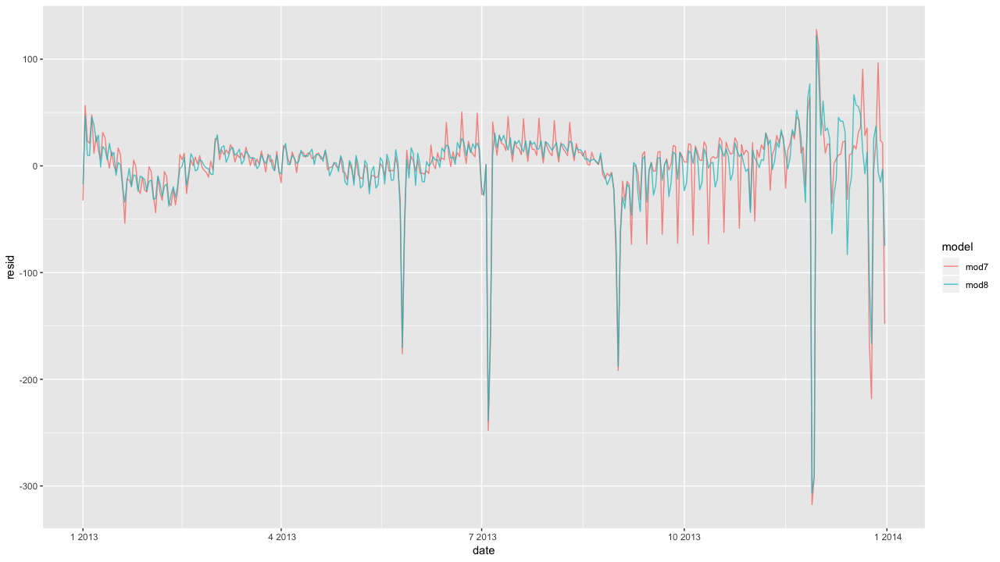

# 19章 モデル構築

### 19.0 ライブラリの読み込み

```text
library("tidyverse")
library("modelr")
library("lubridate")
library("broom")
library("nycflights13")
library("splines")
```

ダイアモンドデータセットの練習問題に必要なコードを先に準備しておきます。

```text
diamonds2 <- diamonds %>%
  filter(carat <= 2.5) %>%
  mutate(
    lprice = log2(price),
    lcarat = log2(carat)
  )

mod_diamond2 <- lm(lprice ~ lcarat + color + cut + clarity, data = diamonds2)

diamonds2 <- add_residuals(diamonds2, mod_diamond2, "lresid2")
```

フライトデータセットの練習問題に必要なコードを先に準備しておきます。

```text
library("nycflights13")
daily <- flights %>%
  mutate(date = make_date(year, month, day)) %>%
  group_by(date) %>%
  summarise(n = n())
daily
#> # A tibble: 365 x 2
#>   date           n
#>   <date>     <int>
#> 1 2013-01-01   842
#> 2 2013-01-02   943
#> 3 2013-01-03   914
#> 4 2013-01-04   915
#> 5 2013-01-05   720
#> 6 2013-01-06   832
#> # … with 359 more rows

daily <- daily %>%
  mutate(wday = wday(date, label = TRUE))

term <- function(date) {
  cut(date,
    breaks = ymd(20130101, 20130605, 20130825, 20140101),
    labels = c("spring", "summer", "fall")
  )
}

daily <- daily %>%
  mutate(term = term(date))

mod <- lm(n ~ wday, data = daily)

daily <- daily %>%
  add_residuals(mod)

mod1 <- lm(n ~ wday, data = daily)
mod2 <- lm(n ~ wday * term, data = daily)
```

### 19.1 はじめに


練習問題はありません。


### 19.2 低品質のダイヤモンドはなぜ高価なのか。

#### 練習問題1 `lcarat`と`lprice`のプロットの縦の明るい縦の縞は何か。

これはある閾値で値が丸められるため、このように縞模様が現れます。

```text
ggplot(diamonds2, aes(lcarat, lprice)) + 
  geom_hex(bins = 50)
```


`lcarat`のヒストグラムはこんな感じです。

```text
diamonds2 %>%
  ggplot(aes(lcarat)) +
  geom_histogram(bins = 100)
```


#### 練習問題2 `log(price) = a_0 + a_1 * log(carat)`は何を示すのか。

これは`log`に変換した回帰分析、log-level回帰、log-log回帰とか呼ばれる回帰分析の表現式かと思います。`carat`が1%増えると、`price`が 1.67%増える。目的変数、説明変数ともにlogを取る場合、`x`が1%変化したときに、`y`が何%変化するかを示します。経済学では弾力性とか呼ばれているものです。

$$
log(y) = a + b・log(x)⇔y = e^{a}・x^b
$$

ここでは自然対数を使っています。

```text
Call:
lm(formula = log(price) ~ log(carat), data = diamonds)

Coefficients:
(Intercept)   log(carat)  
      8.449        1.6766 
```

視覚化してみると、こんな感じです。

```text
log_fit <- lm(log(price) ~ log(carat), data = diamonds)
grid <- diamonds %>% 
  data_grid(carat = seq_range(carat, 20)) %>%
  add_predictions(log_fit)

ggplot() +
  geom_point(data = diamonds, aes(carat, price)) + 
  geom_line(data = grid, aes(carat, exp(pred)), col = "red") +
  labs(x = "carat", y = "price") +
  scale_x_continuous(limits = c(0,3)) + 
  scale_y_continuous(limits = c(0,20000)) 
```


```text
exp(log_fit$coefficients[[1]]) * (1^log_fit$coefficients[[2]])
[1] 4668.816

exp(log_fit$coefficients[[1]]) * (2^log_fit$coefficients[[2]])
[1] 14916.87

exp(log_fit$coefficients[[1]]) * (3^log_fit$coefficients[[2]])
[1] 29428.93
```

#### 練習問題3 大きい残差と小さい残差を持っているダイヤモンドを抽出しなさい。これらのダイヤモンドについて何か変わったことはあるか？特に悪いのか、それとも良いのか、価格の間違いなのか。

ここでは残差の絶対値が2よりも大きいものを抽出します。予測値と実際のデータが大きく異なるので、これらは、`price`のつけ間違いにも見えますが、データの他の値も間違っているかもしれないので、実物と照らし合わせるなどが必要かもしれません。

```text
diamonds2 %>%
  filter(abs(lresid2) > 2) %>%
  add_predictions(mod_diamond2) %>%
  mutate(pred = round(2^pred)) %>% #log2を使った回帰式なので2乗
  select(price, pred, carat) %>%
  arrange(price)
  
# A tibble: 4 x 3
  price  pred carat
  <int> <dbl> <dbl>
1  1186   284 0.25 
2  1186   284 0.25 
3  1776   412 0.290
4  2160   314 0.34 
```

#### 練習問題4 最終的なモデル`mod_diamonds2`は、ダイヤモンドの価格を予測するのに役立つか。

これはlacaratと残差の分布です。このようにいくつかの外れ値の予測という点では難しいかもしれませんが、一般的なダイアモンドの価格を予測する上で役立つモデルかと思われます。

実際にビジネスの予測モデルとして使うには、特徴量エンジニアリングや検証方法は工夫する必要はあるかもしれません。

```text
ggplot(diamonds2, aes(lcarat, lresid2)) +
  geom_hex(bins = 50)
```


### 19.3 何が1日の便数に影響するか。

#### 練習問題1 1月20日、5月26日、9月1日のフライト数が予想より少なかった理由をGoogleのスキルを駆使してブレインストーミングしなさい。

これらは、キング牧師の日、戦没将兵追悼記念日、勤労感謝の日です。

#### 練習問題2 正の残差が高い3日間は何を表していますか？これらの日はどのようにして別の年と一般化できるのか。

上位の3日間は、感謝祭の後の土曜日\(11月30日\)、感謝祭の後の日曜日\(12月1日\)、およびクリスマスの後の土曜日\(12月28日\)に対応しています。休日の日付を使用すれば、他の年に一般化することができます。

```text
daily %>% 
  top_n(., n = 3, resid) %>% 
  arrange(desc(resid))

# A tibble: 5 x 5
  date           n wday  term   resid
  <date>     <int> <ord> <fct>  <dbl>
1 2013-11-30   857 土    fall   112. 
2 2013-12-01   987 日    fall    95.5
3 2013-12-28   814 土    fall    69.4 
```

#### 練習問題3 `wday`を土曜日だけ学期ごとに区切る。`Thurs`、`Fri`、`Sat-summer`、`Sat-spring`、`Sat-fall`を作成しなさい。このモデルは、`wday`と`term`の組み合わせをしたモデルと比較してどうか。

```text
daily <- daily %>%
  mutate(
    wday2 = case_when(
      wday == "土" & term == "summer" ~ "Sat-summer",
      wday == "土" & term == "fall" ~ "Sat-fall",
      wday == "土" & term == "spring" ~ "Sat-spring",
      TRUE ~ as.character(wday)
    )
  )
mod3 <- lm(n ~ wday2, data = daily)
daily %>% count(wday2)
# A tibble: 9 x 2
  wday2          n
  <chr     <int>
1 Sat-fall      18
2 Sat-spring    22
3 Sat-summer    12
4 火            53
5 金            52
6 月            52
7 水            52
8 日            52
9 木            52
```

これらを組み合わせモデルを作成します。`term*wday`のモデルは、交互作用を含むモデルよりも秋の残差が高く、春の残差が少なくなります。

```text
# mod2 <- lm(n ~ wday * term, data = daily)
mod3 <- lm(n ~ wday2, data = daily)

daily %>%
  gather_residuals(sat_term = mod3, all_interact = mod2) %>%
  ggplot(aes(date, resid, colour = model)) +
  geom_line(alpha = 0.75)

```


`mod2`のほうがAICが低く、予測する上では、有用かもしれません。

```text
glance(mod2) %>% select(r.squared, AIC)
# A tibble: 1 x 2
  r.squared   AIC
      <dbl<dbl>
1     0.757 3856.

glance(mod3) %>% select(r.squared, AIC)
# A tibble: 1 x 2
  r.squared   AIC
      <dbl<dbl>
1     0.736 3863.
```

#### 練習問題4 曜日、学期、祝日を組み合わせた新しい変数を作成しなさい。そのモデルの残差はどうか。

まずは祝日をデータ化します。

```text
holidays_2013 <-
  tribble(
    ~holiday, ~date,
    "New Year's Day", 20130101,
    "Martin Luther King Jr. Day", 20130121,
    "Washington's Birthday", 20130218,
    "Memorial Day", 20130527,
    "Independence Day", 20130704,
    "Labor Day", 20130902,
    "Columbus Day", 20131028,
    "Veteran's Day", 20131111,
    "Thanksgiving", 20131128,
    "Christmas", 20131225
  ) %>%
  mutate(date = lubridate::ymd(date))
```

さきほど作成した祝日データを使い、その日付に該当するものは`holiday`とし、それ以外は土曜を区切ります。

```text
daily <- daily %>%
  mutate(
    wday3 =
      case_when(
        date %in% holidays_2013$date ~ "holiday",
        .$wday == "土" & .$term == "summer" ~ "Sat-summer",
        .$wday == "土" & .$term == "fall" ~ "Sat-fall",
        .$wday == "土" & .$term == "spring" ~ "Sat-spring",
        TRUE ~ as.character(.$wday)
      )
  )

mod4 <- lm(n ~ wday3, data = daily)

daily %>%
  add_residuals(mod4) %>%
  ggplot(aes(date, resid)) +
  geom_line(alpha = 0.75)
```


#### 練習問題5 月によって変動する曜日効果にモデルを合わせた場合（つまり`n ~ wday * month`）、どうなるのか？なぜこれはあまり役に立たないのか？

モデルにはパラメタが84個あります。毎月は4〜5週間しかないので、推定値は大きな標準誤差を持ち、少数の観測値からしか推定されないため、サンプルデータを超えて一般化することはできません。

```text
daily <- mutate(daily, month = factor(lubridate::month(date)))
> mod6 <- lm(n ~ wday * month, data = daily)
> print(summary(mod6))

Call:
lm(formula = n ~ wday * month, data = daily)

Residuals:
   Min     1Q Median     3Q    Max 
-269.2   -5.0    1.5    8.8  113.2 

Coefficients:
                Estimate Std. Error t value Pr(>|t|)    
(Intercept)     867.4000     7.5983 114.157  < 2e-16 ***
wday.L          -64.0744    20.8737  -3.070 0.002353 ** 
wday.Q         -165.6001    20.1555  -8.216 7.77e-15 ***
wday.C          -68.2591    20.3115  -3.361 0.000885 ***
wday^4          -92.0814    20.4991  -4.492 1.03e-05 ***
wday^5            9.7925    19.7334   0.496 0.620111    
wday^6          -20.4376    18.9922  -1.076 0.282802    
month2           23.7071    10.9946   2.156 0.031912 *  
[略]
wday^5:month12   20.4470    28.0576   0.729 0.466761    
wday^6:month12    9.5864    27.8866   0.344 0.731282    
---
Signif. codes:  0 ‘***’ 0.001 ‘**’ 0.01 ‘*’ 0.05 ‘.’ 0.1 ‘ ’ 1

Residual standard error: 42.05 on 281 degrees of freedom
Multiple R-squared:  0.8355,	Adjusted R-squared:  0.7869 
F-statistic:  17.2 on 83 and 281 DF,  p-value: < 2.2e-16
```

#### 練習問題6 モデル`n ~ wday + ns(date, 5)`はどのようだと期待するか。なぜこれはあまり役に立たないのか？

`ns()`はスプライン回帰で使用される関数です。詳細は[こちら](https://prs.ism.ac.jp/~nakama/Rjp/splines-manual.pdf)を御覧ください。自然な3次スプラインに対するベース行列を生成する関数です。

曜日と時間で相互作用しない`mod7`の残差は、`mod8`よりも大きくなります。モデル`mod7`は、夏の間は週末を過小評価し、秋の間は週末を過大評価します。

```text
mod7 <- lm(n ~ wday + ns(date, 5), data = daily)
mod8 <- lm(n ~ wday * ns(date, 5), data = daily)

daily %>%
  gather_residuals(mod7, mod8) %>%
  ggplot(aes(date, resid, col = model)) +
  geom_line(alpha = 0.75)
```



#### 練習問題7 日曜日に出発する人々は、月曜日のどこかにいる必要があるビジネスマンである可能性が高いと仮定する。その仮説を、距離と時間に基づいてどのように分解するかを見ることによって調べなさい。それが本当なら、遠くの場所へもっと日曜日の夕方のフライトを見ることを期待できるか。

曜日によるフライトの平均距離を比較してみます。ここでは曜日ごとのバイオリンプロットで視覚化してみます。バイオリンプロットでは、比較しづらいので、平均と誤差を計算し、プロットします。

```text
flights %>%
  select(year, month, day, distance) %>% 
  mutate(date = make_date(year, month, day),
         wday = wday(date, label = TRUE)) %>%
  ggplot(aes(wday, distance)) +
  geom_violin() +
  labs(x = "Day of Week", y = "Average Distance") +
  theme_gray (base_family = "HiraKakuPro-W3")
```


日曜日のフライトが2番目に長いです。土曜日のフライトは平均で最長です。

```text
flights %>%
  select(year, month, day, distance) %>% 
  mutate(date = make_date(year, month, day),
         wday = wday(date, label = TRUE)) %>%
  ggplot(aes(wday, distance)) +
  stat_summary(fun.data = "mean_se") +
  labs(x = "Day of Week", y = "Average Distance") +
  theme_gray (base_family = "HiraKakuPro-W3")
```


#### 練習問題8 日曜日と土曜日がプロットの別々の端にあることは少し煩わしい。月曜日に始まるように因子のレベルを設定する関数を書きなさい。

日曜日が一番最初に来るように因子のレベルが決定されているので、最初の要素を落とす関数を作ることで、自動的に日曜日最後に来るようにします。

```text
levels(daily$wday)
[1] "日" "月" "火" "水" "木" "金" "土"

levels(daily$wday)[-1]
[1] "月" "火" "水" "木" "金" "土"

reorder_suday <- function(x) {
  fct_relevel(x, levels(x)[-1])
}

ggplot(daily, aes(reorder_suday(wday), n)) +
  geom_boxplot() +
  labs(x = "Day of Week", y = "Number of flights")+
  theme_gray (base_family = "HiraKakuPro-W3")
```


### 19.4 モデルについてもっと知る


練習問題はありません。


