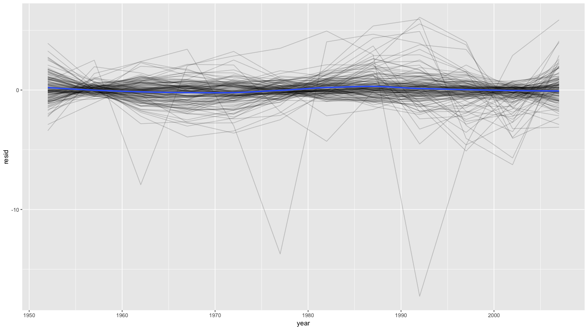
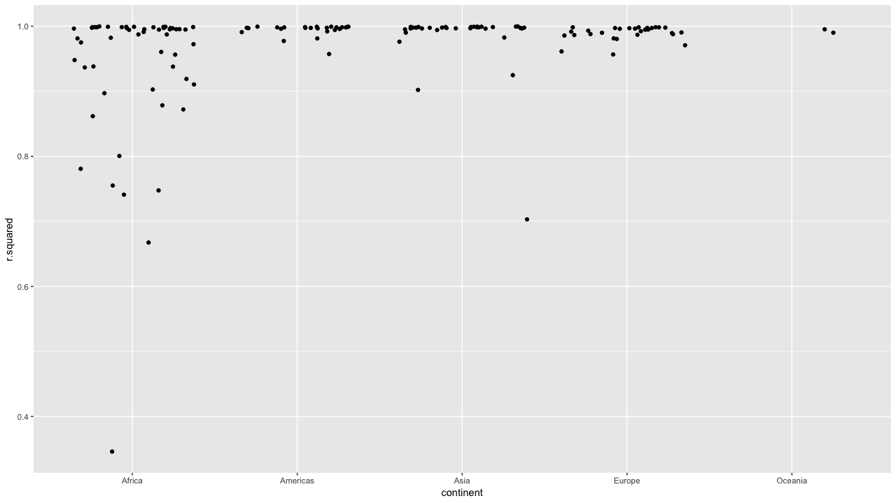
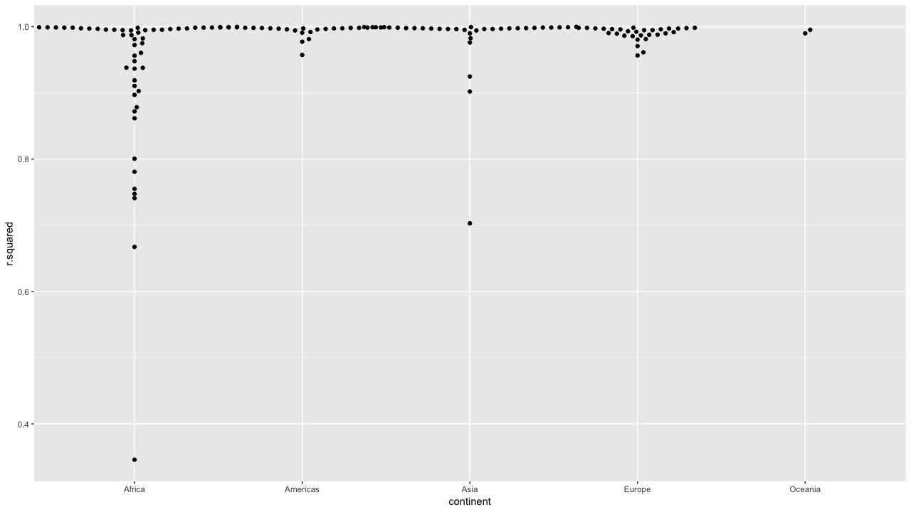
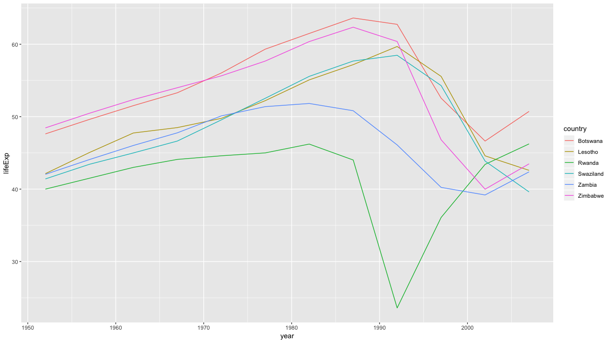

# 20章 purrrとbroomによる多数のモデル

### 20.0 ライブラリの読み込み

```text
library("modelr")
library("tidyverse")
library("gapminder")
```

### 20.1 はじめに


練習問題はありません。


### 20.2 gapminder

#### 練習問題1 線形傾向は、全体的な傾向に対してやや単純すぎる。2次多項式はもっとうまくフィットさせれるか。2次方程式の係数はどのように解釈できるか。

`gapminder`はこのようなデータセットになっています。

```text
gapminder %>% head()

# A tibble: 6 x 6
  country     continent  year lifeExp      pop gdpPercap
  <fct>       <fct>     <int>   <dbl>    <int>     <dbl>
1 Afghanistan Asia       1952    28.8  8425333      779.
2 Afghanistan Asia       1957    30.3  9240934      821.
3 Afghanistan Asia       1962    32.0 10267083      853.
4 Afghanistan Asia       1967    34.0 11537966      836.
5 Afghanistan Asia       1972    36.1 13079460      740.
6 Afghanistan Asia       1977    38.4 14880372      786.
```

ここから各国対して、2次多項式をフィットさせます。そして、各モデルで残差を計算し、その残差をラインチャートで視覚化します。このラインチャートを見る限り、残差が大きくあまり上手くフィットできてない国があるように見えます。これは次の質問で回答します。

```text
gapminder %>%
  group_by(country, continent) %>%
  nest() %>%
  mutate(model = map(data, country_model)) %>% 
  mutate(resids = map2(data, model, add_residuals)) %>% 
  unnest(resids) %>%
  ggplot(aes(year, resid)) +
  geom_line(aes(group = country), alpha = 0.2) +
  geom_smooth(method = "loess")
```



#### 練習問題2 大陸ごとのR2の分布を視覚化する方法を調べなさい。{ggbeeswarm}パッケージを試していなさい。

当てはまりの指標であるR2を国ごとに可視化して、当てはまりが悪い国を可視化します。アフリカの国が当てはまりの悪い国が多いようです。

```text
gapminder %>%
  group_by(country, continent) %>%
  nest() %>%
  mutate(model = map(data, country_model)) %>% 
  mutate(glance = map(model, broom::glance)) %>%
  unnest(glance, .drop = TRUE) %>%
  ggplot(aes(continent, r.squared)) +
  geom_jitter()
```



```text
library("ggbeeswarm")
gapminder %>%
  group_by(country, continent) %>%
  nest() %>%
  mutate(model = map(data, country_model)) %>% 
  mutate(glance = map(model, broom::glance)) %>%
  unnest(glance, .drop = TRUE) %>%
  ggplot(aes(continent, r.squared)) +
  geom_beeswarm()
```



#### 練習問題3 最後のプロットを作成するには、2つのステップが必要だった。国ごとに1行のデータフレームを作成し、それを元のデータセットにセミジョインした。代わりに`unnest()`を使用すれば、この結合を回避できる。

Rの仕様を上手く使うことで実現できます。Rはデータフレームの中にリストを持つことができ、これを展開することもできます。その場合、リストの列以外はリサイクル規則が働き、同じ値を保有します。

```text
gapminder %>%
  group_by(country, continent) %>%
  nest() %>%
  mutate(model = map(data, ~ lm(lifeExp ~ year, .))) %>%
  mutate(glance = map(model, glance)) %>%
  unnest(glance) %>%
  unnest(data) %>%
  filter(r.squared < 0.25) %>%
  select(country, country, year, lifeExp) %>% 
  ggplot(aes(year, lifeExp)) +
  geom_line(aes(color = country))
```



### 20.3 リスト列


練習問題はありません。


### 20.4 リスト列の作成

#### 練習問題1 インプットにアトミックベクトルを取り、そしてリストを返す思いつく限りの関数を書きなさい。

```text
list(1:3) %>% typeof()
[1] "list"

map(1:3, rnorm) %>% typeof()
[1] "list"

str_split(sentences[1:3], " ") %>% typeof()
[1] "list"

str_match_all(c("abc", "aa", "aabaa"), "a+") %>% typeof()
[1] "list"
```

#### 練習問題2 複数の値を返す`quantile()`のような便利な集計関数をブレインストーミングしなさい。

```text
0:10 %>% quantile(., c(0.75, 0.5, 0.25))


75% 50% 25% 

7.5 5.0 2.5 
```

基本的なもので、下記があります。

```text
range(0:10)
[1]  0 10

fivenum(0:10)
[1]  0.0  2.5  5.0  7.5 10.0

summary(0:10)
   Min. 1st Qu.  Median    Mean 3rd Qu.    Max. 
    0.0     2.5     5.0     5.0     7.5    10.0 
```

#### 練習問題3 次のデータフレームには何が欠けているか？その欠けているピースを`quantile()`はどうやって返すのか？

```text
mtcars %>%
  group_by(cyl) %>%
  summarise(q = list(quantile(mpg))) %>%
  unnest()
```

特定の値\(`0%`、`25%`、`50%`、`75%`、`100%`\)の分位数の名前が、欠けています。

```text
mtcars %>%
  group_by(cyl) %>%
  summarise(name = list(names(quantile(mpg))),
            quant = list(quantile(mpg))) %>%
  unnest()
  
# A tibble: 15 x 3
     cyl name  quant
   <dbl> <chr> <dbl>
 1     4 0%     21.4
 2     4 25%    22.8
 3     4 50%    26  
 4     4 75%    30.4
 5     4 100%   33.9
 6     6 0%     17.8
 7     6 25%    18.6
 8     6 50%    19.7
 9     6 75%    21  
10     6 100%   21.4
11     8 0%     10.4
12     8 25%    14.4
13     8 50%    15.2
14     8 75%    16.2
15     8 100%   19.2
```

#### 練習問題4 このコードは何をするのか？なぜそれが役に立つのか。

```text
mtcars %>%
  group_by(cyl) %>%
  summarise_each(funs(list))
```

このコードは`cyl`のグループごとにリストに格納します。簡単のために、列は限定しています。役立て方はわかりません…ごめんなさい。

```text
mtcars %>%
  select(cyl, mpg, disp) %>% 
  group_by(cyl) %>%
  summarise_each(., funs = list)
  
# A tibble: 3 x 3
    cyl mpg        disp      
  <dbl> <list>     <list>    
1     4 <dbl [11]> <dbl [11]>
2     6 <dbl [7]>  <dbl [7]> 
3     8 <dbl [14]> <dbl [14]>
```

### 20.5 リスト列の単純化

#### 練習問題1 リスト列からアトミックベクトル列を作成するのに`lengths()`が便利なのはなぜか？

`length()`はリスト内の各要素の長さを返します。異なる最大長を取得して、そのサイズごとにデータフレームを展開させたりできます。こんな使い方するのか不明…。そして質問文が`lengths()`…調べたけどこんな関数ないと思われる。

```text
mtcars %>% 
  dplyr::select(cyl, mpg) %>% 
  group_by(cyl) %>% 
  summarise_all(., list) %>% 
  mutate(len = map(mpg, length)) %>% 
  unnest(len) %>% 
  mutate(vec = map(.x = len, ~ rnorm(n = .x))) %>%
  unnest(vec) %>% 
  as.data.frame() # 全件プレビュー
  
   cyl len         vec
1    4  11 -0.02106036
2    4  11  2.32759188
3    4  11  0.53757862
4    4  11 -0.15093376
5    4  11 -0.52794020
6    4  11 -0.53505647
7    4  11 -0.61987125
8    4  11 -1.09414715
9    4  11  0.17476441
10   4  11 -3.18918611
11   4  11 -1.16944424
12   6   7  0.99156350
13   6   7  0.14919693
14   6   7  0.55463107
15   6   7 -0.58969070
16   6   7  1.40956455
17   6   7 -0.29744368
18   6   7  0.58735481
19   8  14  0.01367328
20   8  14  0.47909452
21   8  14 -0.44145385
22   8  14  1.24400781
23   8  14 -0.51763373
24   8  14  2.85993663
25   8  14 -0.16172874
26   8  14  0.12612649
27   8  14 -0.62014360
28   8  14  0.73302863
29   8  14  0.18887948
30   8  14  0.63533133
31   8  14  0.71317071
32   8  14 -0.76888774
```

さきほどの発展させると他の引数もコントロールできます。

```text
df <- tibble(size = c(1, 5, 10),
              mean = c(10, 50, 100))
df %>% 
  mutate(vec = map2(.x = size, .y = mean, ~ rnorm(n = .x, mean = .y))) %>%
  unnest(vec)
# A tibble: 16 x 3
    size  mean    vec
   <dbl> <dbl>  <dbl>
 1     1    10   9.88
 2     5    50  52.3 
 3     5    50  48.7 
 4     5    50  50.3 
 5     5    50  50.4 
 6     5    50  49.6 
 7    10   100  99.3 
 8    10   100  98.5 
 9    10   100  98.6 
10    10   100  99.7 
11    10   100 101.  
12    10   100 100.  
13    10   100 102.  
14    10   100  99.4 
15    10   100 101.  
16    10   100 100.  

df <- tibble(n = c(1, 5, 10),
             mean = c(10, 50, 100),
             sd = c(1,5,10))

# 個数・名前が一致する場合のみ可能
df %>% 
  mutate(data = pmap(., ~ rnorm(.))) %>%
  unnest(data)
# A tibble: 16 x 4
       n  mean    sd     data
   <dbl> <dbl> <dbl>    <dbl>
 1     1    10     1  0.363  
 2     5    50     5  0.205  
 3     5    50     5  0.778  
 4     5    50     5 -0.00773
 5     5    50     5  0.969  
 6     5    50     5  0.490  
 7    10   100    10 -0.00954
 8    10   100    10 -0.113  
 9    10   100    10 -1.28   
10    10   100    10 -0.649  
11    10   100    10 -0.263  
12    10   100    10  0.936  
13    10   100    10  0.791  
14    10   100    10 -0.806  
15    10   100    10 -0.476  
16    10   100    10  1.74  

この書き方もできない。
# df %>%
#   mutate(data = map(
#     .x = n,
#     .y = mean,
#     .z = sd,
#     ~ rnorm(n = .x,
#             mean = .y,
#             sd = .z)
#   )) %>%
#   unnest(data)

こっちはいける
# df %>% 
#   mutate(data = map(.x = n,
#                     .y = mean,
#                     ~ rnorm(n = .x,
#                             mean = .y))) %>%
#   unnest(data)
```

出力長が不明な場合の例です。出力する長さがわからない場合、リストに入れて展開することで、やりたいことが実現できます。

```text
x <- sample(1:50, 3, replace = TRUE)
output <- vector("list", length = length(x))

for (i in seq_along(x)) {
  n <- sample(1:10, 1)
  output[[i]] <- rnorm(n, x[[i]], 1)
}

output %>% flatten_dbl()
 [1]  4.277656  3.498297  2.627510  3.606483  6.688524  3.890233 23.489804 24.814582
 
 [9] 23.949598 23.051716 23.467467 29.059334 28.494962 29.689892 27.341221
```

もちろん`map()`を使えばより簡潔に書くことが可能です。

```text
n <- list(1, 2, 3, 4)
mu <- list(-10, 0, 10, 100)
sig <- list(1, 10, 100, 1000)
seq_along(n) %>%
  map(~rnorm(n = n[[.]], mean = mu[[.]], sd = sig[[.]])) %>% 
  flatten_dbl()
  
[1]   -8.910494  -10.655659   -4.412548   70.031965 -204.375790  139.544315 -548.599701
 
[8] -944.362473  267.576337 2333.777414
```

この考えは非常に協力で、ジェイウォーク\(信号無視\)というコンマ区切りで値をもつような最悪なデータの持ち方をしているデータにも役立ちます。

```text
df<- tibble(id = 1:5,
            chr = c("a,b","a,c","b,e","f,g","h,a,s,d"))

df %>% 
  mutate(chr2 = str_split(chr, ",")) %>% 
  unnest(chr2)
  
 # A tibble: 12 x 3
      id chr     chr2 
   <int> <chr>   <chr>
 1     1 a,b     a    
 2     1 a,b     b    
 3     2 a,c     a    
 4     2 a,c     c    
 5     3 b,e     b    
 6     3 b,e     e    
 7     4 f,g     f    
 8     4 f,g     g    
 9     5 h,a,s,d h    
10     5 h,a,s,d a    
11     5 h,a,s,d s    
12     5 h,a,s,d d 
```

もちろん元に簡単に戻せます。

```text
df %>% 
  mutate(chr2 = str_split(chr, ",")) %>% 
  unnest(chr2) %>% 
  group_by(id) %>% 
  summarise(chr3 = paste0(chr2, collapse = ","))
  
# A tibble: 5 x 2
     id chr3   
  <int> <chr>  
1     1 a,b    
2     2 a,c    
3     3 b,e    
4     4 f,g    
5     5 h,a,s,d
```

#### 練習問題2 データフレームの最も一般的なベクトルの型をあげなさい。リストとの違いは何か？

データフレーム内のベクトルの一般的な種類は下記のとおりです。

* `logical`
* `double`
* `integer`
* `character`

リストは他のベクトルのデータ型を含むことができます。なのでアトミックベクトルではありません。

### 20.6 broomで整理データを作る


練習問題はありません。


