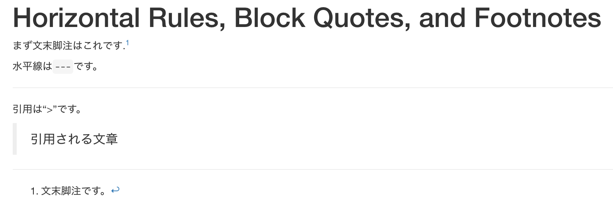

# 21章 マークダウン

### 21.0 ライブラリの読み込み

```text
library("tidyverse")
```

### 21.1 はじめに


練習問題ありません


### 21.2 Rマークダウンの基本

#### 練習問題1 File&gt; New File&gt; R Notebookを使って新しいノートブックを作成。指示を読んで、チャンクを実行する練習しなさい。コードを修正して再実行できることを確認し、修正された出力を確認しなさい。

File&gt; New File&gt; R Notebookから新しいファイルを開きます。それ以降はお任せします。


#### 練習問題2 File&gt; New File&gt; R Markdownを使って新しいR Markdown文書を作成。適切なボタンをクリックしてそれをknitしなさい。入力を変更できることを確認し、出力の更新内容を確認してください。

デフォルトでは、HTML、PDF、Wordで出力ができます。それ以降はお任せします。


#### 練習問題3 上で作成したR NotebookとR Markdownを比較しなさい。出力はどのように似ていて、それらはどう違うのか？

R Notebookは、基本的にHTMLへの出力のためのものです。PDF、Wordにも出力できます。R Markdownと違い作者名や日時等は挿入されません\(手動で挿入可能\)。 

R Markdownは、こちらはレポート提出などを前提とされているが、R Notebookとの違いもほとんどありません。というよりも細かい違いはあるんだろうけど、私がいまいちわかっていない。

#### 練習問題4 HTML、PDF、Wordの3つのフォーマットそれぞれに対して、1つの新しいR Markdown文書を作成しなさい。3つの文書をそれぞれknitし、出力、入力を比べなさい。

YAMLヘッダーの部分に違いがあります。もちろん、出力フォーマットは異なります。

```
output: html_document 
output: word_document 
output: pdf_document
```

また、`output`に`github_document`を選択すれば、Github上でRマークダウンを展開できます。

```text
output: github_document
```


### 21.3 Markdownを使ったテキストフォーマット

#### 練習問題1 簡単なCVを作成して、学んだことを練習しなさい。役職、学歴、職歴の見出しを含め、各セクションには、職種/学位の箇条書きリストを含めなさい。年を太字で強調表示しなさい。

例えば、Rの神様Hadley Wickhamさんの情報をまとめて、CVを作成するとこんな感じです。

```text
---
title: "Hadley Wickham"
---

## Employment

-   Chief Scientist, Rstudio, **2013--present**.
-   Adjust Professor, Rice University, Houston, TX, **2013--present**.
-   Assistant Professor, Rice University, Houston, TX, **2008--12**.

## Education

-   Ph.D. in Statistics, Iowa State University, Ames, IA,  **2008**

-   M.Sc. in Statistics, University of Auckland, New Zealand, **2004**

-   B.Sc. in Statistics and Computer Science, First Class Honours, The 
    University of Auckland, New Zealand, **2002**.

-   Bachelor of Human Biology, First Class Honours, The University of Auckland, 
    Auckland, New Zealand, **1999**.
```

#### 練習問題2 R Markdownクイックリファレンスを使用して、次の方法を見つけます。

* 脚注を追加。
* 水平線を追加。
* ブロック見積もりを追加。

```text
---
title: "Horizontal Rules, Block Quotes, and Footnotes"
output:
  html_document: default
---

まず文末脚注はこれです.[^quick-fox]

水平線は`---`です。

---

引用は"> "です。

> 引用される文章

[^quick-fox]: 文末脚注です。
```



#### 練習問題3 [https://github.com/hadley/r4ds/tree/master/rmarkdown](https://github.com/hadley/r4ds/tree/master/rmarkdown)から`diamond-sizes.Rmd`をコピーし、ローカルのRマークダウン文書に貼り付けなさい。実行できることを確認してから、最も印象的な特徴を説明するテキストを度数分布の後に追加しなさい。

```text
---
title: "Diamond sizes"
date: 2016-08-25
output: html_document
---

```{r setup, include = FALSE}
library(ggplot2)
library(dplyr)
smaller <- diamonds %>% 
  filter(carat <= 2.5)
```

We have data about `r nrow(diamonds)` diamonds. Only 
`r nrow(diamonds) - nrow(smaller)` are larger than
2.5 carats. The distribution of the remainder is shown
below:

```{r, echo = FALSE}
smaller %>% 
  ggplot(aes(carat)) + 
  geom_freqpoly(binwidth = 0.01)
```

comment here!!
```

### 21.4 コードチャンク

#### 練習問題1 カット、カラー、透明度によってダイヤモンドのサイズがどのように変わるかを探るセクションを追加しなさい。Rを知らない人のためにレポートを書いていて、各チャンクに`echo = FALSE`を設定する代わりにグローバルオプションを設定しなさい。

```text
---
title: "Diamond sizes"
date: 2016-08-25
output: html_document
---

```{r knitr_opts, include = FALSE}
knitr::opts_chunk$set(echo = FALSE)
```
```

#### 練習問題2 `diamond-sizes.Rmd`をコピーし、最も重要な属性を表示する表を含む、最大20個のダイヤモンドについて説明するセクションを追加しなさい。

お任せします。

#### 練習問題3 アウトプットがフォーマットされるように`comma()`を使って、`diamond-sizes.Rmd`を修正しなさい。

お任せします。

#### 練習問題4 `d`が`c`と`b`に依存し、`b`と`c`が`a`に依存するようなチャンクのネットワークを設定しなさい。`cache = TRUE`に設定し、`lubridate::now()`を実行し、設定が予想通りか確認しなさい。

```text
The chunk `a` has no dependencies.
```{r a}
print(lubridate::now())
x <- 1
```

The chunk `b` depends on `a`.
```{r b, dependson = c("a")}
print(lubridate::now())
y <- x + 1
```

The chunk `c` depends on `a`.
```{r c, dependson = c("a")}
print(lubridate::now())
z <- x * 2
```

The chunk `d` depends on `c` and `b`:
```{r d, dependson = c("c", "b")}
print(lubridate::now())
w <- y + z
```
```

### 21.5 トラブルシューティング


練習問題ありません


### 21.6 YAMLヘッダ


練習問題ありません


### 21.7もっと学ぶ


練習問題ありません


