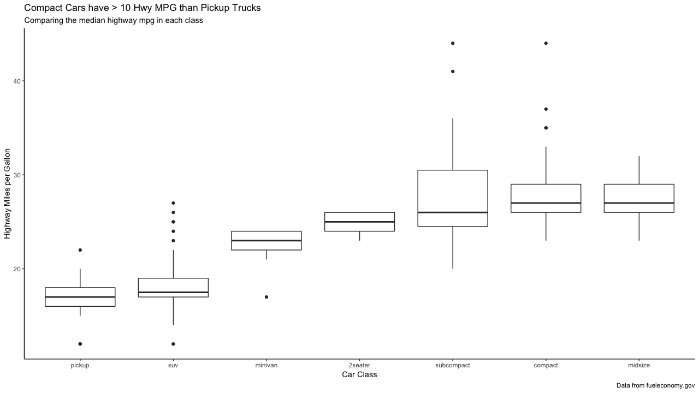

# 22章 ggplot2でコミュニケーションのためのグラフ作成

### 22.0 ライブラリの読み込み

```text
library("tidyverse")
library("modelr")
library("lubridate")
```

### 22.1 はじめに


練習問題ありません。


### 22.2 ラベル

#### 練習問題1 燃費データで`title`、`subtitle`、`caption`、`x`、`y`、および`colour`のラベルをカスタマイズしなさい。

`labs()`を使うことで、ラベル情報を補足できます。

```text
ggplot(mpg, aes(fct_reorder(class, hwy), hwy)) +
  geom_boxplot() +
  labs(
    title = "Compact Cars have > 10 Hwy MPG than Pickup Trucks",
    subtitle = "Comparing the median highway mpg in each class",
    caption = "Data from fueleconomy.gov",
    x = "Car Class",
    y = "Highway Miles per Gallon"
  ) + 
  theme_classic()
```



#### 練習問題2 大きなエンジンを搭載した軽量のスポーツカーが含まれているため、`geom_smooth()`が上向きに歪んでいる。モデリングツールを使用して、より適切なモデルを表示しなさい。

車のクラスによって、燃費と排気量は変わるはずです。そのためクラスごとに回帰直線を引いてみます。その結果として、関係の強さの程度が変わります。関係がない車のクラスもいくつか見られます。

```text
ggplot(mpg, aes(displ, hwy, col = class)) +
  geom_point() +
  geom_smooth(method = "lm", se = FALSE) +
  labs(
    title = "Fuel Efficiency Mostly Varies by Car Class",
    subtitle = "Subcompact caries fuel efficiency varies by engine size",
    caption = "Data from fueleconomy.gov",
    y = "Highway Miles per Gallon",
    x = "Engine Displacement"
  )
```


#### 練習問題3 先月作成した探索的なグラフィックを使用して、他の人が理解しやすいように有益なタイトルを追加しなさい。

お任せします。

### 22.3 アノテーション

#### 練習問題1 `geom_text()`プロットの四隅にテキストを配置するには、無限の位置で使用します。

```text
label <- tribble(
  ~displ, ~hwy, ~label, ~vjust, ~hjust,
  Inf, Inf, "Top right", "top", "right",
  Inf, -Inf, "Bottom right", "bottom", "right",
  -Inf, Inf, "Top left", "top", "left",
  -Inf, -Inf, "Bottom left", "bottom", "left"
)

ggplot(mpg, aes(displ, hwy)) +
  geom_point() +
  geom_text(data = label, aes(label = label, vjust = vjust, hjust = hjust)
```


#### 練習問題2 `annotate()`のドキュメントを読んで、`tibble`を作成せずにテキストラベルをプロットに追加するにはどうすればよいか。

```text
ggplot(mpg, aes(displ, hwy)) +
  geom_point() +
  annotate("text",
           x = Inf, y = Inf,
           label = "Increasing engine size is related to \ndecreasing fuel economy.", vjust = "top", hjust = "right"
  )
```


#### 練習問題3 `geom_text()`はファセットとどのように作用しあうのか？単一のファセットにラベルを追加する方法はあるか。どのようにして各ファセットに異なるラベルを付けられるのか。

ファセットにラベルを描画するには、`label`の`class`に設定します。

```text
label <- tibble(
  displ = Inf,
  hwy = Inf,
  class = "2seater",
  label = "Increasing engine size is \nrelated to decreasing fuel economy."
)

ggplot(mpg, aes(displ, hwy)) +
  geom_point() +
  geom_text(aes(label = label),
    data = label, vjust = "top", hjust = "right",
    size = 2
  ) +
  facet_wrap(~class)
```


各ファセットにラベルを描画するには、同じく`label`に`class`を設定します。

```text
label <- tibble(
  displ = Inf,
  hwy = Inf,
  class = unique(mpg$class),
  label = str_c("Label for ", class)
)

ggplot(mpg, aes(displ, hwy)) +
  geom_point() +
  geom_text(aes(label = label),
    data = label, vjust = "top", hjust = "right",
    size = 3
  ) +
  facet_wrap(~class)
```


#### 練習問題4 `geom_label()`の背景ボックスの外観を制御するための引数は何か？

* `label.padding`：ラベルの周囲のパディング
* `label.r`：角の丸みの量
* `label.size`：ラベル枠の大きさ

#### 練習問題5 `arrow()`の4つの引数は何ですか？どうやって動くのぁ？最も重要なオプションを説明する一連のプロットを作成しなさい。

* `angle` ：矢の角度
* `length` ：矢の長さ
* `ends`：矢を引く線の端
* `type`：`"open"`または`"close"`：矢が閉じた三角形か開いた三角形か

### 22.4 スケール

#### 練習問題1 次のコードがデフォルトのスケールを上書きしないのはなぜか？

この色付けは`color`ではなく`fill`で設定します。なので、`scale_fill_gradient()`で設定します。

```text
df <- tibble(x = rnorm(10000), y = rnorm(10000)) 

ggplot(df, aes(x, y)) + 
  geom_hex() + 
  scale_colour_gradient(low = "white", high = "red") + 
  coord_fixed()
```


```text
ggplot(df, aes(x, y)) +
  geom_hex() +
  scale_fill_gradient(low = "white", high = "red") +
  coord_fixed()
```


#### 練習問題2 すべてのスケールの最初の引数はスケールのラベルです。`labs()`を使うのと同じです。

```text
g1 <- ggplot(mpg, aes(displ, hwy)) +
  geom_point(aes(colour = class)) +
  geom_smooth(se = FALSE) +
  labs(
    x = "Engine displacement (L)",
    y = "Highway fuel economy (mpg)",
    colour = "Car type"
  )

g2 <- ggplot(mpg, aes(displ, hwy)) +
  geom_point(aes(colour = class)) +
  geom_smooth(se = FALSE) +
  scale_x_continuous("Engine displacement (L)") +
  scale_y_continuous("Highway fuel economy (mpg)") +
  scale_colour_discrete("Car type")

gridExtra::grid.arrange(g1, g2, ncol = 2)
```


#### 練習問題3 次のように大統領任期の表示を変更します。

* 上記の2つの変形を組み合わせる。
* y軸の表示を改善。
* 大統領の名前で各用語にラベルを付ける。
* 有益なプロットラベルを追加。
* 配置は4年ごとに特徴づける。

```text
fouryears <- lubridate::make_date(seq(year(min(presidential$start)),
  year(max(presidential$end)),
  by = 4
), 1, 1)

presidential %>%
  mutate(
    id = 33 + row_number(),
    name_id = fct_inorder(str_c(name, " (", id, ")"))
  ) %>%
  ggplot(aes(start, name_id, colour = party)) +
  geom_point() +
  geom_segment(aes(xend = end, yend = name_id)) +
  scale_colour_manual("Party", values = c(Republican = "red", Democratic = "blue")) +
  scale_y_discrete(NULL) +
  scale_x_date(NULL,
    breaks = presidential$start, date_labels = "'%y",
    minor_breaks = fouryears
  ) +
  ggtitle("Terms of US Presdients",
    subtitle = "Roosevelth (34th) to Obama (44th)"
  ) +
  theme(
    panel.grid.minor = element_blank(),
    axis.ticks.y = element_blank()
  )
```


#### 練習問題4 次のプロットの凡例を見やすくするために、`override.aes`を使用しなさい。

`override.aes()`を使えば、`alpha`で透過した凡例をコントロールできます。

```text
ggplot(diamonds %>% sample_n(10000), aes(carat, price, col = cut)) +
  geom_point(alpha = 0.2) +
  theme(legend.position = "bottom") +
  guides(colour = guide_legend(nrow = 1, override.aes = list(alpha = 1)))
```


### 22.5 ズーミング


練習問題はありません


### 22.6 テーマ


練習問題はありません


### 22.7 プロットを保存する


練習問題はありません


### 22.8 もっと知る


練習問題はありません


